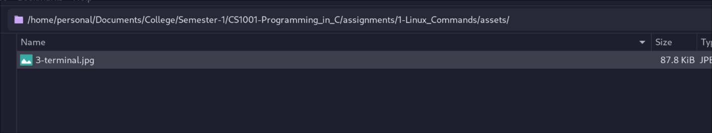
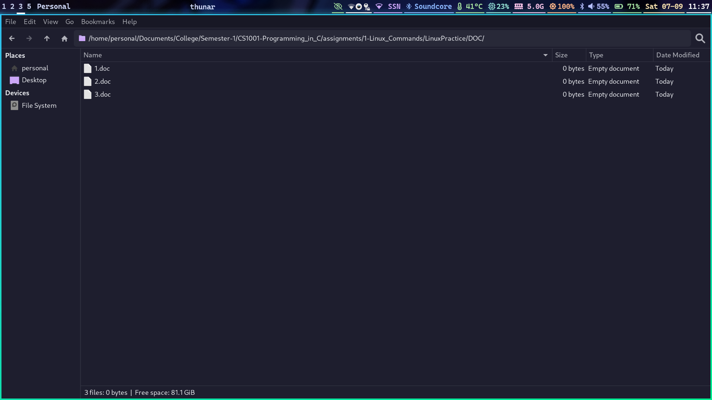
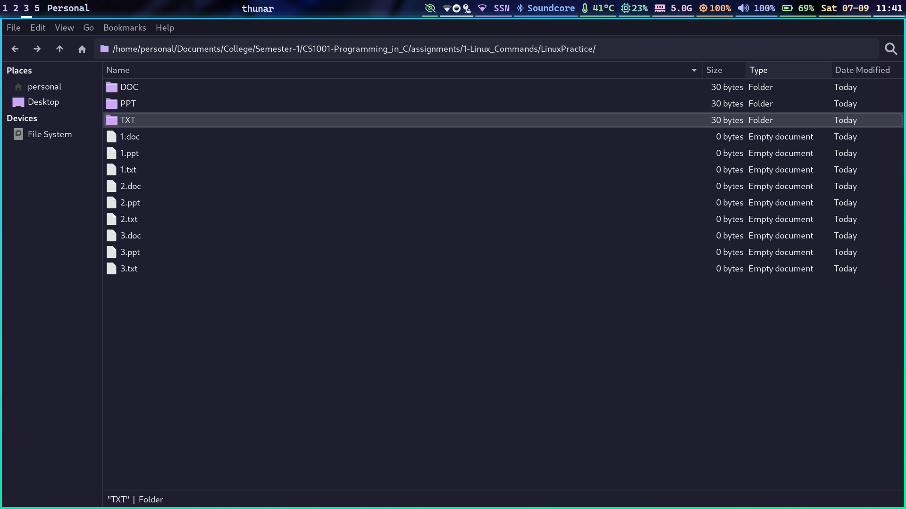
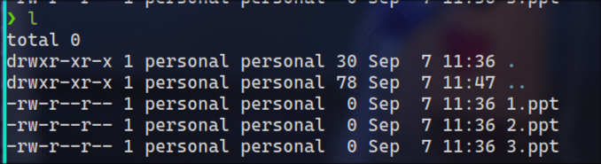
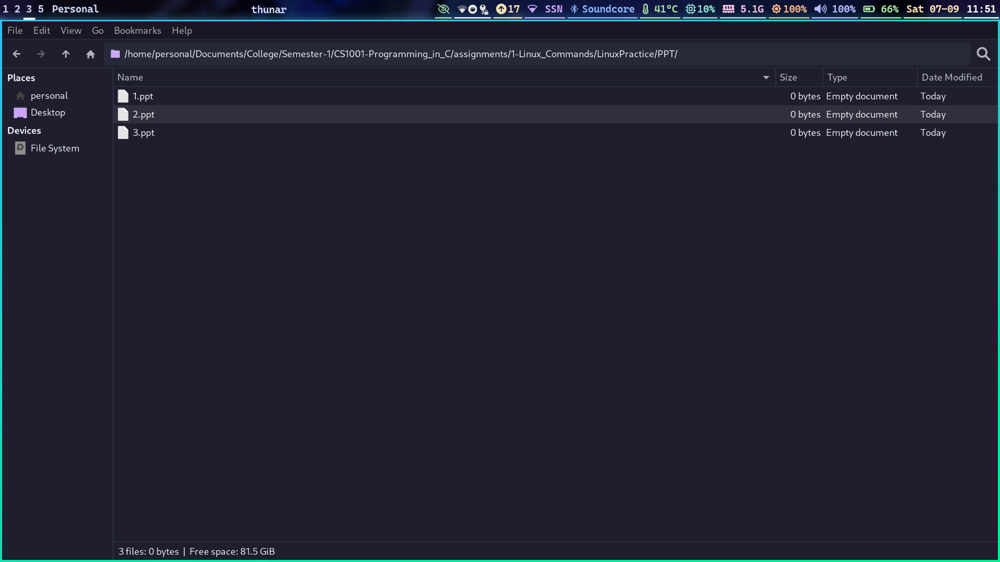
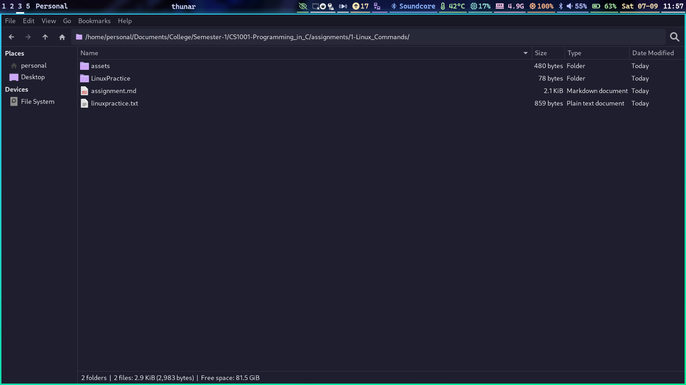
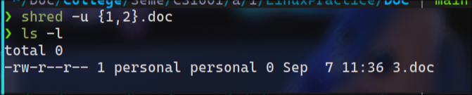
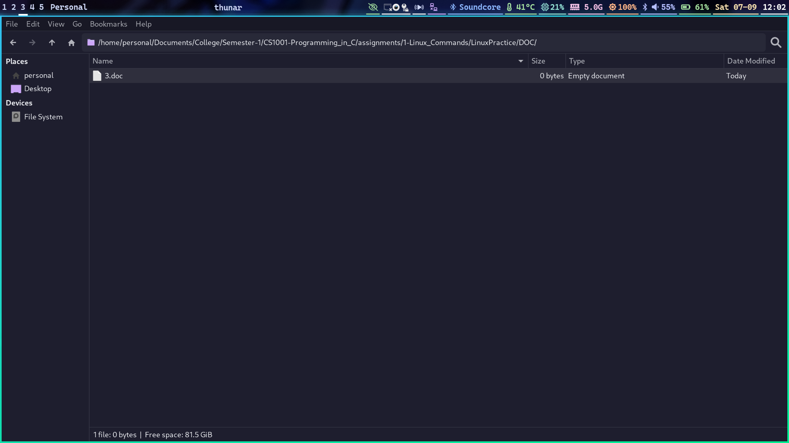

# Linux Commands

## Assignment

1. Open a terminal and create a linuxpractice.txt in the current directory. Whatever commands you type on the prompt must be recorded in this text file for your reference and will be of use to you during examinations.

2. Check the path of the current directory and create a folder named LinuxPractice in the current directory.

3. Create three subfolders (subdirectories) namely, DOC, PPT and TXT in LinuxPractice. Verify whether it is created.

4. Create sample files 1.doc, 2.doc, 3.doc, 1.ppt, 2.ppt, 3.ppt, 1.txt, 2.txt, 3.txt in the respective sub folders. Verify whether it is placed in respective directories.

5. Copy all the contents of DOC, PPT and TXT to LinuxPractice. Verify.

6. Do the above task in a single command. Verify.

7. Create a folder LinuxPracticeCopy in the current directory. Move 3.doc, 3.ppt, 3.txt from the parent directory to this directory. Verify.

8. Remove all ppt files present in LinuxPractice in a single command. Verify before and after.

9. Goto LinuxPracticeCopy directory and remove all files present in it in a single command. Verify.

10. Delete LinuxPracticeCopy temporarily. Restore the deleted folder through prompt. Verify.

11. Goto LinuxPractice and list all files with the extension .ppt

12. Goto LinuxPractice and list all files that begin with ’2’

13. Identify the path of 3.txt, 3.ppt

14. Open 3.txt using a terminal. Once it opens, search for the pattern ’shivnadar’. After the search, close the file using the terminal.

15. Copy the last two commands typed at the terminal to linuxpractice.txt. This must be done using mouse and keyboard.

16. Open 3.txt in the background so that other operations can be performed through the terminal. Verify.

17. Copy LinuxPractice to Documents folder. After copy, compress the folder in Documents. Verify.

18. Goto LinuxPractice; combine 1.txt, 2.txt, 3.txt into a single text file named SingleTextFile.txt.

19. Open 1.doc, 2.doc and export it as pdf document. Merge 1.pdf and 2.pdf using a terminal.

20. Delete 1.doc, 2.doc permanently. verify whether it is permanently deleted.

## Completion

3. Create three subfolders (subdirectories) namely, DOC, PPT and TXT in LinuxPractice. Verify whether it is created.




4. Create sample files 1.doc, 2.doc, 3.doc, 1.ppt, 2.ppt, 3.ppt, 1.txt, 2.txt, 3.txt in the respective sub folders. Verify whether it is placed in respective directories.





5. Copy all the contents of DOC, PPT and TXT to LinuxPractice. Verify.




6. Do the above task in a single command. Verify.

`for folder in *; do touch $folder/{1,2,3}.$(echo $folder | sed 's/.*/\L&/'); done`


7. Create a folder LinuxPracticeCopy in the current directory. Move 3.doc, 3.ppt, 3.txt from the parent directory to this directory. Verify.


8. Remove all ppt files present in LinuxPractice in a single command. Verify before and after.

__Before:__





__After:__


9. Goto LinuxPracticeCopy directory and remove all files present in it in a single command. Verify.


10. Delete LinuxPracticeCopy temporarily. Restore the deleted folder through prompt. Verify.

__Before:__




__After:__


16. Open 3.txt in the background so that other operations can be performed through the terminal. Verify.


17. Copy LinuxPractice to Documents folder. After copy, compress the folder in Documents. Verify.


20. Delete 1.doc, 2.doc permanently. Verify whether it is permanently deleted.





## linuxpractice.txt

```txt

touch linuxpractice.txt
nvim linuxpractice.txt
pwd
mkdir LinuxPractice
cd LinuxPractice
mkdir {DOC,TXT,PPT}
ls -l
for folder in *; do touch $folder/{1,2,3}.$(echo $folder | sed 's/.*/
\L&/'); done
tree
cp */* .
ls -l
cd ..
mkdir LinuxPracticeCopy
mv LinuxPractice/3.* LinuxPracticeCopy
ls -l LinuxPracticeCopy
cd LinuxPractice
ls -l
rm *.ppt
ls -l
cd ../LinuxPracticeCopy
rm *
ls -l
cd ..
trash-put LinuxPracticeCopy
trash-restore LinuxPracticeCopy
cd LinuxPractice
ls -l 2*
find -name 3.txt
find -name 3.ppt
nvim $(find -name 3.txt)
/shivnadar
:q
find -name 3.txt | xargs nvim
nvim $(find -name 3.txt)
history | tail -n 2 >> ../linuxpractice.txt
gedit TXT/3.txt &
cd ..
cp LinuxPractice ~/Documents/
cd ~/Documents/
tar -czvf LinuxPractice.tar.gz LinuxPractice
cd /tmp/LinuxPractice
cd TXT
cat *.txt > SingleTextFile.txt
cd ../DOC
shred -u 1.doc 2.doc
ls -l
```
