# Linux Commands

## Commands

3. Create three subfolders (subdirectories) namely, DOC, PPT and TXT in LinuxPractice. Verify whether it is created.

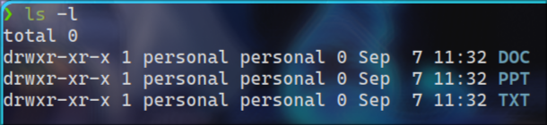


4. Create sample files 1.doc, 2.doc, 3.doc, 1.ppt, 2.ppt, 3.ppt, 1.txt, 2.txt, 3.txt in the respective sub folders. Verify whether it is placed in respective directories.

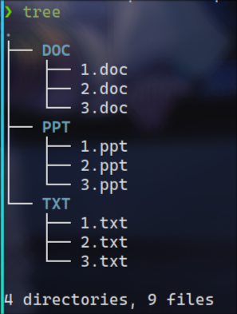


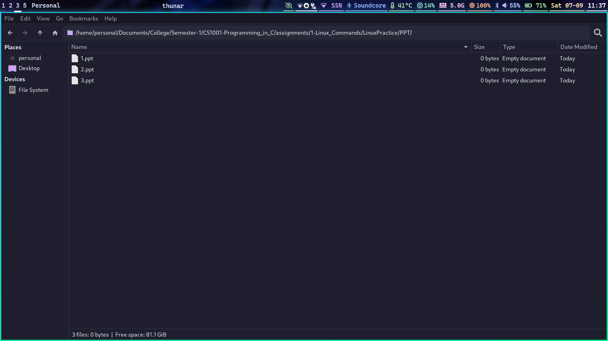


5. Copy all the contents of DOC, PPT and TXT to LinuxPractice. Verify.

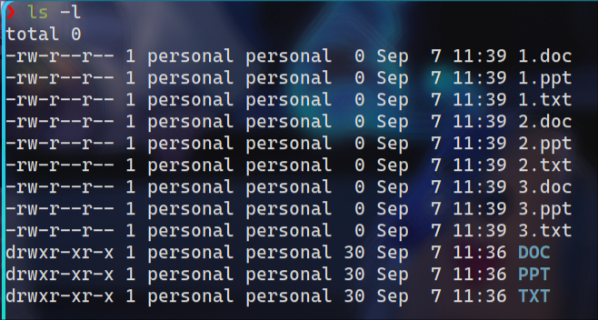


6. Do the above task in a single command. Verify.

`for folder in *; do touch $folder/{1,2,3}.$(echo $folder | sed 's/.*/\L&/'); done`


7. Create a folder LinuxPracticeCopy in the current directory. Move 3.doc, 3.ppt, 3.txt from the parent directory to this directory. Verify.


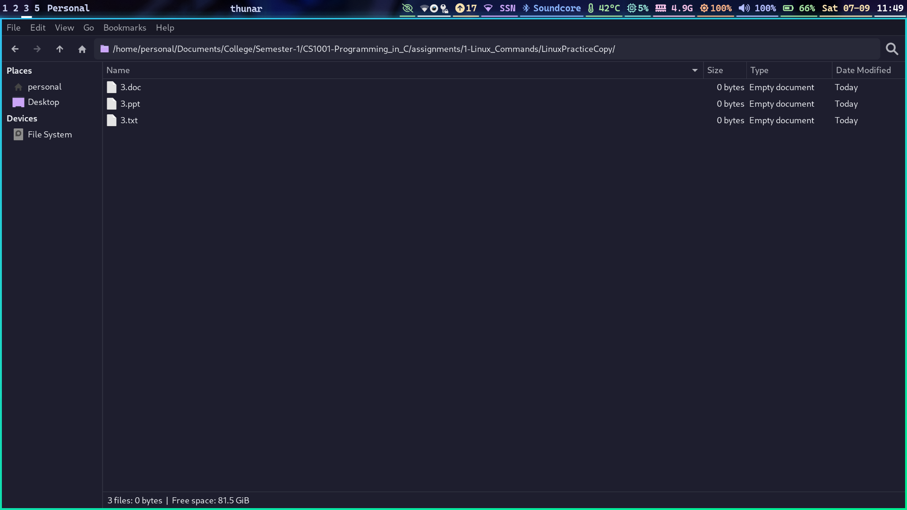

8. Remove all ppt files present in LinuxPractice in a single command. Verify before and after.

__Before:__


__After:__

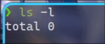


9. Goto LinuxPracticeCopy directory and remove all files present in it in a single command. Verify.


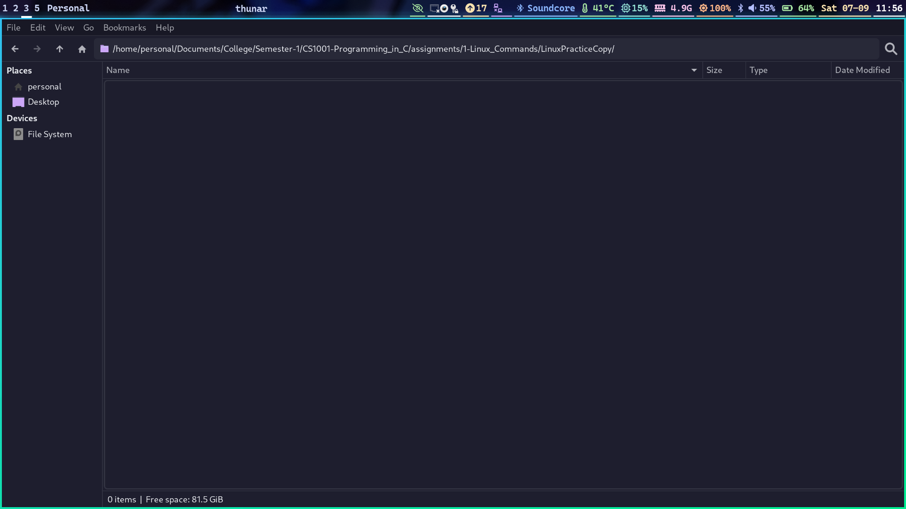

10. Delete LinuxPracticeCopy temporarily. Restore the deleted folder through prompt. Verify.

__Before:__

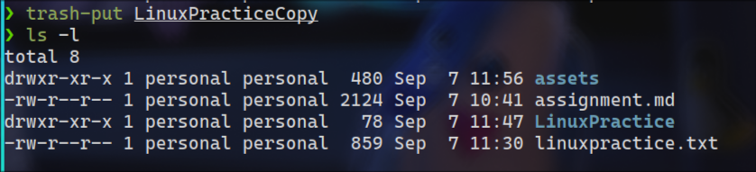


__After:__

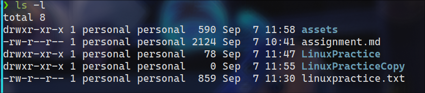

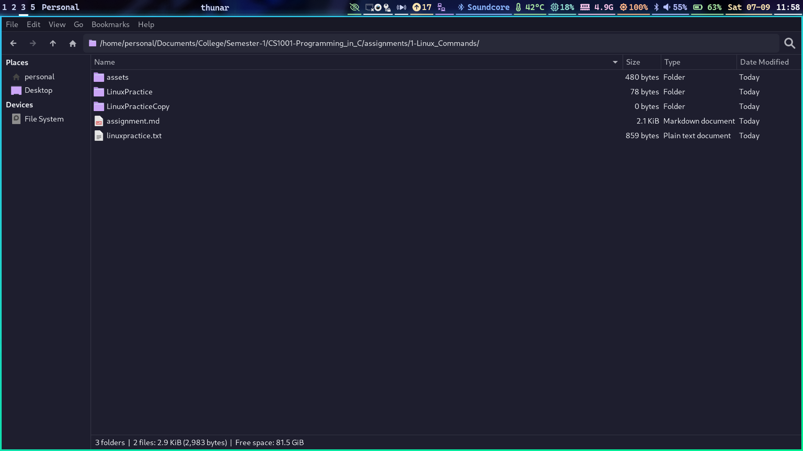

16. Open 3.txt in the background so that other operations can be performed through the terminal. Verify.

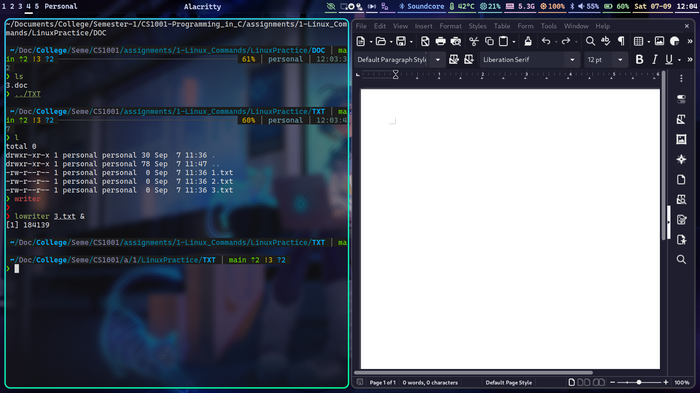

17. Copy LinuxPractice to Documents folder. After copy, compress the folder in Documents. Verify.


20. Delete 1.doc, 2.doc permanently. Verify whether it is permanently deleted.


## linuxpractice.txt

```txt

touch linuxpractice.txt
nvim linuxpractice.txt
pwd
mkdir LinuxPractice
cd LinuxPractice
mkdir {DOC,TXT,PPT}
ls -l
for folder in *; do touch $folder/{1,2,3}.$(echo $folder | sed 's/.*/
\L&/'); done
tree
cp */* .
ls -l
cd ..
mkdir LinuxPracticeCopy
mv LinuxPractice/3.* LinuxPracticeCopy
ls -l LinuxPracticeCopy
cd LinuxPractice
ls -l
rm *.ppt
ls -l
cd ../LinuxPracticeCopy
rm *
ls -l
cd ..
trash-put LinuxPracticeCopy
trash-restore LinuxPracticeCopy
cd LinuxPractice
ls -l 2*
find -name 3.txt
find -name 3.ppt
nvim $(find -name 3.txt)
/shivnadar
:q
find -name 3.txt | xargs nvim
nvim $(find -name 3.txt)
history | tail -n 2 >> ../linuxpractice.txt
gedit TXT/3.txt &
cd ..
cp LinuxPractice ~/Documents/
cd ~/Documents/
tar -czvf LinuxPractice.tar.gz LinuxPractice
cd /tmp/LinuxPractice
cd TXT
cat *.txt > SingleTextFile.txt
cd ../DOC
shred -u 1.doc 2.doc
ls -l
```

# Print Statements and Operators in C

## Employee Salary Calculation

### Algorithm

#### Input

* `quantity` (integer) - Number of items sold by the employee.

#### Output

* `salary` (integer) - Gross salary of the employee.

1. START
2. Initialize:
    * base = 15000
    * bonus_rate = 0.02
    * commission_rate = 0.02
    * cost = 45000
3. Input quantity (number of items sold).
4. Calculate bonus = quantity * bonus_rate.
5. Calculate commission = quantity *cost* commission_rate.
6. Compute salary = base + bonus + commission.
7. Output salary.
8. END

### Code

```c
/*
This code is licensed under the MIT License
Copyright 2024 Pranaov S
https://opensource.org/license/MIT
*/

#include <stdio.h>

int main() {

  // Base values

  int base = 15000;
  float bonus = 0.02;
  float commision = 0.02;
  int cost = 45000;

  int quantity;
  int salary;

  // Ask user for input on quantities sold
  printf("Enter quantities sold: ");
  scanf("%d", &quantity);
  printf("\n");

  // Calculate gross salary based on client's formula
  salary = base + (quantity * bonus) + (quantity * cost) * commision;

  // Send the gross salary to stdout
  printf("Gross salary is %d\n", salary);

  return 0;
}
```

### Output

```sh
$ gcc -o output 1-Employee_Salary.c && ./output
Enter quantities sold: 43

Gross salary is 53700
```

## Make in India Logo

### Algorithm

#### Input

* `colorTerm` (bool) - Flag to check if the terminal supports 4-bit colors.

#### Output

* Make in India logo with black and white backgrounds, or without colorization based on terminal support.

1. START
2. Initialize:
    * ANSI color codes for black and white backgrounds and reset codes
    * termChoice (char)
    * colorTerm (bool)
    * coloredString (char array)
3. Define the `colorize` function to add ANSI color codes to the input string:
    1. Initialize an empty string `coloredString`.
    2. Iterate through each character in the input string `inp`.
    3. For each character, use a switch case to determine the corresponding ANSI color code:
        * If the character is 'B', append the ANSI Black background code and a space, then reset the background.
        * If the character is 'W', append the ANSI white background code and a space, then reset the background.
        * If the character does not match any of the above, append the ANSI black background and a space, then reset the background.
    4. Return the `coloredString` with the injected ANSI codes.
4. Prompt the user to ensure their terminal supports at least 4-bit colors.
5. Input the user's response for terminal support.
6. Set `colorTerm` to true if the user confirms terminal support, otherwise set it to false.
7. Define the "Make in India" logo as a string.
8. If `colorTerm` is true, call the `colorize` function and print the colorized logo.
9. If `colorTerm` is false, print the logo without colorization.
10. END

### Code

```c

/*
This code is licensed under the MIT License
Copyright 2024 Pranaov S
https://opensource.org/license/MIT
*/

#include <stdbool.h>
#include <stdio.h>
#include <string.h>

#define ANSI_BLACK_FG "\x1b[30m"
#define ANSI_BLACK_BG "\x1b[40m"
#define ANSI_WHITE_FG "\x1b[37m"
#define ANSI_WHITE_BG "\x1b[47m"
#define ANSI_RESET_FG "\x1b[0m"
#define ANSI_RESET_BG "\x1b[0m"

char termChoice;
bool colorTerm;

char coloredString[32768];

// Function from:
// https://github.com/pranaovs/college-notes/tree/main/Semester-1/CS1001-Programming_in_C/assignments/2-Print_Statement_and_Operators_in_C/3-Country_Flag/3-Country_Flag.c
// Follows MIT License
char *colorize(char *inp) {

  // iterate through all the characters in the string
  for (int i = 0; i < strlen(inp); i++) {

    // use switch case to append final string embedded with ANSI color codes
    switch (inp[i]) {

    case 'B':
      strcat(coloredString, ANSI_BLACK_BG " " ANSI_RESET_BG);
      break;

    case 'W':
      strcat(coloredString, ANSI_WHITE_BG " " ANSI_RESET_BG);
      break;

    case ' ':
      strcat(coloredString, ANSI_BLACK_BG " " ANSI_RESET_BG);
      break;

    default:
      // Return the char if color code is not found
      // Convert the char to a string for concat
      char letter[2]; // https://stackoverflow.com/a/22429675
      letter[1] = '\0';
      letter[0] = inp[i];
      strcat(coloredString, letter);
    }
  }

  return coloredString; // return the string with injected ANSI codes
}

int main() {

  // Logic from:
  // https://github.com/pranaovs/college-notes/tree/main/Semester-1/CS1001-Programming_in_C/assignments/2-Print_Statement_and_Operators_in_C/3-Country_Flag/3-Country_Flag.c
  // Follows MIT License
  printf("Make sure your terminal (emulator) supports atleast 4-bit colors\n");
  printf("If you don't know what that means, just use one of these:\n");
  printf("    Linux: alacritty, foot, kitty\n");
  printf("    Windows: cmd, Windows Terminal, ConHost, ComEmu, mintty\n");
  printf("    MacOS: MacTerm, Warp, Terminal.app, iTerm2\n");

  printf("\nAre you using a terminal (emulator) that supports atleast 4-bit "
         "colors? [y/N]: ");

  scanf("%c", &termChoice);

  if (termChoice == ('Y' | 'y' | '1')) {
    colorTerm = true;
  } else {
    colorTerm = false;
  }

  // Define Make in India logo

  // clang-format off
  char logo[8192] =  ""
"                                                                                                      \n"
"                                                                              WWWWWWWWWWWW            \n"
"                                                                      WWWWWWWWWWWWWWWWWWWWWW          \n"
"                                                                    WWWWWWWWWWWWWWWWWWWWWWWWW  W      \n"
"                                   WWWWW                 WWWWWWWWWWWWWWWWWWWWWWWWWWWWWWWWWWWWWWW      \n"
"                            WWWWWWWWWWWWWWWWWWWWWWWWWWWWWWWWWWWWWWWWWWWWWWWWWWWWWWWWWWWWWWWWWWWW      \n"
"            WWWWWWWWWWWWWWWWWWWWWWWWWWWWWWWWWWWWWWWWWWWWWWWWWWWWWWWWWWWWWWWWWWWWWWWWWWWWWWWWWWWWW     \n"
"      WWWWWWWWWWWWWWWWWWWWWWWWWWWWWWWWWWWWWWWWWWWWWWWWWWWWWWWWWWWWWWWWWWWWWWWWWWWWWWWWWWWWWWWWWWWWW   \n"
"   WWWWWWWWWWWW         WWWW                                                     WWWWWWWWWWWWWWWWWWWW \n"
"  WWWWW                WWWWW WW WW WWW W  W WWW  WWW W  W  WWW W  W WW  WWW WWWW WWWWWWWWWWWWWWWWWWWW \n"
" WWWW                 WWWWWW W W W W W WWW  WWW   W  WW W   W  WW W W W  W  W  W WWWWWWWWWWWWWWWWWWW  \n"
" WWW                WWWWWWWW W   W WWW W  W W     W  W WW   W  W WW W W  W  WWWW WWWWWWWWWWWWWWW      \n"
" WWW               WWWWWWWWW W   W W W W  W WWW  WWW W  W  WWW W  W WW  WWW W  W WWWWWWWWWWWWWWW      \n"
" WWWW              WWWWWWWWW                                                     WWWWWWWWWWWWWWW      \n"
"  WWWWWWWW        WWWWWWWWWWWWWWWWWWWWWWWWWWWWWWWWWWWWWWWWWWWWWWWWWWWWWWWWWWWWWWWWWWWWWWWWWW WW       \n"
"    WWWWWWWWW    WWWWWWWWWWWWWWWWWWWWWWWWWWW     WWWWWWWWWWWWWWWWWWWWWWWWWWWWWWWWWWWWWW  W            \n"
"      WWWWWWWWW WWWWWWWWWWWWWWW WWWWWWWWWWW              WWWWWWWWWWWWWWWWWWWWWWWWWWW                  \n"
"         WWWWWWWWWWWWWWWWWW      WWWWWWWWWW             WWWWWWWWW    WWWWWWWWWWWWW                    \n"
"               WWWWWWWWW        WWWWWWWWWW              WWWWWWWW         WWWWWWWWWW                   \n"
"               WWWWWWW          WWWWWWWWW              WWWWWWWW           WWWWWWWWW                   \n"
"               WWWWWW            WWWWWWWWWW            WWWWWW               WWWWWWWW                  \n"
"               WWWWWWWWW           WWWWWWWWWWWWWW     WWWWWWW                WWWWWWWWWWW              \n"
"                WWWWWWWWW             WWWWWWWWWWW      WWWWWWWWW                WWWWWWWWW             \n"
"                                                                                                      \n";
  // clang-format on

  // Only try colorizing the logo if user claims terminal supports 4-bit colors
  if (colorTerm) {
    printf("%s", colorize(logo));
  } else {
    printf("%s", logo);
  }

  return 0;
}
```

### Output

```sh
$ gcc -o output 2-Make_in_India_Pattern.c && ./output
Make sure your terminal (emulator) supports atleast 4-bit colors
If you don't know what that means, just use one of these:
    Linux: alacritty, foot, kitty
    Windows: cmd, Windows Terminal, ConHost, ComEmu, mintty
    MacOS: MacTerm, Warp, Terminal.app, iTerm2

Are you using a terminal (emulator) that supports atleast 4-bit colors? [y/N]:                                                                                                       
                                                                              WWWWWWWWWWWW            
                                                                      WWWWWWWWWWWWWWWWWWWWWW          
                                                                    WWWWWWWWWWWWWWWWWWWWWWWWW  W      
                                   WWWWW                 WWWWWWWWWWWWWWWWWWWWWWWWWWWWWWWWWWWWWWW      
                            WWWWWWWWWWWWWWWWWWWWWWWWWWWWWWWWWWWWWWWWWWWWWWWWWWWWWWWWWWWWWWWWWWWW      
            WWWWWWWWWWWWWWWWWWWWWWWWWWWWWWWWWWWWWWWWWWWWWWWWWWWWWWWWWWWWWWWWWWWWWWWWWWWWWWWWWWWWW     
      WWWWWWWWWWWWWWWWWWWWWWWWWWWWWWWWWWWWWWWWWWWWWWWWWWWWWWWWWWWWWWWWWWWWWWWWWWWWWWWWWWWWWWWWWWWWW   
   WWWWWWWWWWWW         WWWW                                                     WWWWWWWWWWWWWWWWWWWW 
  WWWWW                WWWWW WW WW WWW W  W WWW  WWW W  W  WWW W  W WW  WWW WWWW WWWWWWWWWWWWWWWWWWWW 
 WWWW                 WWWWWW W W W W W WWW  WWW   W  WW W   W  WW W W W  W  W  W WWWWWWWWWWWWWWWWWWW  
 WWW                WWWWWWWW W   W WWW W  W W     W  W WW   W  W WW W W  W  WWWW WWWWWWWWWWWWWWW      
 WWW               WWWWWWWWW W   W W W W  W WWW  WWW W  W  WWW W  W WW  WWW W  W WWWWWWWWWWWWWWW      
 WWWW              WWWWWWWWW                                                     WWWWWWWWWWWWWWW      
  WWWWWWWW        WWWWWWWWWWWWWWWWWWWWWWWWWWWWWWWWWWWWWWWWWWWWWWWWWWWWWWWWWWWWWWWWWWWWWWWWWW WW       
    WWWWWWWWW    WWWWWWWWWWWWWWWWWWWWWWWWWWW     WWWWWWWWWWWWWWWWWWWWWWWWWWWWWWWWWWWWWW  W            
      WWWWWWWWW WWWWWWWWWWWWWWW WWWWWWWWWWW              WWWWWWWWWWWWWWWWWWWWWWWWWWW                  
         WWWWWWWWWWWWWWWWWW      WWWWWWWWWW             WWWWWWWWW    WWWWWWWWWWWWW                    
               WWWWWWWWW        WWWWWWWWWW              WWWWWWWW         WWWWWWWWWW                   
               WWWWWWW          WWWWWWWWW              WWWWWWWW           WWWWWWWWW                   
               WWWWWW            WWWWWWWWWW            WWWWWW               WWWWWWWW                  
               WWWWWWWWW           WWWWWWWWWWWWWW     WWWWWWW                WWWWWWWWWWW              
                WWWWWWWWW             WWWWWWWWWWW      WWWWWWWWW                WWWWWWWWW             
                                                                                                      

```

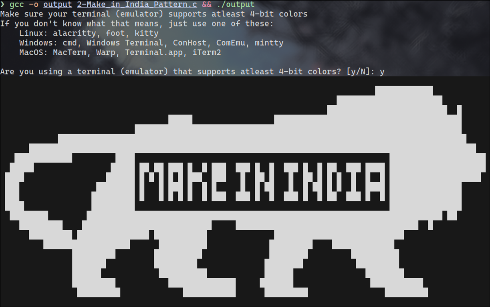

## Country Flag

### Algorithm

#### Input

* `colorTerm` (bool) - Flag to check if the terminal supports 4-bit colors.

#### Output

* Denmark flag with red and white backgrounds, or without colorization based on terminal support.

1. START
2. Initialize:
    * ANSI color codes for red, green, yellow, blue, magenta, cyan, white backgrounds, and reset codes
    * termChoice (char)
    * colorTerm (bool)
    * coloredString (char array)
3. Define the `colorize` function to add ANSI color codes to the input string:
    1. Initialize an empty string `coloredString`.
    2. Iterate through each character in the input string `inp`.
    3. For each character, use a switch case to determine the corresponding ANSI color code:
        * If the character is 'R', append the ANSI red background code and a space, then reset the background.
        * If the character is 'G', append the ANSI green background code and a space, then reset the background.
        * If the character is 'Y', append the ANSI yellow background code and a space, then reset the background.
        * If the character is 'B', append the ANSI blue background code and a space, then reset the background.
        * If the character is 'M', append the ANSI magenta background code and a space, then reset the background.
        * If the character is 'C', append the ANSI cyan background code and a space, then reset the background.
        * If the character is 'W', append the ANSI white background code and a space, then reset the background.
        * If the character does not match any of the above, append the character itself to `coloredString`.
    4. Return the `coloredString` with the injected ANSI codes.
4. Prompt the user to ensure their terminal supports at least 4-bit colors.
5. Input the user's response for terminal support.
6. Set `colorTerm` to true if the user confirms terminal support, otherwise set it to false.
7. Define the Denmark flag as a string.
8. If `colorTerm` is true, call the `colorize` function and print the colorized flag.
9. If `colorTerm` is false, print the flag without colorization.
10. END

### Code

```c

/*
This code is licensed under the MIT License
Copyright 2024 Pranaov S
https://opensource.org/license/MIT
*/

#include <stdbool.h>
#include <stdio.h>
#include <string.h>

// Define ANSI codes for common colors. Can be extended.
// Thanks https://stackoverflow.com/a/3219471 and
// https://stackoverflow.com/a/33206814
#define ANSI_RED_FG "\x1b[31m"
#define ANSI_RED_BG "\x1b[41m"
#define ANSI_GREEN_FG "\x1b[32m"
#define ANSI_GREEN_BG "\x1b[42m"
#define ANSI_YELLOW_FG "\x1b[33m"
#define ANSI_YELLOW_BG "\x1b[43m"
#define ANSI_BLUE_FG "\x1b[34m"
#define ANSI_BLUE_BG "\x1b[44m"
#define ANSI_MAGENTA_FG "\x1b[35m"
#define ANSI_MAGENTA_BG "\x1b[45m"
#define ANSI_CYAN_FG "\x1b[36m"
#define ANSI_CYAN_BG "\x1b[46m"
#define ANSI_WHITE_FG "\x1b[37m"
#define ANSI_WHITE_BG "\x1b[47m"
#define ANSI_RESET_FG "\x1b[0m"
#define ANSI_RESET_BG "\x1b[0m"

char termChoice;
bool colorTerm;

char coloredString[1024];

char *colorize(char *inp) {

  // iterate through all the characters in the string
  for (int i = 0; i < strlen(inp); i++) {

    // use switch case to append final string embedded with ANSI color codes
    switch (inp[i]) {

    case 'R':
      strcat(coloredString, ANSI_RED_BG " " ANSI_RESET_BG);
      break;

    case 'G':
      strcat(coloredString, ANSI_GREEN_BG " " ANSI_RESET_BG);
      break;

    case 'Y':
      strcat(coloredString, ANSI_YELLOW_BG " " ANSI_RESET_BG);
      break;

    case 'B':
      strcat(coloredString, ANSI_BLUE_BG " " ANSI_RESET_BG);
      break;

    case 'M':
      strcat(coloredString, ANSI_MAGENTA_BG " " ANSI_RESET_BG);
      break;

    case 'C':
      strcat(coloredString, ANSI_CYAN_BG " " ANSI_RESET_BG);
      break;

    case 'W':
      strcat(coloredString, ANSI_WHITE_BG " " ANSI_RESET_BG);
      break;

    default:
      // Return the char if color code is not found
      // Convert the char to a string for concat
      char letter[2]; // https://stackoverflow.com/a/22429675
      letter[1] = '\0';
      letter[0] = inp[i];
      strcat(coloredString, letter);
    }
  }

  return coloredString; // return the string with injected ANSI codes
}

int main() {
  printf("Make sure your terminal (emulator) supports atleast 4-bit colors\n");
  printf("If you don't know what that means, just use one of these:\n");
  printf("    Linux: alacritty, foot, kitty\n");
  printf("    Windows: cmd, Windows Terminal, ConHost, ComEmu, mintty\n");
  printf("    MacOS: MacTerm, Warp, Terminal.app, iTerm2\n");

  printf("\nAre you using a terminal (emulator) that supports atleast 4-bit "
         "colors? [y/N]: ");

  scanf("%c", &termChoice);

  if (termChoice == ('Y' | 'y' | '1')) {
    colorTerm = true;
  } else {
    colorTerm = false;
  }

  // Define Denmark flag

  // clang-format off
  char flag[255] = "RRRRRRRRWWRRRRRRRRRRRRRR\n"
                   "RRRRRRRRWWRRRRRRRRRRRRRR\n"
                   "RRRRRRRRWWRRRRRRRRRRRRRR\n"
                   "RRRRRRRRWWRRRRRRRRRRRRRR\n"
                   "WWWWWWWWWWWWWWWWWWWWWWWW\n"
                   "RRRRRRRRWWRRRRRRRRRRRRRR\n"
                   "RRRRRRRRWWRRRRRRRRRRRRRR\n"
                   "RRRRRRRRWWRRRRRRRRRRRRRR\n"
                   "RRRRRRRRWWRRRRRRRRRRRRRR\n";

  // clang-format on

  // Only try colorizing the flag if user claims terminal supports 4-bit colors
  if (colorTerm) {
    printf("%s", colorize(flag));
  } else {
    printf("%s", flag);
  }

  return 0;
}

```

### Output

```sh
$ gcc -o output 3-Country_Flag.c && ./output
Make sure your terminal (emulator) supports atleast 4-bit colors
If you don't know what that means, just use one of these:
    Linux: alacritty, foot, kitty
    Windows: cmd, Windows Terminal, ConHost, ComEmu, mintty
    MacOS: MacTerm, Warp, Terminal.app, iTerm2

Are you using a terminal (emulator) that supports atleast 4-bit colors? [y/N]: n
RRRRRRRRWWRRRRRRRRRRRRRR
RRRRRRRRWWRRRRRRRRRRRRRR
RRRRRRRRWWRRRRRRRRRRRRRR
RRRRRRRRWWRRRRRRRRRRRRRR
WWWWWWWWWWWWWWWWWWWWWWWW
RRRRRRRRWWRRRRRRRRRRRRRR
RRRRRRRRWWRRRRRRRRRRRRRR
RRRRRRRRWWRRRRRRRRRRRRRR
RRRRRRRRWWRRRRRRRRRRRRRR
```

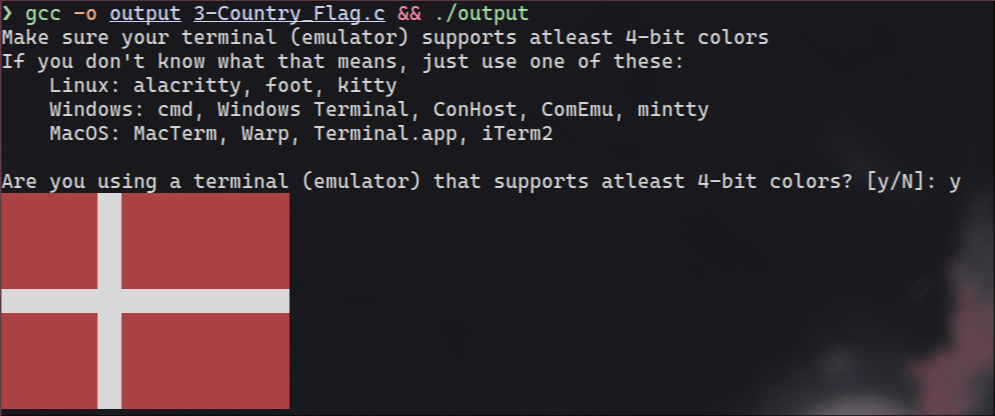

# Selection - Decision Making and Branching (Part 1)

## Student Grade Calculation

### Algorithm

#### Input

* `mark` (integer) - Marks obtained by the student.

#### Output

* `grade` (string) - Grade of the student based on the marks.

1. START
2. Initialize:
    * mark (integer)
3. Print "SNU Chennai grade calculator"
4. Print "Enter the student mark and the grade will be calculated according to SNU Chennai B.Tech regulations (2021)"
5. Print "Enter the student's mark (out of 100): "
6. Input mark
7. Print "Grade for [mark] marks is: "
8. Check the value of mark and determine the grade:
    * If mark is between 91 and 100, print "O"
    * If mark is between 81 and 90, print "A+"
    * If mark is between 71 and 80, print "A"
    * If mark is between 61 and 70, print "B+"
    * If mark is between 51 and 60, print "B"
    * If mark is between 41 and 50, print "P"
    * If mark is between 0 and 40, print "RA"
9. Print a newline
10. END

### Code

```c
#include <stdio.h>

int mark;

int main() {

  printf("SNU Chennai grade calculator\n");
  printf("Enter the student mark and the grade will be calculated according to "
         "SNU Chennai B.Tech regulations (2021)\n\n");
  // https://www.snuchennai.edu.in/wp-content/uploads/2024/01/Regulations_B.Tech-2.pdf

  printf("Enter the student's mark (out of 100): ");
  scanf("%d", &mark);
  printf("\n");

  printf("Grade for %d marks is: ", mark);

  if (mark <= 100 && mark >= 91) {
    printf("O");
  }
  if (mark <= 90 && mark >= 81) {
    printf("A+");
  }
  if (mark <= 80 && mark >= 71) {
    printf("A");
  }
  if (mark <= 70 && mark >= 61) {
    printf("B+");
  }
  if (mark <= 60 && mark >= 51) {
    printf("B");
  }
  if (mark <= 50 && mark >= 41) {
    printf("P");
  }
  if (mark < 40 && mark >= 0) {
    printf("RA");
  }

  printf("\n");

  return 0;
}
```

```sh
$ gcc -o output 1-Student_Grade.c && ./output
SNU Chennai grade calculator
Enter the student mark and the grade will be calculated according to SNU Chennai B.Tech regulations (2021)

Enter the student's mark (out of 100): 89

Grade for 89 marks is: A+
```

## Divisibility Check

### Using `if` statement only

#### Algorithm

##### Input

* `inp` (integer) - Number to check for divisibility.

##### Output

* Divisibility if `inp` by 2, 3, or both.

1. START
2. Initialize:
    * num1 = 2
    * num2 = 3
    * inp (integer)
    * result (integer)
3. Define function `checkDiv(int inp)`:
    * If inp is 0, return 0
    * If inp is divisible by both num1 and num2, return (num1 * num2)
    * If inp is divisible by num1, return num1
    * If inp is divisible by num2, return num2
    * Otherwise, return 1
4. Print "This program checks if the given number is divisible by 2 or 3 or both, using if statements"
5. Print "Enter the number to check for divisibility: "
6. Input inp
7. Call `checkDiv(inp)` and store the result in result
8. Check the value of result and print the appropriate message:
    * If result is 0, print "0 is not an option"
    * If result is 1, print "[inp] is not divisible by neither 2, 3 nor both"
    * If result is 6 (num1 * num2), print "[inp] is divisible by both 2 and 3 (6)"
    * If result is 2 or 3, print "[inp] is divisible by [result]"
9. Print a newline
10. END

#### Code

```c
#include <stdio.h>

// Define the numbers to check for divisibility
int num1 = 2;
int num2 = 3;
int inp, result;

// Use a function to check divisibility and return the divisor. Also returns the
// multiple if both numbers are divisible. Returns 0 if input is zero.
int checkDiv(int inp) {
  if (inp == 0) {
    return 0;
  }
  if (inp % (num1 * num2) == 0) {
    return (num1 * num2);
  }
  if (inp % (num1) == 0) {
    return (num1);
  }
  if (inp % (num2) == 0) {
    return (num2);
  }
  return 1;
}

int main() {

  printf("This program checks if the given number is divisible by %d or %d or "
         "both\n\n, using if statements",
         num1, num2);
  printf("Enter the number to check for divisibility: ");

  scanf("%d", &inp);
  printf("\n");

  result = checkDiv(inp);

  if (result == 0) {
    printf("0 is not an option");
  }
  if (result == 1) {
    printf("%d is not divisible by neither %d, %d nor both", inp, num1, num2);
  }
  if (result == (num1 * num2)) {
    printf("%d is divisible by both %d and %d (%d)", inp, num1, num2, (result));
  }
  if (result == num1 || result == num2) {
    printf("%d is divisible by %d", inp, result);
  }

  printf("\n");

  return 0;
}
```

#### Output

```sh
$ gcc -o output 2_1-Divisibility_Check.c && ./output
This program checks if the given number is divisible by 2 or 3 or both

, using if statementsEnter the number to check for divisibility: 46

46 is divisible by 2
```

### Using `if-else` statements

#### Algorithm

##### Input

* `inp` (integer) - Number to check for divisibility.

##### Output

* Divisibility if `inp` by 2, 3, or both.

1. START
2. Initialize:
    * num1 = 2
    * num2 = 3
    * inp (integer)
    * result (integer)
3. Define function `checkDiv(int inp)`:
    * If inp is 0, return 0
    * Else if inp is divisible by both num1 and num2, return (num1 * num2)
    * Else if inp is divisible by num1, return num1
    * Else if inp is divisible by num2, return num2
    * Else, return 1
4. Print "This program checks if the given number is divisible by 2 or 3 or both, using if-else statements"
5. Print "Enter the number to check for divisibility: "
6. Input inp
7. Call `checkDiv(inp)` and store the result in result
8. Check the value of result and print the appropriate message:
    * If result is 0, print "0 is not an option"
    * Else if result is 1, print "[inp] is not divisible by neither 2, 3 nor both"
    * Else if result is 6 (num1 * num2), print "[inp] is divisible by both 2 and 3 (6)"
    * Else, print "[inp] is divisible by [result]"
9. Print a newline
10. END

#### Code

```c
#include <stdio.h>

// Define the numbers to check for divisibility
int num1 = 2;
int num2 = 3;
int inp, result;

// Use a function to check divisibility and return the divisor. Also returns the
// multiple if both numbers are divisible. Returns 0 if input is zero
int checkDiv(int inp) {
  if (inp == 0) {
    return 0;
  }

  else if (inp % (num1 * num2) == 0) {
    return (num1 * num2);
  }

  else if (inp % (num1) == 0) {
    return (num1);
  }

  else if (inp % (num2) == 0) {
    return (num2);
  }

  else {
    return 1;
  }
}

int main() {

  printf("This program checks if the given number is divisible by %d or %d or "
         "both\n\n, using if-else statements",
         num1, num2);
  printf("Enter the number to check for divisibility: ");

  scanf("%d", &inp);
  printf("\n");

  result = checkDiv(inp);

  if (result == 0) {
    printf("0 is not an option");
  }

  else if (result == 1) {
    printf("%d is not divisible by neither %d, %d nor both", inp, num1, num2);
  }

  else if (result == (num1 * num2)) {
    printf("%d is divisible by both %d and %d (%d)", inp, num1, num2, (result));
  }

  else {
    printf("%d is divisible by %d", inp, result);
  }

  printf("\n");

  return 0;
}
```

#### Output

```sh
$ gcc -o output 2_2-Divisibility_Check.c && ./output
This program checks if the given number is divisible by 2 or 3 or both

, using if-else statementsEnter the number to check for divisibility: 48

48 is divisible by both 2 and 3 (6)
```

### Using nested `if` statements

#### Algorithm

##### Input

* `inp` (integer) - Number to check for divisibility.

##### Output

* Divisibility if `inp` by 2, 3, or both.

1. START
2. Initialize:
    * num1 = 2
    * num2 = 3
    * inp (integer)
    * result (integer)
3. Define function `checkDiv(int inp)`:
    * If inp is 0, return 0
    * If inp is divisible by both num1 and num2, return (num1 * num2)
    * If inp is divisible by num1:
        * If inp is also divisible by both num1 and num2, return (num1 * num2)
        * Else, return num1
    * If inp is divisible by num2:
        * If inp is also divisible by both num1 and num2, return (num1 * num2)
        * Else, return num2
    * Otherwise, return 1
4. Print "This program checks if the given number is divisible by 2 or 3 or both, using nested if and else statements"
5. Print "Enter the number to check for divisibility: "
6. Input inp
7. Call `checkDiv(inp)` and store the result in result
8. Check the value of result and print the appropriate message:
    * If result is 0, print "0 is not an option"
    * If result is 1, print "[inp] is not divisible by neither 2, 3 nor both"
    * If result is 6 (num1 * num2), print "[inp] is divisible by both 2 and 3 (6)"
    * If result is 2 or 3, print "[inp] is divisible by [result]"
9. Print a newline
10. END

#### Code

```c
#include <stdio.h>

// Define the numbers to check for divisibility
int num1 = 2;
int num2 = 3;
int inp, result;

// Use a function to check divisibility and return the divisor. Also returns the
// multiple if both numbers are divisible. Returns zero if input is zero.
int checkDiv(int inp) {
  // Do not process if input is zero
  if (inp == 0) {
    return 0;
  }
  if (inp % (num1 * num2) == 0) {
    return (num1 * num2);
  }
  // use nested if to check if given number is divisible by both numbers if it
  // is divisible by one number
  if (inp % (num1) == 0) {
    if (inp % (num1 * num2) == 0) {
      return (num1 * num2);
    } else {

      return (num1);
    }
  }
  if (inp % (num2) == 0) {
    if (inp % (num1 * num2) == 0) {
      return (num1 * num2);
    } else {

      return (num2);
    }
  }
  return 1;
}

int main() {

  printf("This program checks if the given number is divisible by %d or %d or "
         "both\n\n, using nested if and else statements",
         num1, num2);
  printf("Enter the number to check for divisibility: ");

  scanf("%d", &inp);
  printf("\n");

  result = checkDiv(inp);

  if (result == 0) {
    printf("0 is not an option");
  }
  if (result == 1) {
    printf("%d is not divisible by neither %d, %d nor both", inp, num1, num2);
  }
  if (result == (num1 * num2)) {
    printf("%d is divisible by both %d and %d (%d)", inp, num1, num2, (result));
  }
  if (result == num1 || result == num2) {
    printf("%d is divisible by %d", inp, result);
  }

  printf("\n");

  return 0;
}
```

#### Output

```sh
$ gcc -o output 2_3-Divisibility_Check.c && ./output
This program checks if the given number is divisible by 2 or 3 or both

, using nested if and else statementsEnter the number to check for divisibility: 43

43 is not divisible by neither 2, 3 nor both
```

## Finding the largest number

### Using `if` only statements

#### Algorithm

##### Input

* `num1`, `num2`, `num3`, `num4` (integers) - Four numbers to compare.

##### Output

* The greatest number among `num1`, `num2`, `num3`, and `num4`.

1. START
2. Initialize:
    * num1, num2, num3, num4 (integers)
    * tmpResult1, tmpResult2, tmpResult3, result (integers)
    * tmpResult12, tmpResult23 (integers)
3. Print "This program returns the greatest among 4 numbers using if statements"
4. Print "Enter 4 numbers separated by spaces: "
5. Input num1, num2, num3, num4
6. Compare num1 and num2 to find the greater number:
    * If num1 >= num2, set tmpResult1 = num1
    * Else, set tmpResult1 = num2
7. Compare num2 and num3 to find the greater number:
    * If num2 >= num3, set tmpResult2 = num2
    * Else, set tmpResult2 = num3
8. Compare num3 and num4 to find the greater number:
    * If num3 >= num4, set tmpResult3 = num3
    * Else, set tmpResult3 = num4
9. Compare tmpResult1 and tmpResult2 to find the greater number:
    * If tmpResult1 >= tmpResult2, set tmpResult12 = tmpResult1
    * Else, set tmpResult12 = tmpResult2
10. Compare tmpResult2 and tmpResult3 to find the greater number:
    * If tmpResult2 >= tmpResult3, set tmpResult23 = tmpResult2
    * Else, set tmpResult23 = tmpResult3
11. Compare tmpResult12 and tmpResult23 to find the greatest number:
    * If tmpResult12 >= tmpResult23, set result = tmpResult12
    * Else, set result = tmpResult23
12. Print "The greatest number among [num1], [num2], [num3], [num4], is: [result]"
13. END

#### Code

```c
#include <stdio.h>

int num1, num2, num3, num4;
int tmpResult1, tmpResult2, tmpResult3, result;
int tmpResult12, tmpResult23;

int main() {
  printf("This program returns the greatest among 4 numbers using if "
         "statements\n\n");

  printf("Enter 4 numbers separated by spaces: ");
  scanf("%d %d %d %d", &num1, &num2, &num3,
        &num4); // Read 4 numbers separated by space
  printf("\n");

  // Use a really inefficient logic to reduce 4 numbers to top 3 greatest
  // numbers (eliminate the lowest number)

  // Handle edge cases where numbers are equal
  if (num1 >= num2) {
    tmpResult1 = num1;
  }
  if (num1 < num2) {
    tmpResult1 = num2;
  }

  if (num2 >= num3) {
    tmpResult2 = num2;
  }
  if (num2 < num3) {
    tmpResult2 = num3;
  }

  if (num3 >= num4) {
    tmpResult3 = num3;
  }
  if (num3 < num4) {
    tmpResult3 = num4;
  }

  // Use an even inefficient logic to reduce the top 3 to top 2
  // Compare the greatest numbers among the three
  if (tmpResult1 >= tmpResult2) {
    tmpResult12 = tmpResult1;
  }
  if (tmpResult1 < tmpResult2) {
    tmpResult12 = tmpResult2;
  }

  if (tmpResult2 >= tmpResult3) {
    tmpResult23 = tmpResult2;
  }

  if (tmpResult2 < tmpResult3) {
    tmpResult23 = tmpResult3;
  }

  // Finally compare the top 2 greatest numbers to find the greatest number

  if (tmpResult12 >= tmpResult23) {
    result = tmpResult12;
  }
  if (tmpResult12 < tmpResult23) {
    result = tmpResult23;
  }

  printf("The greatest number among %d, %d, %d, %d, is: %d\n", num1, num2, num3,
         num4, result);
}
```

#### Output

```sh
$ gcc -o output 3_1-Greatest_Number.c && ./output
This program returns the greatest among 4 numbers using if statements

Enter 4 numbers separated by spaces: 2 4 1 3

The greatest number among 2, 4, 1, 3, is: 4
```

### Using `if-else` statements

#### Algorithm

##### Input

* `num1`, `num2`, `num3`, `num4` (integers) - Four numbers to compare.

##### Output

* The greatest number among `num1`, `num2`, `num3`, and `num4`.

1. START
2. Initialize:
    * num1, num2, num3, num4 (integers)
    * tmpResult1, tmpResult2, tmpResult3, result (integers)
    * tmpResult12, tmpResult23 (integers)
3. Print "This program returns the greatest among 4 numbers using if-else statements"
4. Print "Enter 4 numbers separated by spaces: "
5. Input num1, num2, num3, num4
6. Compare num1 and num2 to find the greater number:
    * If num1 >= num2, set tmpResult1 = num1
    * Else, set tmpResult1 = num2
7. Compare num2 and num3 to find the greater number:
    * If num2 >= num3, set tmpResult2 = num2
    * Else, set tmpResult2 = num3
8. Compare num3 and num4 to find the greater number:
    * If num3 >= num4, set tmpResult3 = num3
    * Else, set tmpResult3 = num4
9. Compare tmpResult1 and tmpResult2 to find the greater number:
    * If tmpResult1 >= tmpResult2, set tmpResult12 = tmpResult1
    * Else, set tmpResult12 = tmpResult2
10. Compare tmpResult2 and tmpResult3 to find the greater number:
    * If tmpResult2 >= tmpResult3, set tmpResult23 = tmpResult2
    * Else, set tmpResult23 = tmpResult3
11. Compare tmpResult12 and tmpResult23 to find the greatest number:
    * If tmpResult12 >= tmpResult23, set result = tmpResult12
    * Else, set result = tmpResult23
12. Print "The greatest number among [num1], [num2], [num3], [num4], is: [result]"
13. END

#### Code

```c
#include <stdio.h>

int num1, num2, num3, num4;
int tmpResult1, tmpResult2, tmpResult3, result;
int tmpResult12, tmpResult23;

int main() {
  printf("This program returns the greatest among 4 numbers using if-else "
         "statements\n\n");

  printf("Enter 4 numbers separated by spaces: ");
  scanf("%d %d %d %d", &num1, &num2, &num3,
        &num4); // Read 4 numbers separated by space
  printf("\n");

  // Use a little less inefficient logic to reduce 4 numbers to top 3 greatest
  // numbers (eliminate the lowest number)

  // Handle edge cases where numbers are equal
  if (num1 >= num2) {
    tmpResult1 = num1;
  } else {
    tmpResult1 = num2;
  }

  if (num2 >= num3) {
    tmpResult2 = num2;
  } else {
    tmpResult2 = num3;
  }

  if (num3 >= num4) {
    tmpResult3 = num3;
  } else {
    tmpResult3 = num4;
  }

  // Use an even little less inefficient logic to reduce the top 3 to top 2
  // Compare the greatest numbers among the three
  if (tmpResult1 >= tmpResult2) {
    tmpResult12 = tmpResult1;
  } else {
    tmpResult12 = tmpResult2;
  }

  if (tmpResult2 >= tmpResult3) {
    tmpResult23 = tmpResult2;
  }

  else {
    tmpResult23 = tmpResult3;
  }

  // Finally compare the top 2 greatest numbers to find the greatest number

  if (tmpResult12 >= tmpResult23) {
    result = tmpResult12;
  } else {
    result = tmpResult23;
  }

  printf("The greatest number among %d, %d, %d, %d, is: %d\n", num1, num2, num3,
         num4, result);
}
```

#### Output

```sh
$ gcc -o output 3_2-Greatest_Number.c && ./output
This program returns the greatest among 4 numbers using if-else statements

Enter 4 numbers separated by spaces: 4 9 1 0

The greatest number among 4, 9, 1, 0, is: 9

```

### Using nested `if` statements

#### Algorithm

##### Input

* `num1`, `num2`, `num3`, `num4` (integers) - Four numbers to compare.

##### Output

* The greatest number among `num1`, `num2`, `num3`, and `num4`.

1. START
2. Initialize:
    * num1, num2, num3, num4 (integers)
    * result (integer)
3. Print "This program returns the greatest among 4 numbers using nested if statements"
4. Print "Enter 4 numbers separated by spaces: "
5. Input num1, num2, num3, num4
6. Use nested if-else statements to find the greatest number:
    * If num1 >= num2:
        * If num1 >= num3:
            * If num1 >= num4, set result = num1
            * Else, set result = num4
        * Else if num3 >= num4, set result = num3
        * Else, set result = num4
    * Else if num2 >= num3:
        * If num2 >= num4, set result = num2
        * Else, set result = num4
    * Else if num3 >= num4, set result = num3
    * Else, set result = num4
7. Print "The greatest number among [num1], [num2], [num3], [num4], is: [result]"
8. END

#### Code

```c
#include <stdio.h>

int num1, num2, num3, num4;
int tmpResult1, tmpResult2, tmpResult3, result;
int tmpResult12, tmpResult23;

int main() {
  printf("This program returns the greatest among 4 numbers using nested if "
         "statements\n\n");

  printf("Enter 4 numbers separated by spaces: ");
  scanf("%d %d %d %d", &num1, &num2, &num3,
        &num4); // Read 4 numbers separated by space
  printf("\n");

  // Use a little more lesser inefficient (but ridiculous) logic to find the
  // greatest number using nested if-else

  // Handle edge cases where numbers are equal

  if (num1 >= num2) {
    if (num1 >= num3) {
      if (num1 >= num4) {
        result = num1;
      } else {
        result = num4;
      }
    } else if (num3 >= num4) {
      result = num3;
    } else {
      result = num4;
    }
  } else if (num2 >= num3) {
    if (num2 >= num4) {
      result = num2;
    } else {
      result = num4;
    }
  } else if (num3 >= num4) {
    result = num3;
  } else {
    result = num4;
  }

  printf("The greatest number among %d, %d, %d, %d, is: %d\n", num1, num2, num3,
         num4, result);
}
```

#### Output

```sh
$ gcc -o output 3_3-Greatest_Number.c && ./output
This program returns the greatest among 4 numbers using nested if statements

Enter 4 numbers separated by spaces: 2 4 1 39

The greatest number among 2, 4, 1, 39, is: 39
```

# Selection - Decision Making and Branching (Part 2)

## Calculator implementation

### Using `if` statements only

#### Algorithm

##### Input

* `operation` (character) - Operation to perform.
* `num1`, `num2` (integers) - Two numbers to perform the operation on.

##### Output

* Result of the `operation` on `num1` and `num2`.

1. START
2. Initialize:
    * operation (character)
    * num1, num2 (integers)
3. Print "Enter the operation to perform (+,-,*,/,%,&,^,|): "
4. Input operation
5. Print "Enter two numbers separated by a space: "
6. Input num1, num2
7. Check the value of operation and perform the corresponding calculation:
    * If operation is '+', print "The sum of [num1] and [num2] is [num1 + num2]"
    * If operation is '-', print "The difference between [num1] and [num2] is [num1 - num2]"
    * If operation is '*', print "The product of [num1] and [num2] is [num1* num2]"
    * If operation is '/', print "The division of [num1] and [num2] is [num1 / num2]"
    * If operation is '%', print "[num1] % [num2] = [num1 % num2]"
    * If operation is '&', print "[num1] & [num2] = [num1 & num2]"
    * If operation is '^', print "[num1] ^ [num2] = [num1 ^ num2]"
    * If operation is '|', print "[num1] | [num2] = [num1 | num2]"
8. END

#### Code

```c
// This program implements a simple calculator using just if statements

#include <stdio.h>
int main() {
  char operation;
  int num1, num2;

  printf("\nEnter the operation to perform (+,-,*,/,%%,&,^,|): ");
  scanf("%c", &operation);

  printf("Enter two numbers separated by a space: ");
  scanf("%d %d", &num1, &num2);

  printf("\n");

  if (operation == '+') {
    printf("The sum of %d and %d is %d\n", num1, num2, num1 + num2);
  }
  if (operation == '-') {
    printf("The differrence between %d and %d is %d\n", num1, num2,
           num1 - num2);
  }
  if (operation == '*') {
    printf("The product of %d and %d is %d\n", num1, num2, num1 * num2);
  }
  if (operation == '/') {
    printf("The division of %d and %d is %d\n", num1, num2, num1 / num2);
  }
  if (operation == '%') {
    printf("%d %% %d = %d\n", num1, num2, num1 % num2);
  }
  if (operation == '&') {
    printf("%d & %d = %d\n", num1, num2, num1 & num2);
  }
  if (operation == '^') {
    printf("%d ^ %d = %d\n", num1, num2, num1 ^ num2);
  }
  if (operation == '|') {
    printf("%d | %d = %d\n", num1, num2, num1 | num2);
  }

  return 0;
}
```

#### Output

```sh
$ gcc -o output 1_1-Calculator.c && ./output

Enter the operation to perform (+,-,*,/,%,&,^,|): ^
Enter two numbers separated by a space: 3 8

3 ^ 8 = 11

```

### Using `if-else` statements

#### Algorithm

##### Input

* `operation` (character) - Operation to perform.
* `num1`, `num2` (integers) - Two numbers to perform the operation on.

##### Output

* Result of the `operation` on `num1` and `num2`.

1. START
2. Initialize:
    * operation (character)
    * num1, num2 (integers)
3. Print "Enter the operation to perform (+,-,*,/,%,&,^,|): "
4. Input operation
5. Print "Enter two numbers separated by a space: "
6. Input num1, num2
7. Check the value of operation and perform the corresponding calculation using if-else statements:
    * If operation is '+', print "The sum of [num1] and [num2] is [num1 + num2]"
    * Else if operation is '-', print "The difference between [num1] and [num2] is [num1 - num2]"
    * Else if operation is '*', print "The product of [num1] and [num2] is [num1* num2]"
    * Else if operation is '/', print "The division of [num1] and [num2] is [num1 / num2]"
    * Else if operation is '%', print "[num1] % [num2] = [num1 % num2]"
    * Else if operation is '&', print "[num1] & [num2] = [num1 & num2]"
    * Else if operation is '^', print "[num1] ^ [num2] = [num1 ^ num2]"
    * Else if operation is '|', print "[num1] | [num2] = [num1 | num2]"
8. END

#### Code

```c
// This program implements a simple calculator using if-else statements

#include <stdio.h>
int main() {
  char operation;
  int num1, num2;

  printf("\nEnter the operation to perform (+,-,*,/,%%,&,^,|): ");
  scanf("%c", &operation);

  printf("Enter two numbers separated by a space: ");
  scanf("%d %d", &num1, &num2);

  printf("\n");

  if (operation == '+') {
    printf("The sum of %d and %d is %d\n", num1, num2, num1 + num2);
  } else if (operation == '-') {
    printf("The delse ifferrence between %d and %d is %d\n", num1, num2,
           num1 - num2);
  } else if (operation == '*') {
    printf("The product of %d and %d is %d\n", num1, num2, num1 * num2);
  } else if (operation == '/') {
    printf("The division of %d and %d is %d\n", num1, num2, num1 / num2);
  } else if (operation == '%') {
    printf("%d %% %d = %d\n", num1, num2, num1 % num2);
  } else if (operation == '&') {
    printf("%d & %d = %d\n", num1, num2, num1 & num2);
  } else if (operation == '^') {
    printf("%d ^ %d = %d\n", num1, num2, num1 ^ num2);
  } else if (operation == '|') {
    printf("%d | %d = %d\n", num1, num2, num1 | num2);
  }

  return 0;
}
```

#### Output

```sh
$ gcc -o output 1_2-Calculator.c && ./output

Enter the operation to perform (+,-,*,/,%,&,^,|): *
Enter two numbers separated by a space: 4 26

The product of 4 and 26 is 104
```

## Railway seating

### Using `if` statements only

#### Algorithm

##### Input

* `seat` (integer) - Seat number.

##### Output

* Berth type based on the seat number.

1. START
2. Initialize:
    * seat (integer)
3. Print "Enter the seat number: "
4. Input seat
5. Check if seat is valid:
    * If seat > 80 or seat <= 0, print "Seat number [seat] is invalid. Train has only 80 seats" and return 22 (Invalid argument error code)
6. Determine the berth type based on seat number:
    * If seat % 8 == 0, print "The seat assigned to [seat] is: SIDE UPPER BERTH"
    * If seat % 8 == 7, print "The seat assigned to [seat] is: SIDE LOWER BERTH"
    * If seat % 8 == 6, print "The seat assigned to [seat] is: UPPER BERTH"
    * If seat % 8 == 5, print "The seat assigned to [seat] is: MIDDLE BERTH"
    * If seat % 8 == 4, print "The seat assigned to [seat] is: LOWER BERTH"
    * If seat % 8 == 3, print "The seat assigned to [seat] is: UPPER BERTH"
    * If seat % 8 == 2, print "The seat assigned to [seat] is: MIDDLE BERTH"
    * If seat % 8 == 1, print "The seat assigned to [seat] is: LOWER BERTH"
7. END

#### Code

```c
// Program to find out berth in train when seat number is provided

#include <stdio.h>

int main() {
  int seat;
  printf("Enter the seat number: ");
  scanf("%d", &seat);

  if (seat > 80 || seat <= 0) {
    printf("Seat number %d is invalid. Train has only 80 seats\n", seat);
    return 22; // Exit with Invalid argument error code
  }

  if (seat % 8 == 0) {
    printf("The seat assigned to %d is: SIDE UPPER BERTH\n", seat);
  }
  if (seat % 8 == 7) {
    printf("The seat assigned to %d is: SIDE LOWER BERTH\n", seat);
  }
  if (seat % 8 == 6) {
    printf("The seat assigned to %d is: UPPER BERTH\n", seat);
  }
  if (seat % 8 == 5) {
    printf("The seat assigned to %d is: MIDDLE BERTH\n", seat);
  }
  if (seat % 8 == 4) {
    printf("The seat assigned to %d is: LOWER BERTH\n", seat);
  }
  if (seat % 8 == 3) {
    printf("The seat assigned to %d is: UPPER BERTH\n", seat);
  }
  if (seat % 8 == 2) {
    printf("The seat assigned to %d is: MIDDLE BERTH\n", seat);
  }
  if (seat % 8 == 1) {
    printf("The seat assigned to %d is: LOWER BERTH\n", seat);
  }
  return 0;
}
```

#### Output

```sh
$ gcc -o output 2_1-Railway-seating.c && ./output
Enter the seat number: 35
The seat assigned to 35 is: UPPER BERTH
```

### Using `if-else` statements

#### Algorithm

##### Input

* `seat` (integer) - Seat number.

##### Output

* Berth type based on the seat number.

1. START
2. Initialize:
    * seat (integer)
3. Print "Enter the seat number: "
4. Input seat
5. Check if seat is valid:
    * If seat > 80 or seat <= 0, print "Seat number [seat] is invalid. Train has only 80 seats" and return 22 (Invalid argument error code)
6. Determine the berth type based on seat number using if-else statements:
    * Else if seat % 8 == 0, print "The seat assigned to [seat] is: SIDE UPPER BERTH"
    * Else if seat % 8 == 7, print "The seat assigned to [seat] is: SIDE LOWER BERTH"
    * Else if seat % 8 == 6, print "The seat assigned to [seat] is: UPPER BERTH"
    * Else if seat % 8 == 5, print "The seat assigned to [seat] is: MIDDLE BERTH"
    * Else if seat % 8 == 4, print "The seat assigned to [seat] is: LOWER BERTH"
    * Else if seat % 8 == 3, print "The seat assigned to [seat] is: UPPER BERTH"
    * Else if seat % 8 == 2, print "The seat assigned to [seat] is: MIDDLE BERTH"
    * Else if seat % 8 == 1, print "The seat assigned to [seat] is: LOWER BERTH"
7. END

#### Code

```c
// Program to find out berth in train when seat number is provided

#include <stdio.h>

int main() {
  int seat;
  printf("Enter the seat number: ");
  scanf("%d", &seat);

  if (seat > 80 || seat <= 0) {
    printf("Seat number %d is invalid. Train has only 80 seats\n", seat);
    return 22; // Exit with Invalid argument error code
  }

  else if (seat % 8 == 0) {
    printf("The seat assigned to %d is: SIDE UPPER BERTH\n", seat);
  } else if (seat % 8 == 7) {
    printf("The seat assigned to %d is: SIDE LOWER BERTH\n", seat);
  } else if (seat % 8 == 6) {
    printf("The seat assigned to %d is: UPPER BERTH\n", seat);
  } else if (seat % 8 == 5) {
    printf("The seat assigned to %d is: MIDDLE BERTH\n", seat);
  } else if (seat % 8 == 4) {
    printf("The seat assigned to %d is: LOWER BERTH\n", seat);
  } else if (seat % 8 == 3) {
    printf("The seat assigned to %d is: UPPER BERTH\n", seat);
  } else if (seat % 8 == 2) {
    printf("The seat assigned to %d is: MIDDLE BERTH\n", seat);
  } else if (seat % 8 == 1) {
    printf("The seat assigned to %d is: LOWER BERTH\n", seat);
  }
  return 0;
}
```

#### Output

```sh
$ gcc -o output 2_2-Railway-seating.c && ./output
Enter the seat number: 80
The seat assigned to 80 is: SIDE UPPER BERTH

$ gcc -o output 2_2-Railway-seating.c && ./output
Enter the seat number: 81
Seat number 81 is invalid. Train has only 80 seats
```

## Internet Plan Speed Calculator

### Using `if` statements only

#### Algorithm

##### Input

* `input` (float) - Data plan value.
* `unit` (character) - Data plan unit.

##### Output

* Data plan value in different units.

1. START
2. Initialize:
    * input (float)
    * unit (character)
    * KBps, Kbps, GBps, Gbps, MBps, Mbps, Bps, bps (floats)
3. Print "Enter your data plan in the format number x multiplierBps Example: If your plan is 50MBps, enter 50M. Note: Omit Bps in your input)"
4. Input input and unit
5. Check if unit is valid:
    * If unit is not 'K', 'k', 'G', 'g', 'M', or 'm', print "Invalid input" and return 22 (Invalid argument error code)
6. Convert the input based on the unit:
    * If unit is 'K' or 'k':
        * Calculate GBps = input / 1048576
        * Calculate Gbps = GBps * 8
        * Calculate MBps = input / 1024
        * Calculate Mbps = MBps * 8
        * Calculate KBps = input
        * Calculate Kbps = KBps * 8
        * Calculate Bps = input * 1024
        * Calculate bps = Bps * 8
    * If unit is 'M' or 'm':
        * Calculate GBps = input / 1024
        * Calculate Gbps = GBps * 8
        * Calculate MBps = input
        * Calculate Mbps = MBps * 8
        * Calculate KBps = input * 1024
        * Calculate Kbps = KBps * 8
        * Calculate Bps = input *1024* 1024
        * Calculate bps = input *1024* 1024 * 8
    * If unit is 'G' or 'g':
        * Calculate GBps = input
        * Calculate Gbps = GBps * 8
        * Calculate MBps = input * 1024
        * Calculate Mbps = MBps * 8
        * Calculate KBps = input * 1048576
        * Calculate Kbps = KBps * 8
        * Calculate Bps = input *1024* 1024 * 1024
        * Calculate bps = Bps * 8
7. Print the converted values:
    * Print "Gigabytes per second (GBps): [GBps]"
    * Print "Gigabits per second (Gbps): [Gbps]"
    * Print "Megabytes per second (MBps): [MBps]"
    * Print "Megabits per second (Mbps): [Mbps]"
    * Print "Kilobytes per second (KBps): [KBps]"
    * Print "Kilobits per second (Kbps): [Kbps]"
    * Print "Bytes per second (Bps): [Bps]"
    * Print "Bits per second (bps): [bps]"
8. END

#### Code

```c

// Simple program to convert data from one unit to another
// Promarily to be used with ISP data calculation

#include <stdio.h>

int main() {
  float input;
  char unit;
  float KBps, Kbps, GBps, Gbps, MBps, Mbps, Bps, bps;

  printf("Enter your data plan in the format number multiplier Bps\nExample: "
         "If your plan is 50MBps, enter 50M. Note: Omit Bps in your input)\n");

  scanf("%f%c", &input, &unit);

  if ((unit != 'K' && unit != 'k' && unit != 'G' && unit != 'g' &&
       unit != 'M' && unit != 'm')) {
    printf("Invalid input\n");
    return 22; // Exit code for invalid argument
  }

  if (unit == 'K' || unit == 'k') {
    GBps = input / 1048576;
    Gbps = GBps * 8;
    MBps = input / 1024;
    Mbps = MBps * 8;
    KBps = input * 1;
    Kbps = KBps * 8;
    Bps = input * 1024;
    bps = Bps * 8;
  }
  if (unit == 'M' || unit == 'm') {
    GBps = input / 1024;
    Gbps = GBps * 8;
    MBps = input * 1;
    Mbps = MBps * 8;
    KBps = input * 1024;
    Kbps = KBps * 8;
    Bps = input * 1024 * 1024;
    bps = input * 1024 * 1024 * 8;
  }
  if (unit == 'G' || unit == 'g') {
    GBps = input * 1;
    Gbps = GBps * 8;
    MBps = input * 1024;
    Mbps = MBps * 8;
    KBps = input * 1048576;
    Kbps = KBps * 8;
    Bps = input * 1024 * 1024 * 1024;
    bps = Bps * 8;
  }
  printf("Gigabytes per second (GBps):%.0f\n", GBps);
  printf("Gigabits per second (Gbps):%.0f\n", Gbps);
  printf("Megabytes per second (MBps):%.0f\n", MBps);
  printf("Megabits per second (Mbps):%.0f\n", Mbps);
  printf("Kilobytes per second (KBps): %.0f\n", KBps);
  printf("Kilobits per second (Kbps): %.0f\n", Kbps);
  printf("Bytes per second (Bps):%.0f\n", Bps);
  printf("Bits per second (bps):%.0f\n", bps);

  return 0;
}
```

#### Output

```sh
$ gcc -o output 3_1-Internet_plan.c && ./output
Enter your data plan in the format number multiplier Bps
Example: If your plan is 50MBps, enter 50M. Note: Omit Bps in your input)
23G
Gigabytes per second (GBps):23
Gigabits per second (Gbps):184
Megabytes per second (MBps):23552
Megabits per second (Mbps):188416
Kilobytes per second (KBps): 24117248
Kilobits per second (Kbps): 192937984
Bytes per second (Bps):24696061952
Bits per second (bps):197568495616
```

### Using `if-else` statements

#### Algorithm

##### Input

* `input` (float) - Data plan value.
* `unit` (character) - Data plan unit.

##### Output

* Data plan value in different units.

1. START
2. Initialize:
    * input (float)
    * unit (character)
    * KBps, Kbps, GBps, Gbps, MBps, Mbps, Bps, bps (floats)
3. Print "Enter your data plan in the format number multiplier Bps Example: If your plan is 50MBps, enter 50M. Note: Omit Bps in your input)"
4. Input input and unit
5. Check the value of unit and perform the corresponding conversions:
    * If unit is 'K' or 'k':
        * Calculate GBps = input / 1048576
        * Calculate Gbps = GBps * 8
        * Calculate MBps = input / 1024
        * Calculate Mbps = MBps * 8
        * Calculate KBps = input
        * Calculate Kbps = KBps * 8
        * Calculate Bps = input * 1024
        * Calculate bps = Bps * 8
    * Else if unit is 'M' or 'm':
        * Calculate GBps = input / 1024
        * Calculate Gbps = GBps * 8
        * Calculate MBps = input
        * Calculate Mbps = MBps * 8
        * Calculate KBps = input * 1024
        * Calculate Kbps = KBps * 8
        * Calculate Bps = input *1024* 1024
        * Calculate bps = input *1024* 1024 * 8
    * Else if unit is 'G' or 'g':
        * Calculate GBps = input
        * Calculate Gbps = GBps * 8
        * Calculate MBps = input * 1024
        * Calculate Mbps = MBps * 8
        * Calculate KBps = input * 1048576
        * Calculate Kbps = KBps * 8
        * Calculate Bps = input *1024* 1024 * 1024
        * Calculate bps = Bps * 8
    * Else:
        * Print "Invalid input" and return 22 (Invalid argument error code)
6. Print the converted values:
    * Print "Gigabytes per second (GBps): [GBps]"
    * Print "Gigabits per second (Gbps): [Gbps]"
    * Print "Megabytes per second (MBps): [MBps]"
    * Print "Megabits per second (Mbps): [Mbps]"
    * Print "Kilobytes per second (KBps): [KBps]"
    * Print "Kilobits per second (Kbps): [Kbps]"
    * Print "Bytes per second (Bps): [Bps]"
    * Print "Bits per second (bps): [bps]"
7. END

#### Code

```c
// Simple program to convert data from one unit to another
// Promarily to be used with ISP data calculation

#include <stdio.h>

int main() {
  float input;
  char unit;
  float KBps, Kbps, GBps, Gbps, MBps, Mbps, Bps, bps;

  printf("Enter your data plan in the format number multiplier Bps\nExample: "
         "If your plan is 50MBps, enter 50M. Note: Omit Bps in your input)\n");

  scanf("%f%c", &input, &unit);

  if (unit == 'K' || unit == 'k') {
    GBps = input / 1048576;
    Gbps = GBps * 8;
    MBps = input / 1024;
    Mbps = MBps * 8;
    KBps = input * 1;
    Kbps = KBps * 8;
    Bps = input * 1024;
    bps = Bps * 8;
  } else if (unit == 'M' || unit == 'm') {
    GBps = input / 1024;
    Gbps = GBps * 8;
    MBps = input * 1;
    Mbps = MBps * 8;
    KBps = input * 1024;
    Kbps = KBps * 8;
    Bps = input * 1024 * 1024;
    bps = input * 1024 * 1024 * 8;
  } else if (unit == 'G' || unit == 'g') {
    GBps = input * 1;
    Gbps = GBps * 8;
    MBps = input * 1024;
    Mbps = MBps * 8;
    KBps = input * 1048576;
    Kbps = KBps * 8;
    Bps = input * 1024 * 1024 * 1024;
    bps = Bps * 8;
  } else {
    printf("Invalid input\n");
    return 22; // Exit code for invalid argument
  }

  printf("Gigabytes per second (GBps):%.0f\n", GBps);
  printf("Gigabits per second (Gbps):%.0f\n", Gbps);
  printf("Megabytes per second (MBps):%.0f\n", MBps);
  printf("Megabits per second (Mbps):%.0f\n", Mbps);
  printf("Kilobytes per second (KBps): %.0f\n", KBps);
  printf("Kilobits per second (Kbps): %.0f\n", Kbps);
  printf("Bytes per second (Bps):%.0f\n", Bps);
  printf("Bits per second (bps):%.0f\n", bps);

  return 0;
}
```

#### Output

```sh
$ gcc -o output 3_2-Internet_plan.c && ./output
Enter your data plan in the format number multiplier Bps
Example: If your plan is 50MBps, enter 50M. Note: Omit Bps in your input)
38273K
Gigabytes per second (GBps):0
Gigabits per second (Gbps):0
Megabytes per second (MBps):37
Megabits per second (Mbps):299
Kilobytes per second (KBps): 38273
Kilobits per second (Kbps): 306184
Bytes per second (Bps):39191552
Bits per second (bps):313532416
```

## Number base converter

### Using `if` statements only

#### Algorithm

##### Input

* `num` (integer) - Decimal number to convert.

##### Output

* Binary, octal, and hexadecimal values of the decimal number.

1. START
2. Initialize:
    * num (integer)
3. Print "Enter a decimal number: "
4. Input num
5. Check if num can be represented in 4 binary bits:
    * If num > 15 or num < 0, print "Exception: The number [num] cannot be represented in 4 bits" and return 22 (Invalid argument error code)
6. Determine the binary, octal, and hexadecimal values based on num:
    * If num == 0:
        * Print "Binary: 00"
        * Print "Octal: 0"
        * Print "Hexadecimal: 0"
    * If num == 1:
        * Print "Binary: 01"
        * Print "Octal: 1"
        * Print "Hexadecimal: 1"
    * If num == 2:
        * Print "Binary: 10"
        * Print "Octal: 2"
        * Print "Hexadecimal: 2"
    * If num == 3:
        * Print "Binary: 11"
        * Print "Octal: 3"
        * Print "Hexadecimal: 3"
    * If num == 4:
        * Print "Octal: 4"
        * Print "Hexadecimal: 4"
    * If num == 5:
        * Print "Octal: 5"
        * Print "Hexadecimal: 5"
    * If num == 6:
        * Print "Octal: 6"
        * Print "Hexadecimal: 6"
    * If num == 7:
        * Print "Octal: 7"
        * Print "Hexadecimal: 7"
    * If num == 8:
        * Print "Octal: 10"
        * Print "Hexadecimal: 8"
    * If num == 9:
        * Print "Octal: 11"
        * Print "Hexadecimal: 9"
    * If num == 10:
        * Print "Octal: 12"
        * Print "Hexadecimal: A"
    * If num == 11:
        * Print "Octal: 13"
        * Print "Hexadecimal: B"
    * If num == 12:
        * Print "Octal: 14"
        * Print "Hexadecimal: C"
    * If num == 13:
        * Print "Octal: 15"
        * Print "Hexadecimal: D"
    * If num == 14:
        * Print "Octal: 16"
        * Print "Hexadecimal: E"
    * If num == 15:
        * Print "Octal: 17"
        * Print "Hexadecimal: F"
7. END

#### Code

```c
// Simple program to convert decimal to binary, octal and hexadecimal values
// Only supported till 4 bits. Values are hardcoded so not extensible.

#include <stdio.h>

int main() {

  int num;

  printf("Enter a decimal number: ");
  scanf("%d", &num);

  // Break if number cannot be represented in 4 binary bits
  if (num > 15 || num < 0) {
    printf("Exception: The number %d cannot be represented in 4 bits\n", num);
    return 22; // Exit code for invalid argument
  }

  if (num == 0) {
    printf("Binary: 00\n");
    printf("Octal: 0\n");
    printf("Hexadecimal: 0\n");
  }
  if (num == 1) {
    printf("Binary: 01\n");
    printf("Octal: 1\n");
    printf("Hexadecimal: 1\n");
  }
  if (num == 2) {
    printf("Binary: 10\n");
    printf("Octal: 2\n");
    printf("Hexadecimal: 2\n");
  }
  if (num == 3) {
    printf("Binary: 11\n");
    printf("Octal: 3\n");
    printf("Hexadecimal: 3\n");
  }
  if (num == 4) {
    // Binary of numbers greater than 4 exceeds 2 bits, hence ignore binary
    printf("Octal: 4\n");
    printf("Hexadecimal: 4\n");
  }
  if (num == 5) {
    printf("Octal: 5\n");
    printf("Hexadecimal: 5\n");
  }
  if (num == 6) {
    printf("Octal: 6\n");
    printf("Hexadecimal: 6\n");
  }
  if (num == 7) {
    printf("Octal: 7\n");
    printf("Hexadecimal: 7\n");
  }
  if (num == 8) {
    printf("Octal: 10\n");
    printf("Hexadecimal: 8\n");
  }
  if (num == 9) {
    printf("Octal: 11\n");
    printf("Hexadecimal: 9\n");
  }
  if (num == 10) {
    printf("Octal: 12\n");
    printf("Hexadecimal: A\n");
  }
  if (num == 11) {
    printf("Octal: 13\n");
    printf("Hexadecimal: B\n");
  }
  if (num == 12) {
    printf("Octal: 14\n");
    printf("Hexadecimal: C\n");
  }
  if (num == 13) {
    printf("Octal: 15\n");
    printf("Hexadecimal: D\n");
  }
  if (num == 14) {
    printf("Octal: 16\n");
    printf("Hexadecimal: E\n");
  }
  if (num == 15) {
    printf("Octal: 17\n");
    printf("Hexadecimal: F\n");
  }
  return 0;
}
```

#### Output

```sh
$ gcc -o output 4_1-Number_converter.c && ./output
Enter a decimal number: 43
Exception: The number 43 cannot be represented in 4 bits

$ gcc -o output 4_1-Number_converter.c && ./output
Enter a decimal number: 12
Octal: 14
Hexadecimal: C
```

### Using `if-else` statements

#### Algorithm

##### Input

* `num` (integer) - Decimal number to convert.

##### Output

* Binary, octal, and hexadecimal values of the decimal number.

1. START
2. Initialize:
    * num (integer)
3. Print "Enter a decimal number: "
4. Input num
5. Check if num can be represented in 4 binary bits:
    * If num > 15 or num < 0, print "Exception: The number [num] cannot be represented in 4 bits" and return 22 (Invalid argument error code)
6. Determine the binary, octal, and hexadecimal values based on num using if-else statements:
    * If num == 0:
        * Print "Binary: 00"
        * Print "Octal: 0"
        * Print "Hexadecimal: 0"
    * Else if num == 1:
        * Print "Binary: 01"
        * Print "Octal: 1"
        * Print "Hexadecimal: 1"
    * Else if num == 2:
        * Print "Binary: 10"
        * Print "Octal: 2"
        * Print "Hexadecimal: 2"
    * Else if num == 3:
        * Print "Binary: 11"
        * Print "Octal: 3"
        * Print "Hexadecimal: 3"
    * Else if num == 4:
        * Print "Octal: 4"
        * Print "Hexadecimal: 4"
    * Else if num == 5:
        * Print "Octal: 5"
        * Print "Hexadecimal: 5"
    * Else if num == 6:
        * Print "Octal: 6"
        * Print "Hexadecimal: 6"
    * Else if num == 7:
        * Print "Octal: 7"
        * Print "Hexadecimal: 7"
    * Else if num == 8:
        * Print "Octal: 10"
        * Print "Hexadecimal: 8"
    * Else if num == 9:
        * Print "Octal: 11"
        * Print "Hexadecimal: 9"
    * Else if num == 10:
        * Print "Octal: 12"
        * Print "Hexadecimal: A"
    * Else if num == 11:
        * Print "Octal: 13"
        * Print "Hexadecimal: B"
    * Else if num == 12:
        * Print "Octal: 14"
        * Print "Hexadecimal: C"
    * Else if num == 13:
        * Print "Octal: 15"
        * Print "Hexadecimal: D"
    * Else if num == 14:
        * Print "Octal: 16"
        * Print "Hexadecimal: E"
    * Else if num == 15:
        * Print "Octal: 17"
        * Print "Hexadecimal: F"
    * Else:
        * Print "Unhandled error" and return 22
7. END

#### Code

```c
// Simple program to convert decimal to binary, octal and hexadecimal values
// Only supported till 4 bits. Values are hardcoded so not extensible.

#include <stdio.h>

int main() {

  int num;

  printf("Enter a decimal number: ");
  scanf("%d", &num);

  // Break if number cannot be represented in 4 binary bits
  if (num > 15 || num < 0) {
    printf("Exception: The number %d cannot be represented in 4 bits\n", num);
    return 22; // Exit code for invalid argument
  } else {
    if (num == 0) {
      printf("Binary: 00\n");
      printf("Octal: 0\n");
      printf("Hexadecimal: 0\n");
    } else if (num == 1) {
      printf("Binary: 01\n");
      printf("Octal: 1\n");
      printf("Hexadecimal: 1\n");
    } else if (num == 2) {
      printf("Binary: 10\n");
      printf("Octal: 2\n");
      printf("Hexadecimal: 2\n");
    } else if (num == 3) {
      printf("Binary: 11\n");
      printf("Octal: 3\n");
      printf("Hexadecimal: 3\n");
    } else if (num == 4) {
      // Binary of numbers greater than 4 exceeds 2 bits, hence ignore binary
      printf("Octal: 4\n");
      printf("Hexadecimal: 4\n");
    } else if (num == 5) {
      printf("Octal: 5\n");
      printf("Hexadecimal: 5\n");
    } else if (num == 6) {
      printf("Octal: 6\n");
      printf("Hexadecimal: 6\n");
    } else if (num == 7) {
      printf("Octal: 7\n");
      printf("Hexadecimal: 7\n");
    } else if (num == 8) {
      printf("Octal: 10\n");
      printf("Hexadecimal: 8\n");
    } else if (num == 9) {
      printf("Octal: 11\n");
      printf("Hexadecimal: 9\n");
    } else if (num == 10) {
      printf("Octal: 12\n");
      printf("Hexadecimal: A\n");
    } else if (num == 11) {
      printf("Octal: 13\n");
      printf("Hexadecimal: B\n");
    } else if (num == 12) {
      printf("Octal: 14\n");
      printf("Hexadecimal: C\n");
    } else if (num == 13) {
      printf("Octal: 15\n");
      printf("Hexadecimal: D\n");
    } else if (num == 14) {
      printf("Octal: 16\n");
      printf("Hexadecimal: E\n");
    } else if (num == 15) {
      printf("Octal: 17\n");
      printf("Hexadecimal: F\n");
    } else {
      printf("Unhandled error\n");
      return 22;
    }
  }
  return 0;
}
```

#### Output

```sh
$ gcc -o output 4_2-Number_converter.c && ./output
Enter a decimal number: -1
Exception: The number -1 cannot be represented in 4 bits
$ gcc -o output 4_2-Number_converter.c && ./output
Enter a decimal number: 8 
Octal: 10
Hexadecimal: 8
```

# Repetition - Looping Statements

## Multiplication table

### Algorithm

#### Input

* `input` (integer) - Number to find the multiplication table for.
* `tableUntil` (integer) - Number of multiples to find.

#### Output

* Multiplication table of `input` until `tableUntil`.

1. START
2. Print "Enter the number to want the multiplication table for in the format number x<until>. Example: 5x4 -> "
3. Input `input` and `tableUntil`
4. If `input` <= 0 or `tableUntil` <= 0, print "Inputs must be positive integers. Given: [input] and [tableUntil]" and return 22
5. For `i` from 1 to `tableUntil`:
    * Print "[input] *[i] = [input* i]"
6. END

### Code

```c
// Program to print multiplication table upto n numbers of a given input

#include <stdio.h>
int main() {

  int input;
  int tableUntil;

  printf("Enter the number to want the multiplication table for in the format "
         "number x<until>\nExample: 5x4\n-> ");

  scanf("%dx%d", &input, &tableUntil);
  printf("\n");

  if (input <= 0 || tableUntil <= 0) {
    printf("Inputs must be positive integers. Given: %d and %d\n", input,
           tableUntil);
    return 22; // Exit code for invalid arguments
  }

  for (int i = 1; i <= tableUntil; i++) {
    printf("%d * %d = %d\n", input, i, input * i);
  }

  return 0;
}
```

### Output

```sh
$ gcc -o output 1-Multiplication_table.c && ./output
Enter the number to want the multiplication table for in the format number x<until>
Example: 5x4
-> 4x19

4 * 1 = 4
4 * 2 = 8
4 * 3 = 12
4 * 4 = 16
4 * 5 = 20
4 * 6 = 24
4 * 7 = 28
4 * 8 = 32
4 * 9 = 36
4 * 10 = 40
4 * 11 = 44
4 * 12 = 48
4 * 13 = 52
4 * 14 = 56
4 * 15 = 60
4 * 16 = 64
4 * 17 = 68
4 * 18 = 72
4 * 19 = 76
```

## Factorial Calculator

### Algorithm

#### Input

* `inp` (integer) - Number to find the factorial of.

#### Output

* Factorial of `inp`.

1. START
2. Initialize:
    * ans = 1 (unsigned long)
3. Input inp (integer) from the user.
4. Check if inp < 0:
    * If true, print an error message and exit with code 22.
5. Check if inp > 20:
    * If true, print an error message and exit with code 1.
6. Check if inp == 0:
    * If true, set ans = 1 (since 0! = 1).
7. If inp > 0:
    * For i from inp down to 1:
        * Multiply ans by i.
8. Output inp! = ans.
9. END

### Code

```sh
// Simple program to find factorial of a number

#include <stdio.h>

int main() {

  int inp;

  unsigned long ans = 1;

  printf("Enter the number to find the factorial: ");
  scanf("%d", &inp);

  if (inp < 0) {
    printf("Input must be a positive integer. Provided: %d\n", inp);
    return 22; // Exit code for invalid arguments
  } else if (inp > 20) {
    printf("Due to C data type 'unsigned long' limitations, numbers greater "
           "than 20! cannot be stored\n");
    return 1; // Exit code for operation not permitted
  } else if (inp == 0) {
    ans = 0; // 0! = 1
  } else {
    for (int i = inp; i > 0; i--) {
      ans *= i;
    }
  }

  printf("%d! = %lu\n", inp, ans);

  return 0;
}
```

### Output

```sh
$ gcc -o output 2-Factorial.c && ./output
Enter the number to find the factorial: 8
8! = 40320
$ gcc -o output 2-Factorial.c && ./output
Enter the number to find the factorial: 24 
Due to C data type 'unsigned long' limitations, numbers greater than 20! cannot be stored
$ gcc -o output 2-Factorial.c && ./output
Enter the number to find the factorial: -1
Input must be a positive integer. Provided: -1
```

## Fibonacci Series until n numbers

### Algorithm

#### Input

* `inp` (integer) - Number of Fibonacci numbers to find.

#### Output

* `inp` fibonacci numbers.

1. START
2. Initialize:
    * num1 = 1 (unsigned long)
    * num2 = 1 (unsigned long)
3. Input inp (integer) from the user.
4. Check if inp <= 0:
    * If true, print an error message and exit with code 22.
5. Print num1.
6. For i from 1 to inp - 1:
    * Print num2.
    * Set tmpnum = num2.
    * Update num2 = num2 + num1.
    * Update num1 = tmpnum.
7. Print a newline character.
8. END

### Code

```c
// Program to print Fibonacci sequence until the given index

#include <stdio.h>

int main() {
  int inp;
  unsigned long num1 = 1;
  unsigned long num2 = 1;
  int tmpnum;

  printf("Enter the index to find Fibonacci sequence until: ");
  scanf("%d", &inp);

  if (inp <= 0) {
    printf("Index must be a greater than 0. Input: %d\n", inp);
    return 22; // Error code for invalid argument
  }

  printf("%lu", num1);

  for (int i = 1; i < inp; i++) {
    printf(", %lu", num2);

    // Jump shift the numbers by 1 for addition
    tmpnum = num2;
    num2 += num1;
    num1 = tmpnum;
  }

  printf("\n");
  return 0;
}
```

### Output

```sh
$ gcc -o output 3-Fibonacci_series.c && ./output
Enter the index to find Fibonacci sequence until: 34
1, 1, 2, 3, 5, 8, 13, 21, 34, 55, 89, 144, 233, 377, 610, 987, 1597, 2584, 4181, 6765, 10946, 17711, 28657, 46368, 75025, 121393, 196418, 317811, 514229, 83204
0, 1346269, 2178309, 3524578, 5702887
```

## Fibonacci Series identifier

### Algorithm

#### Input

* `inp` (integer) - Number to check if it is a member of the Fibonacci series.

#### Output

* Whether `inp` is a member of the Fibonacci series or not.

1. START
2. Initialize:
    * num1 = 1 (unsigned long)
    * num2 = 1 (unsigned long)
3. Input inp (integer) from the user.
4. Check if inp <= 0:
    * If true, print an error message and exit with code 22.
5. While num2 <= inp:
    * If num2 == inp:
        * Print that inp is a member of the Fibonacci sequence and exit.
    * Else:
        * Set tmpnum = num2.
        * Update num2 = num2 + num1.
        * Update num1 = tmpnum.
6. Print that inp is not a member of the Fibonacci sequence.
7. END

### Code

```c
// Program to find if input number is a member of the Fibonacci sequence

#include <stdio.h>

int main() {

  int inp;

  unsigned long num1 = 1;
  unsigned long num2 = 1;
  int tmpnum;

  printf(
      "Enter the number to check if it is member of the Fibonacci sequence: ");
  scanf("%d", &inp);

  if (inp <= 0) {
    printf("Input must be a greater than 0. Input: %d\n", inp);
    return 22; // Error code for invalid argument
  }

  // Keep generating numbers in the Fibonacci sequence as long as it is less
  // than given input
  while (num2 <= inp) {

    if (num2 == inp) {
      printf("%d is a member of the Fibonacci sequence\n", inp);
      return 0;
    } else {
      // Find the next number of the Fibonacci sequence

      // Jump shift the numbers by 1 for addition
      tmpnum = num2;
      num2 += num1;
      num1 = tmpnum;
    }
  }

  printf("%d is not a member of the Fibonacci sequence\n", inp);
  return 0;
}
```

### Output

```sh
$ gcc -o output 4-Fibbonacci_identifier.c && ./output
Enter the number to check if it is member of the Fibonacci sequence: 32
32 is not a member of the Fibonacci sequence
$ gcc -o output 4-Fibbonacci_identifier.c && ./output
Enter the number to check if it is member of the Fibonacci sequence: 89
89 is a member of the Fibonacci sequence
```

## Sum of digits of a number

### Algorithm

#### Input

* `inp` (integer) - Number to find the sum of digits of.

#### Output

* Sum of digits of `inp`.

1. START
2. Initialize:
    * sum = 0
3. Input inp (integer) from the user.
4. Set tmpinp = inp.
5. Check if inp <= 0:
    * If true, print an error message and exit with code 22.
6. While tmpinp > 0:
    * Add tmpinp % 10 to sum.
    * Update tmpinp = tmpinp / 10.
7. Output the sum of digits of inp.
8. END

### Code

```sh
// Simple program to find the sum of digits of a positive integer

#include <stdio.h>

int main(void) {
  int inp;
  int tmpinp;
  int sum;

  printf("Enter the number to find the sum of its digits: ");
  scanf("%d", &inp);
  tmpinp = inp;

  if (inp <= 0) {
    printf("Input must be greater than 0. Recieved: %d\n", inp);
    return 22; // Exit code for invalid arguments
  }

  while (tmpinp > 0) {

    // Add the units place of the given number to the sum variable
    sum += tmpinp % 10;

    // Divide the given number by 10 (to get rid of the units place and replace
    // it with ten's place)
    tmpinp /= 10;

    // Rince and repeat
  }

  printf("The sum of digits of %d is %d\n", inp, sum);

  return 0;
}
```

### Output

```sh
$ gcc -o output 5-Sum_of_digits.c && ./output
Enter the number to find the sum of its digits: 32423
The sum of digits of 32423 is 14
$ gcc -o output 5-Sum_of_digits.c && ./output
Enter the number to find the sum of its digits: -213
Input must be greater than 0. Recieved: -213
```

# 1D Array and Strings

## String reversal

### Algorithm

#### Input

* `strarray` (string) - String to reverse.

#### Output

* Reversed string.

1. START
2. Initialize:
    * size = 0
    * i (integer)
    * strarray (character array of size MAX_SIZE)
    * temp (character)
3. Input strarray (string) from the user.
4. Calculate the length of the string:
    * While strarray[size] != '\0':
        * Increment size by 1.
5. Reverse the string:
    * For i from 0 to size/2:
        * Set temp = strarray[i].
        * Set strarray[i] = strarray[size - (i + 1)].
        * Set strarray[size - (i + 1)] = temp.
6. Output the reversed string.
7. END

### Code

```c
// Program to reverse a string
#include <stdio.h>

// Program assumes maxiumu size of the string is MAX_SIZE
#define MAX_SIZE 2048

int main() {
  int size = 0, i;
  char strarray[MAX_SIZE], temp;

  printf("Enter a string: ");

  // BUG: Do not use spaces in string input
  // TODO: Use fgets to get spaces into variable
  scanf("%s", strarray);

  while (strarray[size] != '\0') {
    size = size + 1;
  }

  for (i = 0; i < (size / 2); i++) {
    temp = strarray[i];
    strarray[i] = strarray[size - (i + 1)];
    strarray[size - (i + 1)] = temp;
  }

  printf("%s\n", strarray);
}
```

### Output

```sh
$ gcc -o output 6_1-String_reversal.c && ./output
Enter a string: palindrome?
?emordnilap
```

## Palindrome checker

### Algorithm

#### Input

* `strarray` (string) - String to check if it is a palindrome.

#### Output

* Whether `strarray` is a palindrome or not.

1. START
2. Initialize:
    * size = 0
    * i (integer)
    * flag = 0 (integer)
    * strarray (character array of size MAX_SIZE)
3. Input strarray (string) from the user.
4. Calculate the length of the string:
    * While strarray[size] != '\0':
        * Increment size by 1.
5. Check if the string is a palindrome:
    * For i from 0 to size/2:
        * If strarray[i] != strarray[size - (i + 1)]:
            * Set flag = 1.
6. If flag == 0:
    * Print that strarray is a palindrome.
7. Else:
    * Print that strarray is not a palindrome.
8. END

### Code

```c
// Program to check if given string is a palindrome

#include <stdio.h>

// Program assumes maxiumu size of the string is MAX_SIZE
#define MAX_SIZE 8192

int main() {

  int size = 0, i, flag = 0;
  char strarray[MAX_SIZE], temp;

  printf("Enter a string: ");

  // BUG: Do not use spaces in string input
  // TODO: Use fgets to get spaces into variable
  scanf("%s", strarray);

  while (strarray[size] != '\0') {
    size = size + 1;
  }

  for (i = 0; i < (size / 2); i++) {
    if (strarray[i] != strarray[size - (i + 1)]) {
      flag = 1;
    }
  }

  if (flag == 0) {
    printf("%s is a palindrome\n", strarray);
  } else {
    printf("%s is not a palindrome\n", strarray);
  }
}
```

### Output

```sh
$ gcc -o output 6_2-Palindrome_check.c && ./output
Enter a string: palindrome
palindrome is not a palindrome
$ gcc -o output 6_2-Palindrome_check.c && ./output
Enter a string: panap
panap is a palindrome
```

## Array Equality checker

### Algorithm

#### Input

* `size` (integer) - Size of the arrays.
* `array1` (character array) - First array to compare.
* `array2` (character array) - Second array to compare.

#### Output

* Whether two arrays are equal or not.

1. START
2. Initialize:
    * size (integer)
    * i (integer)
    * flag = 0 (integer)
3. Input size (integer) from the user.
4. Declare two character arrays: array1 and array2 of size `size`.
5. Input elements for array1:
    * For i from 0 to size - 1:
        * Input array1[i].
6. Input elements for array2:
    * For i from 0 to size - 1:
        * Input array2[i].
7. Compare the arrays:
    * For i from 0 to size - 1:
        * If array1[i] != array2[i]:
            * Set flag = 1.
            * Break the loop.
8. If flag == 0:
    * Print "Both arrays are equal".
9. Else:
    * Print "Both arrays are not equal".
10. END

### Code

```c
// Program to check if two arrays are identical

#include <stdio.h>

int main() {

  int size, i, flag = 0;

  printf("Enter size of arrays: ");
  scanf("%d", &size);

  char array1[size], array2[size];

  printf("Enter characters for array 1:");
  for (i = 0; i < size; i++) {
    scanf(" %c", &array1[i]);
  }

  printf("Enter characters for array 2:");
  for (i = 0; i < size; i++) {
    scanf(" %c", &array2[i]);
  }

  for (i = 0; i < size; i++) {
    if (array1[i] != array2[i]) {
      flag = 1;
      // Break out of the loop if any one element is different
      break;
    }
  }

  if (flag == 0) {
    printf("Both arrays are equal\n");
  } else {
    printf("Both arrays are not equal\n");
  }
}
```

### Output

```sh
$ gcc -o output 6_3-Array_equality.c && ./output
Enter size of arrays: 4
Enter characters for array 1:2 3 1 33
Enter characters for array 2:2 3 53 1
Both arrays are not equal
$ gcc -o output 6_3-Array_equality.c && ./output
Enter size of arrays: 4
Enter characters for array 1:2 4 1 2
Enter characters for array 2:2 4 1 2
Both arrays are equal
```

## Array Sorting and inversion

### Algorithm

#### Input

* `size` (integer) - Size of the array.
* `numarray` (integer array) - Array to sort.

#### Output

* Sorted array in ascending and descending order.

1. START
2. Initialize:
    * size (integer)
    * i, j, k (integers)
    * temp (integer)
3. Input size (integer) from the user.
4. Declare an integer array numarray of size `size`.
5. Input elements for numarray:
    * For i from 0 to size - 1:
        * Input numarray[i].
6. Sort the array in ascending order:
    * For i from 0 to size - 1:
        * For j from i + 1 to size - 1:
            * If numarray[i] > numarray[j]:
                * Swap numarray[i] and numarray[j].
7. Output the sorted array in ascending order.
8. Sort the array in descending order:
    * For i from 0 to size - 1:
        * For j from i + 1 to size - 1:
            * If numarray[i] < numarray[j]:
                * Swap numarray[i] and numarray[j].
9. Output the sorted array in descending order.
10. END

### Code

```c
// Program to sort and invert sort an array

#include <stdio.h>

int main() {

  int size, i, j, k, temp;
  printf("Enter size of array: ");
  scanf("%d", &size);

  int numarray[size];
  printf("Enter numbers for array:");
  for (i = 0; i < size; i++) {
    scanf("%d",
          &numarray[i]); // doing "%d\n" here will cause the scanf to get one
                         // extra input from user, though it won't include it
  }

  for (i = 0; i < size; i++) {
    for (j = i + 1; j < size; j++) { // j=i+1 so that it always compares with
                                     // the NEXT element in the array
      if (numarray[i] > numarray[j]) {
        temp = numarray[i];
        numarray[i] = numarray[j];
        numarray[j] = temp;
      }
    }
  }

  printf("Ascending order: ");
  for (i = 0; i < size; i++) {
    printf("%d ", numarray[i]);
  }

  printf("\n");

  for (i = 0; i < size; i++) {
    for (j = i + 1; j < size; j++) {
      if (numarray[i] < numarray[j]) {
        temp = numarray[i];
        numarray[i] = numarray[j];
        numarray[j] = temp;
      }
    }
  }

  printf("Descending order: ");
  for (i = 0; i < size; i++) {
    printf("%d ", numarray[i]);
  }

  printf("\n");
}
```

### Output

```sh
$ gcc -o output 6_4-Array_sort.c && ./output
Enter size of array: 4
Enter numbers for array:2 4 9 1
Ascending order: 1 2 4 9 
Descending order: 9 4 2 1 
```

## Array Merging

### Algorithm

#### Input

* `size` (integer) - Size of the arrays.
* `array1` (integer array) - First array to merge.
* `array2` (integer array) - Second array to merge.

#### Output

* Merged array in ascending order.

1. START
2. Initialize:
    * i = 0, j = 0, n = 0, m = 0 (integers)
3. Input size (integer) from the user.
4. Declare three integer arrays: array1, array2 of size `size`, and merged of size `size * 2`.
5. Input elements for array1:
    * For i from 0 to size - 1:
        * Input array1[i].
6. Input elements for array2:
    * For i from 0 to size - 1:
        * Input array2[i].
7. Merge array1 and array2 into merged in ascending order:
    * While n < size and m < size:
        * If array1[n] <= array2[m]:
            * Set merged[j] = array1[n].
            * Increment j and n.
        * Else:
            * Set merged[j] = array2[m].
            * Increment j and m.
8. If n < size:
    * While n < size:
        * Set merged[j] = array1[n].
        * Increment j and n.
9. Else if m < size:
    * While m < size:
        * Set merged[j] = array2[m].
        * Increment j and m.
10. Output the merged array.
11. END

### Code

```c
// Program to merge two arrays in ascending order into a single array in
// ascending order
#include <stdio.h>

int main() {

  int i = 0, j = 0, n = 0, m = 0, size;

  printf("Enter array size: ");
  scanf("%d", &size);

  int array1[size], array2[size], merged[size * 2];

  printf("Enter numbers for array 1 (separated by newline): ");
  for (i = 0; i < size; i++) {
    scanf("%d", &array1[i]);
  }

  printf("Enter numbers for array 2 (separated by newline): ");
  for (i = 0; i < size; i++) {
    scanf("%d", &array2[i]);
  }

  while (n < size && m < size) {
    if (array1[n] <=
        array2[m]) { // if elements being compared are equal, still the element
                     // will be taken from array1 to put in merged array (you
                     // can take it from array2 also, it makes no difference.
                     // We're just making sure sorting continues even if
                     // elements being compared are equal)
      merged[j] = array1[n];
      j++;
      n++;
    }

    if (array2[m] < array1[n]) {
      merged[j] = array2[m];
      j++;
      m++;
    }
  }

  if (n < size) { // if some elements still remaining in array1 after array2
                  // elements have all been put into merged array,they are put
                  // into merged array directly
    while (n < size) {
      merged[j] = array1[n];
      j++;
      n++;
    }

  } else if (m < size) { // if some elements still remaining in array2 after
                         // array1 elements have all been put into merged
                         // array,they are put into merged array directly
    while (m < size) {
      merged[j] = array2[m];
      j++;
      m++;
    }
  }

  printf("Merged array: ");
  for (j = 0; j < (size * 2); j++) {
    printf("%d ", merged[j]);
  }
  printf("\n");
}
```

### Output

```sh
$ gcc -o output 6_5-Array_merge.c && ./output
Enter array size: 4
Enter numbers for array 1 (separated by newline): 2
4
2
4
Enter numbers for array 2 (separated by newline): 1
0
4
9
Merged array: 1 0 2 4 2 4 4 9 
```

# Functions - Call by Value, Call by Reference, Recursion and Matrices

## Armstrong's Number

### Algorithm

#### Input

* `num` (long integer) - Number to check if it is an Armstrong number.

#### Output

* Whether `num` is an Armstrong number or not.

1. START
2. Define a function `checkIfArmstrong` that takes a long integer `num` and returns a boolean:
    1. Initialize:
        * tmpnum = num (long)
        * sum = 0 (long)
        * r (integer)
    2. While tmpnum > 0:
        * Set r = tmpnum % 10.
        * Add r^3 to sum.
        * Update tmpnum = tmpnum / 10.
    3. If sum == num:
        * Return true.
    4. Else:
        * Return false.
3. In the main function:
    1. Initialize:
        * userinp (long)
        * num = 1 (long)
    2. Input userinp from the user.
    3. Print a message indicating the range for finding Armstrong numbers.
    4. While num < userinp:
        * If `checkIfArmstrong(num)` returns true:
            * Print num.
        * Increment num.
    5. Print a newline character.
4. END

### Code

```c
// Program to check if a number is armstrong number

#include <stdbool.h>
#include <stdio.h>

bool checkIfArmstrong(long num) {
  long tmpnum = num;
  long sum = 0;
  int r;
  while (tmpnum > 0) {

    r = tmpnum % 10;         // Get the units place
    sum = sum + (r * r * r); // Add the units place cube to a variable
    tmpnum = tmpnum / 10;    // Remove units place and save the number
  }
  // printf("%ld -> %ld\n", num, sum);
  if (sum == num) {
    return true;
  } else {
    return false;
  }
}

int main() {
  long userinp, num;
  printf("Enter a number to find armstrong numbers until it: ");
  scanf("%ld", &userinp);
  num = 1;

  printf("Trying to find armstrong numbers till %ld\n", userinp);

  // Use a while loop to check if armstrong from 1 to userinp
  while (num < userinp) {
    if (checkIfArmstrong(num)) {
      printf("%ld ", num);
    }
    num++;
  }
  printf("\n");
  return 0;
}
```

### Output

```sh
$ gcc -o output 7_01-Armstrong_number.c && ./output
Enter a number to find armstrong numbers until it: 1038
Trying to find armstrong numbers till 1038
1 153 370 371 407 
```

## Palindrome number check

### Algorithm

#### Input

* `inp` (long integer) - Number to check if it is a palindrome.

#### Output

* Whether `inp` is a palindrome or not.

1. START
2. Define a function `checkPalindrome` that takes a character pointer `inp` and returns a boolean:
    1. Initialize:
        * size = 0 (integer)
        * i (integer)
    2. Calculate the length of the string:
        * While inp[size] != '\0':
            * Increment size by 1.
    3. Check if the string is a palindrome:
        * For i from 0 to size/2:
            * If inp[i] != inp[size - (i + 1)]:
                * Return false.
    4. Return true.
3. In the main function:
    1. Initialize:
        * strarray (character array of size MAX_SIZE)
    2. Input strarray (string) from the user.
    3. If `checkPalindrome(strarray)` returns true:
        * Print that strarray is a palindrome.
    4. Else:
        * Print that strarray is not a palindrome.
4. END

### Code

```c
// Program to check if given string is a palindrome

#include <stdbool.h>
#include <stdio.h>

// Program assumes maxiumum size of the string is MAX_SIZE
#define MAX_SIZE 8192

bool checkPalindrome(char *inp) {

  int size = 0, i;
  while (inp[size] != '\0') {
    size = size + 1;
  }

  for (i = 0; i < (size / 2); i++) {
    if (inp[i] != inp[size - (i + 1)]) {
      return false;
    }
  }

  return true;
}

int main() {

  char strarray[MAX_SIZE], temp;

  printf("Enter a number: ");

  scanf("%s", strarray);

  if (checkPalindrome(strarray)) {
    printf("%s is a palindrome\n", strarray);
  } else {
    printf("%s is not a palindrome\n", strarray);
  }
}
```

### Output

```sh
$ gcc -o output 7_02-Palindrome_number.c && ./output
Enter a number: 12321
12321 is a palindrome
$ gcc -o output 7_02-Palindrome_number.c && ./output
Enter a number: 4353
4353 is not a palindrome
```

## Sum of digits

### Using Call by Value

#### Algorithm

##### Input

* `num` (long integer) - Number to find the sum of digits of.

##### Output

* Sum of digits of `num`.

1. START
2. Define a function `sumOfDigits` that takes a long integer `num` and returns an integer:
    1. Initialize:
        * tmpnum = num (long)
        * sum = 0 (integer)
        * r (integer)
    2. While tmpnum > 0:
        * Set r = tmpnum % 10.
        * Add r to sum.
        * Update tmpnum = tmpnum / 10.
    3. Return sum.
3. In the main function:
    1. Initialize:
        * userinp (long)
    2. Input userinp from the user.
    3. Print the sum of digits of userinp using the `sumOfDigits` function.
4. END

#### Code

```c
#include <stdbool.h>
#include <stdio.h>

int sumOfDigits(long num) {
  long tmpnum = num;
  int sum = 0;
  int r;
  while (tmpnum > 0) {

    r = tmpnum % 10;
    sum = sum + (r);
    tmpnum = tmpnum / 10;
  }
  // printf("%ld -> %d\n", num, sum);

  return sum;
}

int main() {

  long userinp;
  printf("Enter a number to find its sum: ");
  scanf("%ld", &userinp);

  printf("Sum of digits of %ld is %d\n", userinp, sumOfDigits(userinp));
}
```

#### Output

```sh
$ gcc -o output 7_03_1-Sum_of_digits-Value.c && ./output
Enter a number to find its sum: 2453
Sum of digits of 2453 is 14
```

### Using Call by Reference

#### Algorithm

##### Input

* `num` (long integer) - Number to find the sum of digits of.

##### Output

* Sum of digits of `num`.

1. START
2. Define a function `sumOfDigits` that takes a pointer to a long integer `num` and returns an integer:
    1. Initialize:
        * tmpnum = *num (long)
        * sum = 0 (integer)
        * r (integer)
    2. While tmpnum > 0:
        * Set r = tmpnum % 10.
        * Add r to sum.
        * Update tmpnum = tmpnum / 10.
    3. Return sum.
3. In the main function:
    1. Initialize:
        * userinp (long)
    2. Input userinp from the user.
    3. Print the sum of digits of userinp using the `sumOfDigits` function, passing the address of userinp.
4. END

#### Code

```c
// Program to fund sum of numbers using a function and pass by reference
#include <stdio.h>

int sumOfDigits(long *num) {
  long tmpnum = *num;
  int sum = 0;
  int r;
  while (tmpnum > 0) {

    r = tmpnum % 10;
    sum = sum + (r);
    tmpnum = tmpnum / 10;
  }
  // printf("%ld -> %d\n", num, sum);

  return sum;
}

int main() {

  long userinp;
  printf("Enter a number to find its sum: ");
  scanf("%ld", &userinp);

  printf("Sum of digits of %ld is %d\n", userinp, sumOfDigits(&userinp));
}
```

#### Output

```sh
$ gcc -o output 7_03_2-Sum_of_digits-Reference.c && ./output
Enter a number to find its sum: 1342
Sum of digits of 1342 is 10
```

## Characters in a string

### Algorithm

#### Input

* `str` (character array) - String to find the number of characters in.

#### Output

* Number of characters in `str`.

1. START
2. Define a function `char_count_val` that takes a character array `str` and returns an integer:
    1. Initialize:
        * count = 0 (integer)
    2. For each character in `str` until the null terminator:
        * Increment count.
    3. Return count.
3. Define a function `char_count_ref` that takes a character pointer `str` and returns an integer:
    1. Initialize:
        * count = 0 (integer)
    2. For each character in `str` until the null terminator:
        * Increment count.
    3. Return count.
4. In the main function:
    1. Initialize:
        * str (character array of size 100)
    2. Input str from the user.
    3. Print the number of characters in str using the `char_count_val` function.
    4. Print the number of characters in str using the `char_count_ref` function.
5. END

### Code

```c
// Count the number of characters using call by value and call by reference

#include <stdio.h>

int char_count_val(char str[]) {
  int count = 0;
  for (int i = 0; str[i] != '\0'; i++) {
    count++;
  }
  return count;
}

int char_count_ref(char *str) {
  int count = 0;
  for (int i = 0; str[i] != '\0'; i++) {
    (count)++;
  }
  return count;
}

int main() {
  char str[100];
  printf("Enter a string: ");
  scanf("%s", str);

  printf("Number of characters in the string using call by value: %d\n",
         char_count_val(str));

  printf("Number of characters in the string using call be reference: %d\n",
         char_count_ref(str));

  return 0;
}
```

### Output

```sh
$ gcc -o output 7_04-Character_count.c && ./output
Enter a string: palindrome
Number of characters in the string using call by value: 10
Number of characters in the string using call be reference: 10
```

## Searching an Array

### Algorithm

#### Input

* `n` (integer) - Number of elements in the array.
* `arr` (integer array) - Array to search in.
* `key` (integer) - Element to search.

#### Output

* Whether `key` is found in `arr` or not.

1. START
2. Declare variables:
    * `n` (number of elements in the array)
    * `key` (element to search)
    * `found` (flag for search result)
3. Input `n` (number of elements in the array).
4. Declare an array `arr` of size `n`.
5. Input the elements of the array into `arr`.
6. Input `key` (element to search).
7. Call `search_array(arr, n, key)`:
    * Iterate through the array:
        * If `arr[i]` equals `key`, return 1.
    * If the loop completes without finding `key`, return 0.
8. If the result of `search_array` is 1, print "Element found in the array."
9. Otherwise, print "Element not found in the array."
10. Call `search_array_ref(arr, n, key, &found)`:
    * Initialize `found` to 0.
    * Iterate through the array:
        * If `arr[i]` equals `key`, set `found` to 1 and return.
11. If `found` is 1, print "Element found in the array."
12. Otherwise, print "Element not found in the array."
13. END

### Code

```c
// Search an element in an array using call by value and call by reference

#include <stdio.h>

int search_array(int arr[], int n, int key) {
  for (int i = 0; i < n; i++) {
    if (arr[i] == key) {
      return 1;
    }
  }
  return 0;
}

void search_array_ref(int arr[], int n, int key, int *found) {
  *found = 0;
  for (int i = 0; i < n; i++) {
    if (arr[i] == key) {
      *found = 1;
      return;
    }
  }
}

int main() {
  int n, key;
  printf("Enter the number of elements in the array: ");
  scanf("%d", &n);

  int arr[n];
  printf("Enter the elements of the array: ");
  for (int i = 0; i < n; i++) {
    scanf("%d", &arr[i]);
  }

  printf("Enter the element to search: ");
  scanf("%d", &key);

  if (search_array(arr, n, key)) {
    printf("Element found in the array.\n");
  } else {
    printf("Element not found in the array.\n");
  }

  int found;
  search_array_ref(arr, n, key, &found);
  if (found) {
    printf("Element found in the array.\n");
  } else {
    printf("Element not found in the array.\n");
  }

  return 0;
}
```

### Output

```sh
$ gcc -o output 7_05-Array_search.c && ./output
Enter the number of elements in the array: 4
Enter the elements of the array: 1 9 2 29
Enter the element to search: 43
Element not found in the array.
Element not found in the array.

$ gcc -o output 7_05-Array_search.c && ./output
Enter the number of elements in the array: 4
Enter the elements of the array: 1 3 9 23
Enter the element to search: 23
Element found in the array.
Element found in the array.
```

## Decimal to Binary Conversion

### Algorithm

#### Input

* `num` (decimal number to convert).

#### Output

* Binary representation of `num`.

1. START
2. Declare variables:
    * `num` (decimal number to convert)
    * `count` (number of binary digits)
    * `quo` (global variable to store the quotient)
3. Input `num` (decimal number to convert).
4. Initialize `quo` to `num`.
5. Call `Digits(num)` to calculate the number of binary digits:
    * Initialize `count` to 1.
    * While `num` is not 1:
        * Divide `num` by 2.
        * Increment `count`.
    * Return `count`.
6. Declare an array `arr` of size `count` to store binary digits.
7. Initialize a pointer `ptr` to point to `arr`.
8. Call `Convert(quo, ptr)` to convert decimal to binary:
    * If `quo` is 1:
        * Set `rem` to 1.
        * Set `choice` to 0 (base case: stop recursion).
    * Otherwise:
        * Set `rem` to `quo % 2`.
        * Update `quo` to `quo / 2`.
        * Set `choice` to 1 (continue recursion).
    * Store `rem` in the array at the position pointed to by `ptr`.
    * If `choice` is 1:
        * Increment `ptr` to the next position.
        * Recursively call `Convert(quo, ptr)`.
9. Print the binary number in reverse order by iterating through `arr` from the last element to the first.
10. END

### Code

```c
// Convert a decimal number to binary number using recursion

#include <stdio.h>

// Global variable to store the quotient
int quo;

// Function to calculate the number of binary digits needed for a given decimal
// number
int Digits(int num) {
  int count = 1;
  while (num != 1) {
    num = num / 2;
    count += 1;
  }
  return count;
}

// Recursive function to convert decimal to binary
int Convert(int quo, int *ptr) {
  int rem;    // Remainder when dividing by 2
  int choice; // Choice to continue recursion or not

  if (quo == 1) {
    rem = 1;
    choice = 0; // Base case: stop recursion
  } else {
    rem = quo % 2; // Get remainder
    quo = quo / 2; // Update quotient
    choice = 1;    // Continue recursion
  }

  *ptr = rem; // Store remainder in the array

  if (choice) {
    ptr += 1;          // Move pointer to next position
    Convert(quo, ptr); // Recursive call
  }

  return 0;
}

int main() {
  int num, count;

  // Prompt user for input
  printf("Enter the number:");
  scanf("%d", &num);

  // Initialize global quotient variable
  quo = num;

  // Calculate the number of binary digits
  count = Digits(num);

  // Create an array to store binary digits
  int arr[count];
  int *ptr = arr;

  // Convert decimal to binary
  Convert(quo, ptr);

  // Print the binary number in reverse order
  for (int i = 0; i < count; i++) {
    printf("%d", arr[count - i - 1]);
  }

  printf("\n");

  return 0;
}
```

### Output

```sh
$ gcc -o output 7_06-Binary_to_decimal.c && ./output;
Enter the number:3819
111011101011
```

## Palindrome check using recursion

### Algorithm

#### Input

* `str1` (input string).

#### Output

* Whether `str1` is a palindrome or not.

1. START
2. Declare variables:
    * `str1` (input string)
    * `len` (length of the input string)
3. Input `str1` (string to check for palindrome).
4. Calculate the length of `str1` using `strlen`.
5. If the last character of `str1` is a newline, remove it and decrement `len`.
6. Declare `str2` (reversed string) with length `len + 1`.
7. Call `reverse(str1, str2, 0, len)` to reverse the string:
    * If `i` is less than `len`:
        * Set `str2[i]` to `str1[len - 1 - i]`.
        * Recursively call `reverse(str1, str2, i + 1, len)`.
8. Null-terminate `str2`.
9. Compare `str1` and `str2` using `strcmp`:
    * If they are equal, print that `str1` is a palindrome.
    * Otherwise, print that `str1` is not a palindrome.
10. END

### Code

```c
#include <stdio.h>
#include <string.h>

// Function to reverse the string using recursion
void reverse(const char str1[], char str2[], int i, int len);

int main() {
  char str1[100];
  int len;

  // Prompt user for input
  printf("Enter the string: ");
  fgets(str1, sizeof(str1), stdin);

  // Calculate the length of the input string
  len = strlen(str1);

  // Remove the newline character if present
  if (str1[len - 1] == '\n') {
    str1[len - 1] = '\0';
    len--;
  }

  // Declare the reversed string with the same length as the input string
  char str2[len + 1];

  // Initialize the reversed string
  reverse(str1, str2, 0, len);
  str2[len] = '\0'; // Null-terminate the reversed string

  // Check if the original string and the reversed string are the same
  if (strcmp(str1, str2) == 0) {
    printf("%s is a palindrome\n", str1);

  } else {
    printf("%s is not a palindrome\n", str1);
  }

  return 0;
}

// Function to reverse the string using recursion
void reverse(const char str1[], char str2[], int i, int len) {
  if (i < len) {
    str2[i] = str1[len - 1 - i];
    reverse(str1, str2, i + 1, len);
  }
}
```

### Output

```sh
$ gcc -o output 7_07-Palindrome_check_recursion.c && ./output
Enter the string: hello
hello is not a palindrome
$ gcc -o output 7_07-Palindrome_check_recursion.c && ./output
Enter the string: wevew
wevew is a palindrome
```

## String reversal using recursion

### Algorithm

#### Input

* `str1` (input string).

#### Output

* Reversed string.

1. START
2. Declare variables:
    * `str1` (input string)
    * `len` (length of the input string)
    * `index` (index for recursion)
3. Input `str1` (string to reverse).
4. Calculate the length of `str1` using `strlen`.
5. If the last character of `str1` is a newline, remove it and decrement `len`.
6. Declare `str2` (reversed string) with length `len + 1`.
7. Initialize `index` to 0.
8. Call `reverse(str1, str2, index, len)` to reverse the string:
    * If `index` is less than `len`:
        * Set `str2[index]` to `str1[len - 1 - index]`.
        * Recursively call `reverse(str1, str2, index + 1, len)`.
9. Null-terminate `str2`.
10. Print the reversed string `str2`.
11. END

### Code

```c
// Program to reverse a string using recursion

#include <stdio.h>
#include <string.h>

// Function to reverse a string using recursion
void reverse(const char str1[], char str2[], int index, int len);

int main() {
  char str1[100];
  int len;

  // Prompt user for input
  printf("Enter the string you wish to reverse: ");
  fgets(str1, sizeof(str1), stdin);

  // Remove the newline character from the input string if present
  len = strlen(str1);
  if (str1[len - 1] == '\n') {
    str1[len - 1] = '\0';
    len--;
  }

  // Create an array to hold the reversed string
  char str2[len + 1]; // +1 for the null terminator

  // Initialize the index for recursion
  int index = 0;

  // Call the recursive function to reverse the string
  reverse(str1, str2, index, len);

  // Null-terminate the reversed string
  str2[len] = '\0';

  // Print the reversed string
  printf("The reversed string is: %s\n", str2);

  return 0;
}

// Recursive function to reverse a string
void reverse(const char str1[], char str2[], int index, int len) {
  if (index < len) {
    // Copy character from the end of str1 to the beginning of str2
    str2[index] = str1[len - 1 - index];
    // Recur for the next character
    reverse(str1, str2, index + 1, len);
  }
}
```

### Output

```sh
$ gcc -o output 7_08-String_reversal_recursion.c && ./output
Enter the string you wish to reverse: reverse
The reversed string is: esrever

$ gcc -o output 7_08-String_reversal_recursion.c && ./output
Enter the string you wish to reverse: wasitacaroracatisaw
The reversed string is: wasitacaroracatisaw
```

## Matrix operations calculator

### Algorithm

#### Input

* `row` (number of rows in the matrices).
* `col` (number of columns in the matrices).
* `matr1` (first matrix).
* `matr2` (second matrix).
* `ans` (result matrix).

#### Output

* Result of matrix addition or subtraction.

1. START
2. Declare variables:
    * `row` (number of rows in the matrices)
    * `col` (number of columns in the matrices)
    * `matr1` (first matrix)
    * `matr2` (second matrix)
    * `ans` (result matrix)
    * `mode` (operation mode: addition or subtraction)
3. Input `row` and `col` (dimensions of the matrices).
4. Input elements for `matr1` (Matrix 1):
    * For each element in `matr1`:
        * Input the element at position `(i, j)`.
5. Input elements for `matr2` (Matrix 2):
    * For each element in `matr2`:
        * Input the element at position `(i, j)`.
6. Clear the input buffer.
7. Input `mode` (operation mode: '+' for addition or '-' for subtraction).
8. If `mode` is '+':
    * For each element in `ans`:
        * Set `ans[i][j]` to `matr1[i][j] + matr2[i][j]`.
9. Else if `mode` is '-':
    * For each element in `ans`:
        * Set `ans[i][j]` to `matr1[i][j] - matr2[i][j]`.
10. Else:
    * Print "Invalid Input".
    * Return 1.
11. Print the result matrix `ans`:
    * For each element in `ans`:
        * Print the element at position `(i, j)`.
12. END

### Code

```c
// Program to perform matrix addition or subtraction based on user input

#include <stdio.h>

// Main function
int main() {
  int row, col;

  // Prompt user for matrix dimensions
  printf("Enter the dimensions of the matrix: ");
  scanf("%d %d", &row, &col);

  // Declare matrices and result matrix
  int matr1[row][col];
  int matr2[row][col];
  int ans[row][col];
  char mode;

  // Input elements for Matrix 1
  printf("For Matrix 1:\n");
  for (int i = 0; i < row; i++) {
    for (int j = 0; j < col; j++) {
      printf("Enter the element at (%d,%d): ", i, j);
      scanf("%d", &matr1[i][j]);
    }
  }

  // Input elements for Matrix 2
  printf("For Matrix 2:\n");
  for (int i = 0; i < row; i++) {
    for (int j = 0; j < col; j++) {
      printf("Enter the element at (%d,%d): ", i, j);
      scanf("%d", &matr2[i][j]);
    }
  }

  // Clear input buffer
  while (getchar() != '\n')
    ;

  // Prompt user for operation mode
  printf("Enter '+' for addition or '-' for subtraction: ");
  scanf("%c", &mode);

  // Perform matrix addition or subtraction based on user input
  if (mode == '+') {
    for (int i = 0; i < row; i++) {
      for (int j = 0; j < col; j++) {
        ans[i][j] = matr1[i][j] + matr2[i][j];
      }
    }
  } else if (mode == '-') {
    for (int i = 0; i < row; i++) {
      for (int j = 0; j < col; j++) {
        ans[i][j] = matr1[i][j] - matr2[i][j];
      }
    }
  } else {
    // Handle invalid input
    printf("Invalid Input\n");
    return 1;
  }

  // Print the result matrix
  for (int i = 0; i < row; i++) {
    for (int j = 0; j < col; j++) {
      printf("The element at (%d,%d) is %d\n", i, j, ans[i][j]);
    }
  }

  return 0;
}
```

### Output

```sh
$ gcc -o output 7_09-Matrix_operations.c && ./output
Enter the dimensions of the matrix: 2 2
For Matrix 1:
Enter the element at (0,0): 5
Enter the element at (0,1): 2
Enter the element at (1,0): 1
Enter the element at (1,1): 3
For Matrix 2:
Enter the element at (0,0): 5
Enter the element at (0,1): 2
Enter the element at (1,0): 1
Enter the element at (1,1): 3
Enter '+' for addition or '-' for subtraction: +
The element at (0,0) is 10
The element at (0,1) is 4
The element at (1,0) is 2
The element at (1,1) is 6


$ gcc -o output 7_09-Matrix_operations.c && ./output
Enter the dimensions of the matrix: 3 2
For Matrix 1:
Enter the element at (0,0): 4
Enter the element at (0,1): 2
Enter the element at (1,0): 1
Enter the element at (1,1): 4
Enter the element at (2,0): 6
Enter the element at (2,1): 3
For Matrix 2:
Enter the element at (0,0): 1
Enter the element at (0,1): 3
Enter the element at (1,0): 6
Enter the element at (1,1): 7
Enter the element at (2,0): 5
Enter the element at (2,1): 3
Enter '+' for addition or '-' for subtraction: -
The element at (0,0) is 3
The element at (0,1) is -1
The element at (1,0) is -5
The element at (1,1) is -3
The element at (2,0) is 1
The element at (2,1) is 0
```

## Matrix Multiplication Calculator

### Algorithm

#### Input

* `row1` (number of rows in the first matrix).
* `col1` (number of columns in the first matrix).
* `row2` (number of rows in the second matrix).
* `col2` (number of columns in the second matrix).
* `matr1` (first matrix).
* `matr2` (second matrix).

#### Output

* Result of matrix multiplication.

1. START
2. Input dimensions of the first matrix:
    * row1
    * col1
3. Input dimensions of the second matrix:
    * row2
    * col2
4. Check if matrix multiplication is possible:
    * If col1 != row2, print "Multiplication cannot be performed" and return 1.
5. Declare matrices with a maximum size of 10x10:
    * matr1[10][10]
    * matr2[10][10]
    * ans[10][10]
6. Input elements of the first matrix:
    * For i from 0 to row1 - 1:
        * For j from 0 to col1 - 1:
            * Input matr1[i][j]
7. Input elements of the second matrix:
    * For i from 0 to row2 - 1:
        * For j from 0 to col2 - 1:
            * Input matr2[i][j]
8. Call the function to multiply the matrices:
    * For i from 0 to row1 - 1:
        * For j from 0 to col2 - 1:
            * Initialize sum to 0
            * For k from 0 to col1 - 1:
                * sum += matr1[i][k] * matr2[k][j]
            * ans[i][j] = sum
9. Output the resulting matrix:
    * For i from 0 to row1 - 1:
        * For j from 0 to col2 - 1:
            * Print ans[i][j]
10. END

### Code

```c
// Program to multiply two matrices

#include <stdio.h>

// Function to multiply two matrices
void Multiply(int matr1[][10], int matr2[][10], int row1, int col1, int row2,
              int col2, int ans[][10]) {
  // Iterate over each row of the first matrix
  for (int i = 0; i < row1; i++) {
    // Iterate over each column of the second matrix
    for (int j = 0; j < col2; j++) {
      int sum = 0; // Initialize sum for the current element
      // Perform the dot product of the row and column
      for (int k = 0; k < col1; k++) {
        sum += matr1[i][k] * matr2[k][j];
      }
      ans[i][j] = sum; // Store the result in the answer matrix
    }
  }
}

int main() {
  int row1, col1, row2, col2;

  // Input dimensions of the first matrix
  printf("Enter the dimensions of the matrix 1 (rows and columns): ");
  scanf("%d %d", &row1, &col1);

  // Input dimensions of the second matrix
  printf("Enter the dimensions of the matrix 2 (rows and columns): ");
  scanf("%d %d", &row2, &col2);

  // Check if matrix multiplication is possible
  if (col1 != row2) {
    printf("Multiplication cannot be performed\n");
    return 1;
  }

  // Declare matrices with a maximum size of 10x10
  int matr1[10][10], matr2[10][10], ans[10][10];

  // Input elements of the first matrix
  printf("For Matrix 1:\n");
  for (int i = 0; i < row1; i++) {
    for (int j = 0; j < col1; j++) {
      printf("Enter the element at (%d,%d): ", i, j);
      scanf("%d", &matr1[i][j]);
    }
  }

  // Input elements of the second matrix
  printf("For Matrix 2:\n");
  for (int i = 0; i < row2; i++) {
    for (int j = 0; j < col2; j++) {
      printf("Enter the element at (%d,%d): ", i, j);
      scanf("%d", &matr2[i][j]);
    }
  }

  // Call the function to multiply the matrices
  Multiply(matr1, matr2, row1, col1, row2, col2, ans);

  // Output the resulting matrix
  printf("The answer matrix is:\n");
  for (int i = 0; i < row1; i++) {
    for (int j = 0; j < col2; j++) {
      printf("%d ", ans[i][j]);
    }
    printf("\n");
  }

  return 0;
}
```

### Output

```sh
$ gcc -o output 7_10-Matrix_multiplication.c && ./output
Enter the dimensions of the matrix 1 (rows and columns): 2 3
Enter the dimensions of the matrix 2 (rows and columns): 4 5
Multiplication cannot be performed

$ gcc -o output 7_10-Matrix_multiplication.c && ./output
Enter the dimensions of the matrix 1 (rows and columns): 2 2
Enter the dimensions of the matrix 2 (rows and columns): 2 2
For Matrix 1:
Enter the element at (0,0): 2
Enter the element at (0,1): 5
Enter the element at (1,0): 6
Enter the element at (1,1): 3
For Matrix 2:
Enter the element at (0,0): 1
Enter the element at (0,1): 4 
Enter the element at (1,0): 6
Enter the element at (1,1): 9
The answer matrix is:
32 53
24 51
```

## Tic Tac Toe Game

### Algorithm

#### Input

* `row` (row number for the move).
* `col` (column number for the move).

#### Output

* Winner of the game or a draw.

1. START
2. Initialize:
    * board[3][3] with empty spaces
    * currentPlayer = 'X'
    * row, col (integers for move coordinates)
3. Loop until a player wins or the board is full:
    1. Print the current state of the board.
    2. Prompt the current player to enter their move (row and column).
    3. Input row and col.
    4. If the move is valid (within bounds and cell is empty):
        1. Place the player's mark on the board.
        2. Check if the current player has won:
            * If true, print the board and declare the current player as the winner. Break the loop.
        3. Check if the board is full:
            * If true, print the board and declare a draw. Break the loop.
        4. Switch to the other player.
    5. Else, prompt the player to try again.
4. END

### Code

```c
// Program to implement a simple 2-player Tic-Tac-Toe game
#include <stdio.h>

// Function prototypes
void initializeBoard(char board[3][3]);
void printBoard(char board[3][3]);
int makeMove(char board[3][3], int row, int col, char player);
int checkWin(char board[3][3], char player);
int isBoardFull(char board[3][3]);

int main() {
  char board[3][3];         // 3x3 Tic-Tac-Toe board
  char currentPlayer = 'X'; // Player 'X' starts the game
  int row, col;             // Variables to store the row and column of the move

  // Initialize the board with empty spaces
  initializeBoard(board);

  // Main game loop
  while (1) {
    // Print the current state of the board
    printBoard(board);

    // Prompt the current player to enter their move
    printf("Player %c's turn. Enter row (0-2) and column (0-2): ",
           currentPlayer);
    scanf("%d %d", &row, &col);

    // Attempt to make the move
    if (makeMove(board, row, col, currentPlayer)) {
      // Check if the current player has won
      if (checkWin(board, currentPlayer)) {
        printBoard(board);
        printf("Player %c wins!\n", currentPlayer);
        break;
      }
      // Check if the board is full (draw)
      if (isBoardFull(board)) {
        printBoard(board);
        printf("It's a draw!\n");
        break;
      }
      // Switch to the other player
      currentPlayer = (currentPlayer == 'X') ? 'O' : 'X';
    } else {
      // Invalid move, prompt the player to try again
      printf("Invalid move. Try again.\n");
    }
  }

  return 0;
}

// Function to initialize the board with empty spaces
void initializeBoard(char board[3][3]) {
  for (int i = 0; i < 3; i++) {
    for (int j = 0; j < 3; j++) {
      board[i][j] = ' ';
    }
  }
}

// Function to print the current state of the board
void printBoard(char board[3][3]) {
  printf("\n");
  for (int i = 0; i < 3; i++) {
    printf(" %c | %c | %c \n", board[i][0], board[i][1], board[i][2]);
    if (i < 2) {
      printf("---+---+---\n");
    }
  }
  printf("\n");
}

// Function to make a move on the board
int makeMove(char board[3][3], int row, int col, char player) {
  // Check if the move is within bounds and the cell is empty
  if (row < 0 || row > 2 || col < 0 || col > 2 || board[row][col] != ' ') {
    return 0; // Invalid move
  }
  board[row][col] = player; // Place the player's mark on the board
  return 1;                 // Valid move
}

// Function to check if the current player has won
int checkWin(char board[3][3], char player) {
  // Check rows and columns for a win
  for (int i = 0; i < 3; i++) {
    if ((board[i][0] == player && board[i][1] == player &&
         board[i][2] == player) ||
        (board[0][i] == player && board[1][i] == player &&
         board[2][i] == player)) {
      return 1; // Player wins
    }
  }
  // Check diagonals for a win
  if ((board[0][0] == player && board[1][1] == player &&
       board[2][2] == player) ||
      (board[0][2] == player && board[1][1] == player &&
       board[2][0] == player)) {
    return 1; // Player wins
  }
  return 0; // No win
}

// Function to check if the board is full (draw)
int isBoardFull(char board[3][3]) {
  for (int i = 0; i < 3; i++) {
    for (int j = 0; j < 3; j++) {
      if (board[i][j] == ' ') {
        return 0; // Board is not full
      }
    }
  }
  return 1; // Board is full
}
```

### Output

```sh
$ gcc -o output 7_11-Tic_Tac_Toe.c && ./output

   |   |   
---+---+---
   |   |   
---+---+---
   |   |   

Player X's turn. Enter row (0-2) and column (0-2): 1 1

   |   |   
---+---+---
   | X |   
---+---+---
   |   |   

Player O's turn. Enter row (0-2) and column (0-2): 0 0

 O |   |   
---+---+---
   | X |   
---+---+---
   |   |   

Player X's turn. Enter row (0-2) and column (0-2): 1 0

 O |   |   
---+---+---
 X | X |   
---+---+---
   |   |   

Player O's turn. Enter row (0-2) and column (0-2): 3 0
Invalid move. Try again.

 O |   |   
---+---+---
 X | X |   
---+---+---
   |   |   

Player O's turn. Enter row (0-2) and column (0-2): 2 0

 O |   |   
---+---+---
 X | X |   
---+---+---
 O |   |   

Player X's turn. Enter row (0-2) and column (0-2): 2 0
Invalid move. Try again.

 O |   |   
---+---+---
 X | X |   
---+---+---
 O |   |   

Player X's turn. Enter row (0-2) and column (0-2): 1 1
Invalid move. Try again.

 O |   |   
---+---+---
 X | X |   
---+---+---
 O |   |   

Player X's turn. Enter row (0-2) and column (0-2): 1 2

 O |   |   
---+---+---
 X | X | X 
---+---+---
 O |   |   

Player X wins!
```

# Structures and Union

## Student Details

1. START
2. Define a struct `Student` with fields `name`, `rollno`, and `marks`.
3. Define a constant `STUDENT_COUNT` as 3.
4. Implement a function `get_details` to input and return a `Student` struct:
    1. Declare a local `Student` variable `new_student`.
    2. Input the student's name, roll number, and marks.
    3. Return the populated `Student` struct.
5. Implement a function `print_student` to print details of a `Student` struct:
    1. Print the student's name, roll number, and marks.
6. Implement a function `print_all_students` to print details of all students in an array:
    1. Loop through each student in the array.
    2. Call `print_student` for each student.
7. In `main` function:
    1. Declare an array `student_list` of `Student` structs.
    2. Declare variables `choice` and `details_exist`.
    3. Loop until `choice` is 4:
        1. Display menu and input `choice`.
        2. If `choice` is 1:
            1. Input details for each student and store in `student_list`.
            2. Set `details_exist` to true.
        3. If `choice` is 2 and `details_exist` is true:
            1. Input index of student to edit.
            2. Edit details of the selected student.
        4. If `choice` is 3 and `details_exist` is true:
            1. Input index of student to view.
            2. Display details of the selected student or all students.
        5. If `choice` is 4:
            1. Print "Exiting program".
        6. If `choice` is invalid, print "Invalid choice".
8. END

### Code

```c
/*
This code is licensed under the MIT License
Copyright 2024 Pranaov S
https://opensource.org/license/MIT
*/

/* C program to collect details of students and save it in an array, and display
using a menu-driven interface */

#include <stdbool.h>
#include <stdio.h>
#include <string.h>

// Number of student's details to collect
#define STUDENT_COUNT 3

// Define a new struct called Student
struct Student {
  char name[100];
  int rollno;
  int marks;
};

// Unused code
void strip0(char *ptr) {
  // Remove the newline character from the input string if present

  int len = strlen(ptr);
  if (ptr[len - 1] == '\n') {
    ptr[len - 1] = '\0';
    len--;
  }
}

// Function to return an object of student struct after taking inputs
struct Student get_details() {
  // Create a local instance/object of the struct Student
  struct Student new_student;
  printf("Enter student name: ");
  // TODO: Clear old buffer before accepting new value using fgets
  // fgets(new_student.name, sizeof(new_student.name), stdin);
  // strip0(new_student.name);
  // TODO: Accept spaces in student name. Currently, spaces break code
  scanf("%s", new_student.name);
  printf("Enter student %s's roll number: ", new_student.name);
  scanf("%d", &new_student.rollno);
  printf("Enter student %s's marks: ", new_student.name);
  scanf("%d", &new_student.marks);

  // Return the populated Student struct
  return new_student;
}

/* Function to print details of an object os struct Student
Expects a struct Student*/
void print_student(struct Student stu) {
  printf("Student name: %s\n", stu.name);
  printf("Student %s's roll number: %d\n", stu.name, stu.rollno);
  printf("Student %s's marks: %d\n", stu.name, stu.marks);
  printf("\n");
}

/* Function to print details of the all the elements
of an array of struct Student
Expects an array of struct Student */
void print_all_students(struct Student student_list[]) {
  for (int i = 0; i < STUDENT_COUNT; i++) {
    // Create an local instance of the struct Student
    // with each element of the array
    struct Student stu = student_list[i];
    print_student(stu);
  }
}

int main() {

  struct Student student_list[STUDENT_COUNT];
  int choice;
  bool details_exist = false; // Initially student_list array is not populated

  while (choice != 4) {

    printf("Enter the action to perform:\n"
           "1. Enter student details (overwrites all existing details)\n"
           "2. Edit student details\n"
           "3. View student details\n"
           "4. Quit\n"
           "\n"
           "Choice: ");

    scanf("%d", &choice);
    printf("\n");

    // Menu-driven entry
    switch (choice) {
    case 1:
      // Case: Input student details

      printf("Enter the details\n");
      // Loop through STUDENT_COUNT times to get the student details, and add it
      // in an array of struct Student
      for (int i = 0; i < STUDENT_COUNT; i++) {
        printf("Enter the details of student %d\n", i + 1);
        student_list[i] =
            get_details(); // get_details() function returns struct Student
        printf("\n");
      }
      details_exist = true; // Set details_exist to true to allow editing
      break;

    case 2:
      // Case: Edit student details

      if (details_exist) {
        printf("Enter the student's index number to edit details:\n");

        // Print students names along with an index
        for (int i = 0; i < STUDENT_COUNT; i++) {
          // Create an instance of the struct Student
          // with each element of the array
          struct Student stu = student_list[i];
          printf("%d: %s\n", (i + 1), stu.name);
        }

        printf("\nChoice: ");
        int edit_choice;
        scanf("%d", &edit_choice);
        printf("\n");

        // If given choice lies withing STUDENT_COUNT range, edit the student
        // entry
        if (edit_choice <= STUDENT_COUNT && edit_choice > 0) {
          student_list[edit_choice - 1] = get_details();
        } else {
          printf("Invalid choice\n");
        }

      } else {
        printf("Student's details do not exist. Use option 1 to populate\n");
      }
      break;

    case 3:
      // Case: View student details
      if (details_exist) {
        printf("Enter index of student to view details\n");

        // Print students names along with an index
        for (int i = 0; i < STUDENT_COUNT; i++) {
          // Create an local instance of the struct Student
          // with each element of the array
          struct Student stu = student_list[i];
          printf("%d: %s\n", (i + 1), stu.name);
        }
        printf("%d: All details\n", STUDENT_COUNT + 1);

        printf("\nChoice: ");
        int view_choice;
        scanf("%d", &view_choice);
        printf("\n");

        // If given choice lies withing STUDENT_COUNT range, view the student
        // entry
        if (view_choice <= STUDENT_COUNT && view_choice > 0) {
          print_student(student_list[view_choice - 1]);
          // If given choise is 1 more than STUDENT_COUNT, show all students
          // details
        } else if (view_choice == (STUDENT_COUNT + 1)) {
          print_all_students(student_list);
        } else {
          printf("Invalid choice\n");
        }

      } else {
        printf("Student's details do not exist. Use option 1 to populate\n\n");
      }
      break;

    case 4:
      // Just output. Initial while loop will not re-iterate
      printf("Exiting program\n");
      break;

    default:
      printf("Invalid choice\n\n");
    }
  }

  return 0;
}

```

### Output

```sh
$ gcc -o output 9_1-Student_details.c && ./output
Enter the action to perform:
1. Enter student details (overwrites all existing details)
2. Edit student details
3. View student details
4. Quit

Choice: 1

Enter the details
Enter the details of student 1
Enter student name: stu1
Enter student stu1's roll number: 1231
Enter student stu1's marks: 90

Enter the details of student 2
Enter student name: stu2
Enter student stu2's roll number: 1232
Enter student stu2's marks: 48

Enter the details of student 3
Enter student name: stu3
Enter student stu3's roll number: 1233
Enter student stu3's marks: 29

Enter the action to perform:
1. Enter student details (overwrites all existing details)
2. Edit student details
3. View student details
4. Quit

Choice: 3

Enter index of student to view details
1: stu1
2: stu2
3: stu3
4: All details

Choice: 4

Student name: stu1
Student stu1's roll number: 1231
Student stu1's marks: 90

Student name: stu2
Student stu2's roll number: 1232
Student stu2's marks: 48

Student name: stu3
Student stu3's roll number: 1233
Student stu3's marks: 29

Enter the action to perform:
1. Enter student details (overwrites all existing details)
2. Edit student details
3. View student details
4. Quit

Choice: 4

Exiting program
```

## Book details and checkout

### Algorithm

#### Input

* `max_books` (maximum number of books that can be stored).
* `name` (name of the book).
* `author` (author of the book).
* `cost` (cost of the book).
* `choice` (user choice for menu).

#### Output

* Book details.
* Total cost of books in the cart.

1. START
2. Define a struct `Book` with fields `name`, `author`, and `cost`.
3. Implement a function `get_details` to input and return a `Book` struct:
    1. Declare a local `Book` variable `new_book`.
    2. Input the book's name, author, and cost.
    3. Return the populated `Book` struct.
4. Implement a function `print_book` to print details of a `Book` struct:
    1. Print the book's name, author, and cost.
5. Implement a function `print_all_books` to print details of all books in an array:
    1. Loop through each book in the array.
    2. Call `print_book` for each book.
6. In `main` function:
    1. Declare variables `choice`, `details_exist`, `max_books`, and `book_count`.
    2. Input the maximum number of books.
    3. Declare an array `book_array` of `Book` structs with size `max_books`.
    4. Loop until `choice` is 5:
        1. Display menu and input `choice`.
        2. If `choice` is 1:
            1. Input details for a new book and store in `book_array`.
            2. Increment `book_count`.
            3. Set `details_exist` to true.
        3. If `choice` is 2 and `details_exist` is true:
            1. Input index of book to delete.
            2. Delete the selected book and shift remaining books.
            3. Decrement `book_count`.
        4. If `choice` is 3 and `details_exist` is true:
            1. Input index of book to view.
            2. Display details of the selected book or all books.
        5. If `choice` is 4 and `details_exist` is true:
            1. Implement a checkout system to add books to a cart and calculate total cost.
        6. If `choice` is 5:
            1. Print "Exiting program".
        7. If `choice` is invalid, print "Invalid choice".
7. END

### Code

```c
/*
This code is licensed under the MIT License
Copyright 2024 Pranaov S
https://opensource.org/license/MIT
*/

/* C program to save book details, display and handle book billing
using a menu-driven interface */

#include <stdbool.h>
#include <stdio.h>

// Define a new struct called Book
struct Book {
  char name[100];
  char author[100];
  int cost;
};

// Function to return an object of struct Book after taking inputs
struct Book get_details() {
  // Create a local instance/object of the struct Book
  struct Book new_book;
  // BUG: Doesn't accept spaces
  printf("Enter book name (avoid spaces): ");
  scanf("%s", new_book.name);
  // BUG: Doesn't accept spaces
  printf("Enter book: %s's author (avoid spaces): ", new_book.name);
  scanf("%s", new_book.author);
  printf("Enter book %s's cost: ", new_book.name);
  scanf("%d", &new_book.cost);

  // Return the populated Book struct
  return new_book;
}

/* Function to print details of an object of struct Book
Expects a struct Book*/
void print_book(struct Book stu) {
  printf("Book name: %s\n", stu.name);
  printf("Book %s's author: %s\n", stu.name, stu.author);
  printf("Book %s's cost: %d\n", stu.name, stu.cost);
  printf("\n");
}

/* Function to print details of the all the elements
of an array of struct Book
Expects an array of struct Book */
void print_all_books(struct Book book_array[], int count) {
  for (int i = 0; i < count; i++) {
    // Create an local instance of the struct Book
    // with each element of the array
    struct Book stu = book_array[i];
    print_book(stu); // use the print_book function to print details of the book
  }
}

int main() {

  int choice;
  bool details_exist = false; // Initially book_array array is not populated

  printf("Enter the maximum number of books: ");
  int max_books;
  scanf("%d", &max_books);
  struct Book book_array[max_books];

  // Variable to keep track of the number of books
  int book_count = 0;

  while (choice != 5) {

    printf("Enter the action to perform:\n"
           "1. Add a new book\n"
           "2. Delete an existing book\n"
           "3. View book details\n"
           "4. Checkout books\n"
           "5. Quit\n"
           "\n"
           "Choice: ");

    scanf("%d", &choice);
    printf("\n");

    // Menu-driven entry
    switch (choice) {
    case 1:
      // Case: Input book details

      // Don't allow to add more books than the maximum size of the array
      if (book_count >= max_books) {
        printf("Maximum books reached\n");
      } else {
        printf("Enter book details\n");
        book_array[book_count] = get_details();
        details_exist = true; // Set details_exist to true to allow editing
        book_count++;
      }

      break;

    case 2:
      // Case: Delete book

      if (details_exist) {

        printf("Enter the book's index number to delete:\n");
        for (int i = 0; i < book_count; i++) {
          printf("%d: %s\n", (i + 1), book_array[i].name);
        }
        printf("%d: Back to main menu\n", book_count + 1);

        printf("\nChoice: ");
        int delete_choice;
        scanf("%d", &delete_choice);
        printf("\n");

        if (delete_choice == book_count + 1) {
          printf("Exiting to main menu\n");
        } else if (delete_choice <= book_count && delete_choice > 0) {
          // Shift all elements to the left after the deleted element
          for (int i = delete_choice - 1; i < book_count - 1; i++) {
            book_array[i] = book_array[i + 1];
          }
          book_count--; // Decrement book_count
        } else {
          printf("Invalid choice\n");
        }
      } else {
        printf("Book's details do not exist. Use option 1 to populate\n");
      }

      break;

    case 3:
      // Case: View book details

      if (details_exist) {
        printf("Enter the book's index number to edit details:\n");

        // Print book's names along with an index
        for (int i = 0; i < book_count; i++) {
          printf("%d: %s\n", (i + 1), book_array[i].name);
        }
        printf("%d: All details\n", book_count + 1);
        printf("%d: Back to main menu\n", book_count + 2);

        printf("\nChoice: ");
        int view_choice;
        scanf("%d", &view_choice);
        printf("\n");

        // Print all books
        if (view_choice == book_count + 1) {
          print_all_books(book_array, book_count);
        }
        // Return to main menu
        else if (view_choice == book_count + 2) {
        }
        // If given choice lies withing book_count range, view the book
        // details
        else if (view_choice <= book_count && view_choice > 0) {
          print_book(book_array[view_choice - 1]);
        } else {
          printf("Invalid choice\n");
        }

      } else {
        printf("Book's details do not exist. Use option 1 to populate\n");
      }
      break;

    case 4:
      // Case: Checkout books
      if (details_exist) {
        int checkout_choice = 0;

        // Create a new array of struct Book to store the cart
        // TODO: Make it dynamic. Current implementation uses max_books
        struct Book cart[max_books];
        int cart_count = 0;

        // Print book's names along with an index
        for (int i = 0; i < book_count; i++) {
          printf("%d: %s\n", (i + 1), book_array[i].name);
        }
        printf("%d: View cart\n", book_count + 1);
        printf("%d: Checkout\n", book_count + 2);
        printf("%d: View all books\n", book_count + 3);

        printf("%d: Back to main menu\n", book_count + 4);

        // Loop until the user chooses to exit
        while (checkout_choice != book_count + 2) {

          printf("Enter the book's index number to add to cart:\n");
          printf("\nChoice: ");
          scanf("%d", &checkout_choice);
          printf("\n");

          // Case -4: Exit to main menu
          if (checkout_choice == book_count + 4) {
            printf("Exiting checkout\n");
          } // Case -3: Reprint menu
          else if (checkout_choice == book_count + 3) {

            // Print book's names along with an index
            for (int i = 0; i < book_count; i++) {
              printf("%d: %s\n", (i + 1), book_array[i].name);
            }
            printf("%d: View cart\n", book_count + 1);
            printf("%d: Checkout\n", book_count + 2);
            printf("%d: View all books\n", book_count + 3);

            printf("%d: Back to main menu\n", book_count + 4);
          }

          // Case 1 to 0: Add book to cart
          else if (checkout_choice <= book_count && checkout_choice > 0) {
            printf("Book %s added to cart\n",
                   book_array[checkout_choice - 1].name);
            cart[cart_count] = book_array[checkout_choice - 1];
            cart_count++;
          } // Case -1: Print all books in the cart
          else if (checkout_choice == book_count + 1) {
            int total_cost;
            for (int i = 0; i < cart_count; i++) {
              printf("Book %d: %s\n", (i + 1), cart[i].name);
              total_cost = total_cost + cart[i].cost;
            }
            printf("\nTotal cost: %d\n", total_cost);

          } // Case -2: Checkout
          else if (checkout_choice == book_count + 2) {
            int total_cost;
            for (int i = 0; i < cart_count; i++) {
              printf("Book %d: %s\n", (i + 1), cart[i].name);
              total_cost = total_cost + cart[i].cost;
            }
            printf("\nTotal cost: %d\n", total_cost);
            printf("Books checked out\n");
            cart_count = 0;

            // Return to main menu
            break;

          } else {
            printf("Invalid choice\n");
          }
        }
      } else {
        printf("Book's details do not exist. Use option 1 to populate\n");
      }
      break;

    case 5:
      // Just output. Initial while loop will not re-iterate
      printf("Exiting program\n");
      break;

    default:
      printf("Invalid choice\n\n");
    }
  }

  return 0;
}
```

### Output

```sh
$ gcc -o output 9_2-Book_details.c && ./output
Enter the maximum number of books: 3
Enter the action to perform:
1. Add a new book
2. Delete an existing book
3. View book details
4. Checkout books
5. Quit

Choice: 1

Enter book details
Enter book name (avoid spaces): Book1
Enter book: Book1's author (avoid spaces): Auth1
Enter book Book1's cost: 324
Enter the action to perform:
1. Add a new book
2. Delete an existing book
3. View book details
4. Checkout books
5. Quit

Choice: 1

Enter book details
Enter book name (avoid spaces): Book2
Enter book: Book2's author (avoid spaces): Auth2
Enter book Book2's cost: 243
Enter the action to perform:
1. Add a new book
2. Delete an existing book
3. View book details
4. Checkout books
5. Quit

Choice: 1

Enter book details
Enter book name (avoid spaces): Book3
Enter book: Book3's author (avoid spaces): Auth1
Enter book Book3's cost: 534
Enter the action to perform:
1. Add a new book
2. Delete an existing book
3. View book details
4. Checkout books
5. Quit

Choice: 3

Enter the book's index number to edit details:
1: Book1
2: Book2
3: Book3
4: All details
5: Back to main menu

Choice: 4

Book name: Book1
Book Book1's author: Auth1
Book Book1's cost: 324

Book name: Book2
Book Book2's author: Auth2
Book Book2's cost: 243

Book name: Book3
Book Book3's author: Auth1
Book Book3's cost: 534

Enter the action to perform:
1. Add a new book
2. Delete an existing book
3. View book details
4. Checkout books
5. Quit

Choice: 4

1: Book1
2: Book2
3: Book3
4: View cart
5: Checkout
6: View all books
7: Back to main menu
Enter the book's index number to add to cart:

Choice: 1

Book Book1 added to cart
Enter the book's index number to add to cart:

Choice: 2

Book Book2 added to cart
Enter the book's index number to add to cart:

Choice: 1

Book Book1 added to cart
Enter the book's index number to add to cart:

Choice: 1

Book Book1 added to cart
Enter the book's index number to add to cart:

Choice: 5

Book 1: Book1
Book 2: Book2
Book 3: Book1
Book 4: Book1

Total cost: 1215
Books checked out
Enter the action to perform:
1. Add a new book
2. Delete an existing book
3. View book details
4. Checkout books
5. Quit

Choice: 5

Exiting program
```

## Employee Details

### Algorithm

#### Input

* `empcount` (number of employees).
* `name`, `empid`, `age`, `sex`, `position`, `salary` (employee details).

#### Output

* Employee details.

1. START
2. Define a struct `Employee` with fields `name`, `empid`, `age`, `sex`, `position`, and `salary`.
3. Implement a function `get_details` to input and return an `Employee` struct:
    1. Declare a local `Employee` variable `new_employee`.
    2. Input the employee's name, employee id, age, sex, position, and salary.
    3. Return the populated `Employee` struct.
4. Implement a function `print_details` to print details of all employees in an array:
    1. Loop through each employee in the array.
    2. Print the employee's name, employee id, age, sex, position, and salary.
5. In `main` function:
    1. Input the number of employees `empcount`.
    2. Declare an array `employee_list` of `Employee` structs with size `empcount`.
    3. Loop through `empcount` times to input details for each employee and store in `employee_list`.
    4. Call `print_details` to display details of all employees.
6. END

### Code

```c
/*
This code is licensed under the MIT License
Copyright 2024 Pranaov S
https://opensource.org/license/MIT
*/

// C program to collect details of employees and save it in an array, and
// display the details
#include <stdio.h>

// Define a new struct called Employee
struct Employee {
  char name[100];
  int empid;
  int age;
  char sex[10];
  char position[100];
  int salary;
};

// Function to return an object of employee struct after taking inputs
struct Employee get_details() {
  // Create a local instance/object of the struct Employee
  struct Employee new_employee;
  printf("Enter employee name: ");
  scanf("%s", new_employee.name);
  printf("Enter employee %s's employee id: ", new_employee.name);
  scanf("%d", &new_employee.empid);
  printf("Enter employee %s's age: ", new_employee.name);
  scanf("%d", &new_employee.age);
  printf("Enter employee %s's sex: ", new_employee.name);
  scanf("%s", new_employee.sex);
  printf("Enter employee %s's position: ", new_employee.name);
  scanf("%s", new_employee.position);
  printf("Enter employee %s's salary: ", new_employee.name);
  scanf("%d", &new_employee.salary);

  // Return the populated Employee struct
  return new_employee;
}

/* Function to print details of the all the members
of an array of struct Employee
Expects an array of struct Employee and
count (number of elements in the array of struct Employee) */
// TODO: calculate count inside function
void print_details(struct Employee employee_list[], int count) {
  for (int i = 0; i < count; i++) {
    // Create an local instance of the struct Student
    // with each element of the array
    struct Employee emp = employee_list[i];
    printf("Employee name: %s\n", emp.name);
    printf("Employee %s's employee id: %d\n", emp.name, emp.empid);
    printf("Employee %s's age: %d\n", emp.name, emp.age);
    printf("Employee %s's sex: %s\n", emp.name, emp.sex);
    printf("Employee %s's position: %s\n", emp.name, emp.position);
    printf("Employee %s's salary: %d\n", emp.name, emp.salary);
    printf("\n");
  }
}

int main() {

  printf("Enter number of employees: ");
  int empcount;
  scanf("%d", &empcount);
  struct Employee employee_list[empcount];

  printf("Enter the details\n");
  // Loop through empcount times to get the employee details, and add it in
  // an array of struct Employee
  for (int i = 0; i < empcount; i++) {
    printf("Enter the details of employee %d\n", i + 1);
    employee_list[i] = get_details();
  }

  printf("\n========== Recalling Details ==========\n");
  print_details(employee_list, sizeof(employee_list) / sizeof(*employee_list));

  return 0;
}
```

### Output

```sh
$ gcc -o output 9_3-Employee_details.c && ./output
Enter number of employees: 3
Enter the details
Enter the details of employee 1
Enter employee name: emp1
Enter employee emp1's employee id: 1241
Enter employee emp1's age: 30
Enter employee emp1's sex: m
Enter employee emp1's position: manager
Enter employee emp1's salary: 90200
Enter the details of employee 2
Enter employee name: emp2
Enter employee emp2's employee id: 1342
Enter employee emp2's age: 40
Enter employee emp2's sex: f
Enter employee emp2's position: scrum
Enter employee emp2's salary: 39482
Enter the details of employee 3
Enter employee name: emp3
Enter employee emp3's employee id: 2832
Enter employee emp3's age: 23
Enter employee emp3's sex: f
Enter employee emp3's position: developer
Enter employee emp3's salary: 100290

========== Recalling Details ==========
Employee name: emp1
Employee emp1's employee id: 1241
Employee emp1's age: 30
Employee emp1's sex: m
Employee emp1's position: manager
Employee emp1's salary: 90200

Employee name: emp2
Employee emp2's employee id: 1342
Employee emp2's age: 40
Employee emp2's sex: f
Employee emp2's position: scrum
Employee emp2's salary: 39482

Employee name: emp3
Employee emp3's employee id: 2832
Employee emp3's age: 23
Employee emp3's sex: f
Employee emp3's position: developer
Employee emp3's salary: 100290
```

## Library Item (Book/CD) Details

### Algorithm

#### Input

* `name` (name of the item).
* `is_book` (true if the item is a book, false if it is a DVD).
* `pages` (number of pages if the item is a book).
* `duration` (duration in minutes if the item is a DVD).

#### Output

* Item details.

1. START
2. Define a union `item_length` with fields `pages` and `duration`.
3. Define a struct `Item` with fields `name`, `is_book`, and `length`.
4. Implement a function `input_item` to input and populate an `Item` struct:
    1. Input the item's name.
    2. Input whether the item is a book.
    3. If the item is a book, input the number of pages.
    4. If the item is a DVD, input the duration in minutes.
5. Implement a function `print_item` to display details of an `Item` struct:
    1. Print the item's name.
    2. Print the item type (Book or DVD).
    3. If the item is a book, print the number of pages.
    4. If the item is a DVD, print the duration in minutes.
6. In `main` function:
    1. Declare a variable `item` of type `Item`.
    2. Call `input_item` to input details for `item`.
    3. Call `print_item` to display details of `item`.
7. END

### Code

```c
#include <stdbool.h>
#include <stdio.h>

// Define a union for item length
union item_length {
  int pages;
  float duration;
};

// Define a structure for a library item
struct Item {
  char name[100];
  bool is_book; // true if book, false if DVD
  union item_length length;
};

// Function to input item details
void input_item(struct Item *item) {
  printf("Enter item name: ");
  scanf("%s", (*item).name);

  printf("Is the item a book? (1 for Yes, 0 for No): ");
  scanf("%d", (int *)&(*item).is_book);

  if ((*item).is_book) {
    printf("Enter number of pages: ");
    scanf("%d", &(*item).length.pages);
  } else {
    printf("Enter duration in minutes: ");
    scanf("%f", &(*item).length.duration);
  }
}

// Function to display item details
void print_item(struct Item item) {
  printf("Item name: %s\n", item.name);
  if (item.is_book) {
    printf("Item type: Book\n");
    printf("Number of pages: %d\n", item.length.pages);
  } else {
    printf("Item type: DVD\n");
    printf("Duration: %.2f minutes\n", item.length.duration);
  }
}

int main() {
  struct Item item;

  input_item(&item);
  print_item(item);

  return 0;
}
```

### Output

```sh
$ gcc -o output 9_4-Library_item.c && ./output
Enter item name: item1
Is the item a book? (1 for Yes, 0 for No): 1
Enter number of pages: 60
Item name: item1
Item type: Book
Number of pages: 60

$ gcc -o output 9_4-Library_item.c && ./output
Enter item name: item2
Is the item a book? (1 for Yes, 0 for No): 0
Enter duration in minutes: 42
Item name: item2
Item type: DVD
Duration: 42.00 minutes
```

# Dynamic Memory Allocation, Pointers, and Call by Reference

## Largest Number

### Algorithm

#### Input

* `size` (size of the list).
* numbers in the list.

#### Output

* Largest number in the list.

1. START
2. Define a function prototype `int largestnum(int *ptr, int *size)`.
3. In `main` function:
    1. Declare pointers `size`, `ptr`, `largest`, and `i`.
    2. Allocate memory for `i`, `size`, and `largest`.
    3. Input the size of the list and store it in `size`.
    4. Allocate memory for `ptr` to store the list of numbers.
    5. Loop through the list to input numbers:
        1. Input each number and store it in `ptr`.
    6. Call `largestnum` function to find the largest number and store the result in `largest`.
    7. Print the largest number.
    8. Free the allocated memory for `size`, `i`, `largest`, and `ptr`.
4. Implement the function `largestnum`:
    1. Declare pointers `i` and `largest`.
    2. Allocate memory for `i` and `largest`.
    3. Initialize `largest` to 0.
    4. Loop through the list to find the largest number:
        1. If the current number is greater than `largest`, update `largest`.
    5. Return the value of `largest`.
    6. Free the allocated memory for `i` and `largest`.
5. END

### Code

```c
// C program to find the largest among ‘n’ numbers using DMA, pointers, and call-by-reference only
#include <stdio.h>
#include <stdlib.h>

// Function prototype
int largestnum(int *ptr, int *size);

// Main block
int main()
{
    int *size, *ptr, *largest, *i;

    i = (int *)malloc(sizeof(int));
    size = (int *)malloc(sizeof(int));
    largest = (int *)malloc(sizeof(int));

    printf("Enter size of list: ");
    scanf("%d", size);

    ptr = (int *)malloc((*size) * sizeof(int));

    for (*i = 0; *i < *size; (*i)++) // Entering numbers in list
    {
        printf("Enter number: ");
        scanf("%d", ptr + (*i));
    }

    *largest = largestnum(ptr, size);
    printf("The largest number is %d\n", *largest);

    free(size); // Freeing memory locations
    free(i);
    free(largest);
    free(ptr);

    return 0;
    
}

// Function declaration
int largestnum(int *ptr, int *size)
{
    int *i, *largest;
    i = (int *)malloc(sizeof(int));
    largest = (int *)malloc(sizeof(int));
    *largest = 0;
    for (*i = 0; *i < *size; (*i)++) // Finding largest number
    {
        if (*(ptr + (*i)) > *largest)
        {
            *largest = *(ptr + (*i));
        }
    }
    return *largest;
    free(i);
    free(largest);
}
```

### Output

```sh
$ gcc -o output Lab10q1.c && ./output
Enter size of list: 4
Enter number: 2
Enter number: 3
Enter number: 5
Enter number: 2
The largest number is 5
```

## Searching an Element

### Algorithm

#### Input

* `size` (size of the list).
* numbers in the list.

#### Output

* Whether the number is found in the list or not.

1. START
2. Define a function prototype `void search(int *ptr, int *size, int *num)`.
3. In `main` function:
    1. Declare pointers `size`, `ptr`, `i`, and `num`.
    2. Allocate memory for `i`, `size`, and `num`.
    3. Input the size of the list and store it in `size`.
    4. Allocate memory for `ptr` to store the list of numbers.
    5. Loop through the list to input numbers:
        1. Input each number and store it in `ptr`.
    6. Input the number to search for and store it in `num`.
    7. Call `search` function to search for the number in the list.
    8. Free the allocated memory for `size`, `i`, `num`, and `ptr`.
4. Implement the function `search`:
    1. Declare pointers `i` and `flag`.
    2. Allocate memory for `i` and `flag`.
    3. Initialize `flag` to 0.
    4. Loop through the list to search for the number:
        1. If the current number is equal to `num`, set `flag` to 1.
    5. If `flag` is 1, print "Number found".
    6. Otherwise, print "Number not found".
    7. Free the allocated memory for `i` and `flag`.
5. END

### Code

```c
// C program to search for a given element in a set of ‘n’ elements using DMA, pointers, and call-by-reference only
#include <stdio.h>
#include <stdlib.h>

// Function prototype
void search(int *ptr, int *size, int *num);

// Main block
int main()
{
    int *size, *ptr, *i, *num;

    i = (int *)malloc(sizeof(int));
    size = (int *)malloc(sizeof(int));
    num = (int *)malloc(sizeof(int));

    printf("Enter size of list: ");
    scanf("%d", size);

    ptr = (int *)malloc((*size) * sizeof(int));

    for (*i = 0; *i < *size; (*i)++) // Entering numbers in list
    {
        printf("Enter number: ");
        scanf("%d", ptr + (*i));
    }

    printf("Enter number to search for: ");
    scanf("%d", num);

    search(ptr, size, num);

    free(size); // Freeing memory locations
    free(i);
    free(num);
    free(ptr);
    
    return 0;
}

// Function declaration
void search(int *ptr, int *size, int *num)
{

    int *i, *flag;
    i = (int *)malloc(sizeof(int));
    flag = (int *)malloc(sizeof(int));
    *flag = 0;

    for (*i = 0; *i < *size; (*i)++) // Searching if number present
    {
        if (*(ptr + (*i)) == *num)
        {
            *flag = 1;
        }
    }

    if (*flag == 1)
    {
        printf("Number found\n");
    }
    else
    {
        printf("Number not found\n");
    }

    free(flag);
    free(i);
}
```

### Output

```sh
$ gcc -o output Lab10q2.c && ./output
Enter size of list: 4
Enter number: 1
Enter number: 3
Enter number: 5
Enter number: 2
Enter number to search for: 4
Number not found

$ gcc -o output Lab10q2.c && ./output
Enter size of list: 4
Enter number: 2
Enter number: 4
Enter number: 1
Enter number: 6
Enter number to search for: 6
Number found
```

## Sorting Elements

### Algorithm

#### Input

* `size` (size of the list).
* numbers in the list.

#### Output

* Sorted list in ascending order.

1. START
2. Define a function prototype `void ascendingsort(int *ptr, int *size)`.
3. In `main` function:
    1. Declare pointers `size`, `ptr`, and `i`.
    2. Allocate memory for `i` and `size`.
    3. Input the size of the list and store it in `size`.
    4. Allocate memory for `ptr` to store the list of numbers.
    5. Loop through the list to input numbers:
        1. Input each number and store it in `ptr`.
    6. Call `ascendingsort` function to sort the list in ascending order.
    7. Free the allocated memory for `size`, `i`, and `ptr`.
4. Implement the function `ascendingsort`:
    1. Declare pointers `i`, `j`, and `temp`.
    2. Allocate memory for `i`, `j`, and `temp`.
    3. Loop through the list to sort the numbers using bubble sort:
        1. Compare each pair of adjacent elements.
        2. If the first element is greater than the second, swap them.
    4. Print the sorted list.
    5. Free the allocated memory for `i`, `j`, and `temp`.
5. END

### Code

```c
// C program to arrange a given set of ‘n’ elements in ascending order using DMA, pointers, and call-by-reference only
#include <stdio.h>
#include <stdlib.h>

// Function prototype
void ascendingsort(int *ptr, int *size);

// Main block         
int main()
{
    int *size, *ptr, *i;

    i = (int *)malloc(sizeof(int));
    size = (int *)malloc(sizeof(int));

    printf("Enter size of list: ");
    scanf("%d", size);
    ptr = (int *)malloc((*size) * sizeof(int));

    for (*i = 0; *i < *size; (*i)++) // Entering numbers in list
    {
        printf("Enter number: ");
        scanf("%d", ptr + (*i));
    }
    
    ascendingsort(ptr, size);

    
    free(size); // Freeing memory locations
    free(i);
    free(ptr);

    return 0;
}

// Function declaration
void ascendingsort(int *ptr, int *size)
{
    int *i, *temp, *j;

    i = (int *)malloc(sizeof(int));
    j = (int *)malloc(sizeof(int));
    temp = (int *)malloc(sizeof(int));

    for (*j = 0; *j < (*size) - 1; (*j)++)
    {
        for (*i = 0; *i < (*size) - *j - 1; (*i)++)
        {

            if (*(ptr + (*i)) > *(ptr + ((*i) + 1)))
            {
                *temp = *(ptr + (*i));
                *(ptr + (*i)) = *(ptr + ((*i) + 1));
                *(ptr + ((*i) + 1)) = *temp;
            }
        }
    }

    printf("Sorted list is:\n");
    for (*i = 0; *i < *size; (*i)++)
    {
        printf("%d\n", *(ptr + (*i)));
    }
    free(temp);
    free(i);
    free(j);
}
```

### Output

```sh
$ gcc -o output Lab10q3.c && ./output
Enter size of list: 4
Enter number: 4
Enter number: 1
Enter number: 6
Enter number: 3
Sorted list is:
1
3
4
6
```

# Linked List

## Singly Linked List

### Algorithm

#### Input

* `int` - Menu options
* List items

#### Output

* Singly Linked List

1. START
2. Initialize `head` to NULL.
3. Define the structure for a node in the linked list.
4. Define function `insert_beginning(int num)`:
    1. Allocate memory for a new node.
    2. If memory allocation fails, print "Memory allocation failed!" and return.
    3. Set the `data` field of the new node to `num`.
    4. Set the `next` field of the new node to `head`.
    5. Set `head` to the new node.
5. Define function `insert_end(int num)`:
    1. Allocate memory for a new node.
    2. If memory allocation fails, print "Memory allocation failed!" and return.
    3. Set the `data` field of the new node to `num`.
    4. Set the `next` field of the new node to NULL.
    5. If `head` is NULL, set `head` to the new node.
    6. Else, traverse to the end of the list and set the `next` field of the last node to the new node.
6. Define function `insert_position(int pos, int num)`:
    1. If `pos` is less than 1, print "Invalid position! Position must be greater than or equal to 1." and return.
    2. Allocate memory for a new node.
    3. If memory allocation fails, print "Memory allocation failed!" and return.
    4. Set the `data` field of the new node to `num`.
    5. If `pos` is 1, set the `next` field of the new node to `head` and set `head` to the new node.
    6. Else, traverse to the position `pos-1` and insert the new node by setting the `next` field of the new node to the `next` field of the node at position `pos-1`, and then setting the `next` field of the node at position `pos-1` to the new node.
7. Define function `delete_beginning()`:
    1. If `head` is NULL, print "List is empty! Cannot delete." and return.
    2. Set `temp` to `head`.
    3. Set `head` to the `next` field of `head`.
    4. Free `temp`.
8. Define function `delete_end()`:
    1. If `head` is NULL, print "List is empty! Cannot delete." and return.
    2. If the `next` field of `head` is NULL, free `head` and set `head` to NULL.
    3. Else, traverse to the second last node and set its `next` field to NULL, then free the last node.
9. Define function `delete_position(int pos)`:
    1. If `head` is NULL, print "List is empty! Cannot delete." and return.
    2. If `pos` is less than 1, print "Invalid position! Position must be greater than or equal to 1." and return.
    3. If `pos` is 1, set `temp` to `head`, set `head` to the `next` field of `head`, and free `temp`.
    4. Else, traverse to the position `pos-1` and delete the node at position `pos` by setting the `next` field of the node at position `pos-1` to the `next` field of the node at position `pos`, and then freeing the node at position `pos`.
10. Define function `search(int num)`:
    1. If `head` is NULL, print "List is empty! Cannot search." and return.
    2. Traverse the list and check if `num` is present.
    3. If found, print the position.
    4. If not found, print "Number not found!".
11. Define function `display()`:
    1. If `head` is NULL, print "List is empty!" and return.
    2. Traverse the list and print each node's data.
12. Define function `display_reverse(struct node *head)`:
    1. If `head` is NULL, return.
    2. Recursively call `display_reverse` with the `next` field of `head`.
    3. Print the `data` field of `head`.
13. Define function `reverse_link()`:
    1. If `head` is NULL, print "List is empty! Nothing to reverse." and return.
    2. Initialize `prev` to NULL, `curr` to `head`, and `next` to NULL.
    3. Traverse the list and reverse the links by setting the `next` field of `curr` to `prev`, then updating `prev` to `curr`, `curr` to `next`, and `next` to the `next` field of `curr`.
    4. Set `head` to `prev`.
14. END

### Code

```c
#include <stdio.h>
#include <stdlib.h>

// Define the structure for a node in the linked list
struct node {
  int data;
  struct node *next;
} *head = NULL;

// Function prototypes
void insert_beginning(int);
void insert_end(int);
void insert_position(int, int);
void delete_beginning();
void delete_end();
void delete_position(int);
void search(int);
void display();
void display_reverse(struct node *);
void reverse_link();

int main() {
  while (1) {
    int choice;
    printf("1. Insert Beginning\n2. Insert End\n3. Insert Position\n");
    printf("4. Delete Beginning\n5. Delete End\n6. Delete Position\n");
    printf("7. Search\n8. Display\n9. Display Reverse\n10. Reverse Link\n11. "
           "Exit\n\n");
    printf("Enter your choice: ");
    scanf("%d", &choice);

    switch (choice) {
    case 1: {
      int num;
      printf("Enter the number: ");
      scanf("%d", &num);
      insert_beginning(num);
      break;
    }
    case 2: {
      int num2;
      printf("Enter the number: ");
      scanf("%d", &num2);
      insert_end(num2);
      break;
    }
    case 3: {
      int pos, num3;
      printf("Enter position and number: ");
      scanf("%d %d", &pos, &num3);
      insert_position(pos, num3);
      break;
    }
    case 4:
      delete_beginning();
      break;
    case 5:
      delete_end();
      break;
    case 6: {
      int pos_del;
      printf("Enter position to delete: ");
      scanf("%d", &pos_del);
      delete_position(pos_del);
      break;
    }
    case 7: {
      int num_search;
      printf("Enter number to search: ");
      scanf("%d", &num_search);
      search(num_search);
      break;
    }
    case 8:
      display();
      break;
    case 9:
      display_reverse(head);
      printf("\n");
      break;
    case 10:
      reverse_link();
      break;
    case 11:
      exit(0);
    default:
      printf("Invalid choice!\n");
    }
  }
  return 0;
}

// Function to insert a node at the beginning of the list
void insert_beginning(int num) {
  struct node *new_node = (struct node *)malloc(sizeof(struct node));
  if (!new_node) {
    printf("Memory allocation failed!\n");
    return;
  }
  new_node->data = num;
  new_node->next = head;
  head = new_node;
}

// Function to insert a node at the end of the list
void insert_end(int num) {
  struct node *new_node = (struct node *)malloc(sizeof(struct node));
  if (!new_node) {
    printf("Memory allocation failed!\n");
    return;
  }
  new_node->data = num;
  new_node->next = NULL;

  if (head == NULL) {
    head = new_node;
  } else {
    struct node *temp = head;
    while (temp->next != NULL) {
      temp = temp->next;
    }
    temp->next = new_node;
  }
}

// Function to insert a node at a specific position in the list
void insert_position(int pos, int num) {
  if (pos < 1) {
    printf("Invalid position! Position must be greater than or equal to 1.\n");
    return;
  }

  struct node *new_node = (struct node *)malloc(sizeof(struct node));
  if (!new_node) {
    printf("Memory allocation failed!\n");
    return;
  }
  new_node->data = num;

  if (pos == 1) {
    new_node->next = head;
    head = new_node;
  } else {
    struct node *temp = head;
    for (int i = 1; temp != NULL && i < pos - 1; i++) {
      temp = temp->next;
    }
    if (temp == NULL) {
      printf("Position out of range!\n");
      free(new_node);
      return;
    }
    new_node->next = temp->next;
    temp->next = new_node;
  }
}

// Function to delete a node from the beginning of the list
void delete_beginning() {
  if (head == NULL) {
    printf("List is empty! Cannot delete.\n");
    return;
  }
  struct node *temp = head;
  head = head->next;
  free(temp);
}

// Function to delete a node from the end of the list
void delete_end() {
  if (head == NULL) {
    printf("List is empty! Cannot delete.\n");
    return;
  }
  if (head->next == NULL) {
    free(head);
    head = NULL;
    return;
  }
  struct node *temp = head;
  while (temp->next->next != NULL) {
    temp = temp->next;
  }
  free(temp->next);
  temp->next = NULL;
}

// Function to delete a node from a specific position in the list
void delete_position(int pos) {
  if (head == NULL) {
    printf("List is empty! Cannot delete.\n");
    return;
  }
  if (pos < 1) {
    printf("Invalid position! Position must be greater than or equal to 1.\n");
    return;
  }
  if (pos == 1) {
    struct node *temp = head;
    head = head->next;
    free(temp);
    return;
  }
  struct node *temp = head;
  for (int i = 1; temp != NULL && i < pos - 1; i++) {
    temp = temp->next;
  }
  if (temp == NULL || temp->next == NULL) {
    printf("Position out of range!\n");
    return;
  }
  struct node *to_delete = temp->next;
  temp->next = to_delete->next;
  free(to_delete);
}

// Function to search for a node in the list
void search(int num) {
  if (head == NULL) {
    printf("List is empty! Cannot search.\n");
    return;
  }
  struct node *temp = head;
  int pos = 1;
  while (temp != NULL) {
    if (temp->data == num) {
      printf("Number found at position %d\n", pos);
      return;
    }
    temp = temp->next;
    pos++;
  }
  printf("Number not found!\n");
}

// Function to display the list
void display() {
  if (head == NULL) {
    printf("List is empty!\n");
    return;
  }
  struct node *temp = head;
  printf("List: ");
  while (temp != NULL) {
    printf("%d ", temp->data);
    temp = temp->next;
  }
  printf("\n");
}

// Function to display the list in reverse order
void display_reverse(struct node *head) {
  if (head == NULL) {
    return;
  }
  display_reverse(head->next);
  printf("%d ", head->data);
}

// Function to reverse the linked list
void reverse_link() {
  if (head == NULL) {
    printf("List is empty! Nothing to reverse.\n");
    return;
  }
  struct node *prev = NULL, *curr = head, *next;
  while (curr != NULL) {
    next = curr->next;
    curr->next = prev;
    prev = curr;
    curr = next;
  }
  head = prev;
}
```

### Output

```sh
$ gcc -o output/single_llist singly_linked_list.c && ./output/single_llist
1. Insert Beginning
2. Insert End
3. Insert Position
4. Delete Beginning
5. Delete End
6. Delete Position
7. Search
8. Display
9. Display Reverse
10. Reverse Link
11. Exit

Enter your choice: 1
Enter the number: 2
1. Insert Beginning
2. Insert End
3. Insert Position
4. Delete Beginning
5. Delete End
6. Delete Position
7. Search
8. Display
9. Display Reverse
10. Reverse Link
11. Exit

Enter your choice: 1
Enter the number: 3
1. Insert Beginning
2. Insert End
3. Insert Position
4. Delete Beginning
5. Delete End
6. Delete Position
7. Search
8. Display
9. Display Reverse
10. Reverse Link
11. Exit

Enter your choice: 2
Enter the number: 4
1. Insert Beginning
2. Insert End
3. Insert Position
4. Delete Beginning
5. Delete End
6. Delete Position
7. Search
8. Display
9. Display Reverse
10. Reverse Link
11. Exit

Enter your choice: 3
Enter position and number: 1
4
1. Insert Beginning
2. Insert End
3. Insert Position
4. Delete Beginning
5. Delete End
6. Delete Position
7. Search
8. Display
9. Display Reverse
10. Reverse Link
11. Exit

Enter your choice: 8
List: 4 3 2 4 
1. Insert Beginning
2. Insert End
3. Insert Position
4. Delete Beginning
5. Delete End
6. Delete Position
7. Search
8. Display
9. Display Reverse
10. Reverse Link
11. Exit

Enter your choice: 5
1. Insert Beginning
2. Insert End
3. Insert Position
4. Delete Beginning
5. Delete End
6. Delete Position
7. Search
8. Display
9. Display Reverse
10. Reverse Link
11. Exit

Enter your choice: 8
List: 4 3 2 
1. Insert Beginning
2. Insert End
3. Insert Position
4. Delete Beginning
5. Delete End
6. Delete Position
7. Search
8. Display
9. Display Reverse
10. Reverse Link
11. Exit

Enter your choice: 9
2 3 4 
1. Insert Beginning
2. Insert End
3. Insert Position
4. Delete Beginning
5. Delete End
6. Delete Position
7. Search
8. Display
9. Display Reverse
10. Reverse Link
11. Exit

Enter your choice: 20
Invalid choice!
1. Insert Beginning
2. Insert End
3. Insert Position
4. Delete Beginning
5. Delete End
6. Delete Position
7. Search
8. Display
9. Display Reverse
10. Reverse Link
11. Exit

Enter your choice: 10
1. Insert Beginning
2. Insert End
3. Insert Position
4. Delete Beginning
5. Delete End
6. Delete Position
7. Search
8. Display
9. Display Reverse
10. Reverse Link
11. Exit

Enter your choice: 8
List: 2 3 4 
1. Insert Beginning
2. Insert End
3. Insert Position
4. Delete Beginning
5. Delete End
6. Delete Position
7. Search
8. Display
9. Display Reverse
10. Reverse Link
11. Exit

Enter your choice: 11
```

## Doubly Linked List

### Algorithm

#### Input

* `int` - Menu option
* List items

#### Output

* Doubly Linked List

1. START
2. Initialize `head` to NULL.
3. Define the structure for a node in the doubly linked list.
4. Define function `insert_beginning(int num)`:
    1. Allocate memory for a new node.
    2. If memory allocation fails, print "Memory allocation failed!" and return.
    3. set the `data` field of the new node to `num`.
    4. set the `next` field of the new node to `head`.
    5. set the `prev` field of the new node to null.
    6. if `head` is not null, set the `prev` field of `head` to the new node.
    7. set `head` to the new node.
5. define function `insert_end(int num)`:
    1. allocate memory for a new node.
    2. if memory allocation fails, print "memory allocation failed!" and return.
    3. set the `data` field of the new node to `num`.
    4. set the `next` field of the new node to null.
    5. if `head` is null, set the `prev` field of the new node to null and set `head` to the new node.
    6. else, traverse to the end of the list and set the `next` field of the last node to the new node, and set the `prev` field of the new node to the last node.
6. define function `insert_position(int pos, int num)`:
    1. if `pos` is less than 1, print "invalid position! position must be greater than or equal to 1." and return.
    2. allocate memory for a new node.
    3. if memory allocation fails, print "memory allocation failed!" and return.
    4. set the `data` field of the new node to `num`.
    5. if `pos` is 1, set the `next` field of the new node to `head`, set the `prev` field of the new node to null, and if `head` is not null, set the `prev` field of `head` to the new node, then set `head` to the new node.
    6. else, traverse to the position `pos-1` and insert the new node by setting the `next` field of the new node to the `next` field of the node at position `pos-1`, setting the `prev` field of the new node to the node at position `pos-1`, and if the `next` field of the node at position `pos-1` is not null, set the `prev` field of the node at position `pos` to the new node, then set the `next` field of the node at position `pos-1` to the new node.
7. define function `delete_beginning()`:
    1. if `head` is null, print "list is empty! cannot delete." and return.
    2. set `temp` to `head`.
    3. set `head` to the `next` field of `head`.
    4. if `head` is not null, set the `prev` field of `head` to null.
    5. free `temp`.
8. define function `delete_end()`:
    1. if `head` is null, print "list is empty! cannot delete." and return.
    2. if the `next` field of `head` is null, free `head` and set `head` to null.
    3. else, traverse to the last node and set the `next` field of the second last node to null, then free the last node.
9. define function `delete_position(int pos)`:
    1. if `head` is null, print "list is empty! cannot delete." and return.
    2. if `pos` is less than 1, print "invalid position! position must be greater than or equal to 1." and return.
    3. if `pos` is 1, set `temp` to `head`, set `head` to the `next` field of `head`, and if `head` is not null, set the `prev` field of `head` to null, then free `temp`.
    4. else, traverse to the position `pos-1` and delete the node at position `pos` by setting the `next` field of the node at position `pos-1` to the `next` field of the node at position `pos`, and if the `next` field of the node at position `pos` is not null, set the `prev` field of the node at position `pos+1` to the node at position `pos-1`, then free the node at position `pos`.
10. define function `search(int num)`:
    1. if `head` is null, print "list is empty! cannot search." and return.
    2. traverse the list and check if `num` is present.
    3. if found, print the position.
    4. if not found, print "number not found!".
11. define function `display()`:
    1. if `head` is null, print "list is empty!" and return.
    2. traverse the list and print each node's data.
12. define function `display_reverse(struct node *head)`:
    1. if `head` is null, return.
    2. recursively call `display_reverse` with the `next` field of `head`.
    3. print the `data` field of `head`.
13. define function `reverse_link()`:
    1. if `head` is null, print "list is empty! nothing to reverse." and return.
    2. initialize `temp` to null and `current` to `head`.
    3. traverse the list and reverse the links by setting the `prev` field of `current` to the `next` field of `current`, setting the `next` field of `current` to `temp`, updating `temp` to `current`, and updating `current` to the `prev` field of `current`.
    4. if `temp` is not null, set `head` to the `prev` field of `temp`.
14. end

### Code

```c
#include <stdio.h>
#include <stdlib.h>

// Define the structure for a node in the doubly linked list
struct node {
  int data;
  struct node *next;
  struct node *prev;
} *head = NULL;

// Function prototypes
void insert_beginning(int);
void insert_end(int);
void insert_position(int, int);
void delete_beginning();
void delete_end();
void delete_position(int);
void search(int);
void display();
void display_reverse(struct node *);
void reverse_link();

int main() {
  while (1) {
    int choice;
    printf("1. Insert Beginning\n2. Insert End\n3. Insert Position\n");
    printf("4. Delete Beginning\n5. Delete End\n6. Delete Position\n");
    printf("7. Search\n8. Display\n9. Display Reverse\n10. Reverse Link\n11. "
           "Exit\n\n");
    printf("Enter your choice: ");
    scanf("%d", &choice);

    switch (choice) {
    case 1: {
      int num;
      printf("Enter the number: ");
      scanf("%d", &num);
      insert_beginning(num);
      break;
    }
    case 2: {
      int num2;
      printf("Enter the number: ");
      scanf("%d", &num2);
      insert_end(num2);
      break;
    }
    case 3: {
      int pos, num3;
      printf("Enter position and number: ");
      scanf("%d %d", &pos, &num3);
      insert_position(pos, num3);
      break;
    }
    case 4:
      delete_beginning();
      break;
    case 5:
      delete_end();
      break;
    case 6: {
      int pos_del;
      printf("Enter position to delete: ");
      scanf("%d", &pos_del);
      delete_position(pos_del);
      break;
    }
    case 7: {
      int num_search;
      printf("Enter number to search: ");
      scanf("%d", &num_search);
      search(num_search);
      break;
    }
    case 8:
      display();
      break;
    case 9:
      display_reverse(head);
      printf("\n");
      break;
    case 10:
      reverse_link();
      break;
    case 11:
      exit(0);
    default:
      printf("Invalid choice!\n");
    }
  }
  return 0;
}

// Function to insert a node at the beginning of the list
void insert_beginning(int num) {
  struct node *new_node = (struct node *)malloc(sizeof(struct node));
  if (!new_node) {
    printf("Memory allocation failed!\n");
    return;
  }
  new_node->data = num;
  new_node->next = head;
  new_node->prev = NULL;
  if (head != NULL) {
    head->prev = new_node;
  }
  head = new_node;
}

// Function to insert a node at the end of the list
void insert_end(int num) {
  struct node *new_node = (struct node *)malloc(sizeof(struct node));
  if (!new_node) {
    printf("Memory allocation failed!\n");
    return;
  }
  new_node->data = num;
  new_node->next = NULL;
  if (head == NULL) {
    new_node->prev = NULL;
    head = new_node;
    return;
  }
  struct node *temp = head;
  while (temp->next != NULL) {
    temp = temp->next;
  }
  temp->next = new_node;
  new_node->prev = temp;
}

// Function to insert a node at a specific position in the list
void insert_position(int pos, int num) {
  if (pos < 1) {
    printf("Invalid position! Position must be greater than or equal to 1.\n");
    return;
  }

  struct node *new_node = (struct node *)malloc(sizeof(struct node));
  if (!new_node) {
    printf("Memory allocation failed!\n");
    return;
  }
  new_node->data = num;

  if (pos == 1) {
    new_node->next = head;
    new_node->prev = NULL;
    if (head != NULL) {
      head->prev = new_node;
    }
    head = new_node;
  } else {
    struct node *temp = head;
    for (int i = 1; temp != NULL && i < pos - 1; i++) {
      temp = temp->next;
    }
    if (temp == NULL) {
      printf("Position out of range!\n");
      free(new_node);
      return;
    }
    new_node->next = temp->next;
    new_node->prev = temp;
    if (temp->next != NULL) {
      temp->next->prev = new_node;
    }
    temp->next = new_node;
  }
}

// Function to delete a node from the beginning of the list
void delete_beginning() {
  if (head == NULL) {
    printf("List is empty! Cannot delete.\n");
    return;
  }
  struct node *temp = head;
  head = head->next;
  if (head != NULL) {
    head->prev = NULL;
  }
  free(temp);
}

// Function to delete a node from the end of the list
void delete_end() {
  if (head == NULL) {
    printf("List is empty! Cannot delete.\n");
    return;
  }
  if (head->next == NULL) {
    free(head);
    head = NULL;
    return;
  }
  struct node *temp = head;
  while (temp->next != NULL) {
    temp = temp->next;
  }
  temp->prev->next = NULL;
  free(temp);
}

// Function to delete a node from a specific position in the list
void delete_position(int pos) {
  if (head == NULL) {
    printf("List is empty! Cannot delete.\n");
    return;
  }
  if (pos < 1) {
    printf("Invalid position! Position must be greater than or equal to 1.\n");
    return;
  }
  if (pos == 1) {
    struct node *temp = head;
    head = head->next;
    if (head != NULL) {
      head->prev = NULL;
    }
    free(temp);
    return;
  }
  struct node *temp = head;
  for (int i = 1; temp != NULL && i < pos - 1; i++) {
    temp = temp->next;
  }
  if (temp == NULL || temp->next == NULL) {
    printf("Position out of range!\n");
    return;
  }
  struct node *to_delete = temp->next;
  temp->next = to_delete->next;
  if (to_delete->next != NULL) {
    to_delete->next->prev = temp;
  }
  free(to_delete);
}

// Function to search for a node in the list
void search(int num) {
  if (head == NULL) {
    printf("List is empty! Cannot search.\n");
    return;
  }
  struct node *temp = head;
  int pos = 1;
  while (temp != NULL) {
    if (temp->data == num) {
      printf("Number found at position %d\n", pos);
      return;
    }
    temp = temp->next;
    pos++;
  }
  printf("Number not found!\n");
}

// Function to display the list
void display() {
  if (head == NULL) {
    printf("List is empty!\n");
    return;
  }
  struct node *temp = head;
  printf("List: ");
  while (temp != NULL) {
    printf("%d ", temp->data);
    temp = temp->next;
  }
  printf("\n");
}

// Function to display the list in reverse order
void display_reverse(struct node *head) {
  if (head == NULL) {
    return;
  }
  display_reverse(head->next);
  printf("%d ", head->data);
}

// Function to reverse the linked list
void reverse_link() {
  if (head == NULL) {
    printf("List is empty! Nothing to reverse.\n");
    return;
  }
  struct node *temp = NULL;
  struct node *current = head;
  while (current != NULL) {
    temp = current->prev;
    current->prev = current->next;
    current->next = temp;
    current = current->prev;
  }
  if (temp != NULL) {
    head = temp->prev;
  }
}
```

### Output

```sh
$ gcc -o output/double_llist doubly_linked_list.c && ./output/double_llist
1. Insert Beginning
2. Insert End
3. Insert Position
4. Delete Beginning
5. Delete End
6. Delete Position
7. Search
8. Display
9. Display Reverse
10. Reverse Link
11. Exit

Enter your choice: 1
Enter the number: 2
1. Insert Beginning
2. Insert End
3. Insert Position
4. Delete Beginning
5. Delete End
6. Delete Position
7. Search
8. Display
9. Display Reverse
10. Reverse Link
11. Exit

Enter your choice: 1
Enter the number: 4
1. Insert Beginning
2. Insert End
3. Insert Position
4. Delete Beginning
5. Delete End
6. Delete Position
7. Search
8. Display
9. Display Reverse
10. Reverse Link
11. Exit

Enter your choice: 2
Enter the number: 6
1. Insert Beginning
2. Insert End
3. Insert Position
4. Delete Beginning
5. Delete End
6. Delete Position
7. Search
8. Display
9. Display Reverse
10. Reverse Link
11. Exit

Enter your choice: 3
Enter position and number: 2 9
1. Insert Beginning
2. Insert End
3. Insert Position
4. Delete Beginning
5. Delete End
6. Delete Position
7. Search
8. Display
9. Display Reverse
10. Reverse Link
11. Exit

Enter your choice: 8
List: 4 9 2 6 
1. Insert Beginning
2. Insert End
3. Insert Position
4. Delete Beginning
5. Delete End
6. Delete Position
7. Search
8. Display
9. Display Reverse
10. Reverse Link
11. Exit

Enter your choice: 5
1. Insert Beginning
2. Insert End
3. Insert Position
4. Delete Beginning
5. Delete End
6. Delete Position
7. Search
8. Display
9. Display Reverse
10. Reverse Link
11. Exit

Enter your choice: 8
List: 4 9 2 
1. Insert Beginning
2. Insert End
3. Insert Position
4. Delete Beginning
5. Delete End
6. Delete Position
7. Search
8. Display
9. Display Reverse
10. Reverse Link
11. Exit

Enter your choice: 7
Enter number to search: 10
Number not found!
1. Insert Beginning
2. Insert End
3. Insert Position
4. Delete Beginning
5. Delete End
6. Delete Position
7. Search
8. Display
9. Display Reverse
10. Reverse Link
11. Exit

Enter your choice: 9
2 9 4 
1. Insert Beginning
2. Insert End
3. Insert Position
4. Delete Beginning
5. Delete End
6. Delete Position
7. Search
8. Display
9. Display Reverse
10. Reverse Link
11. Exit

Enter your choice: 10
1. Insert Beginning
2. Insert End
3. Insert Position
4. Delete Beginning
5. Delete End
6. Delete Position
7. Search
8. Display
9. Display Reverse
10. Reverse Link
11. Exit

Enter your choice: 8
List: 2 9 4 
1. Insert Beginning
2. Insert End
3. Insert Position
4. Delete Beginning
5. Delete End
6. Delete Position
7. Search
8. Display
9. Display Reverse
10. Reverse Link
11. Exit

Enter your choice: 4
1. Insert Beginning
2. Insert End
3. Insert Position
4. Delete Beginning
5. Delete End
6. Delete Position
7. Search
8. Display
9. Display Reverse
10. Reverse Link
11. Exit

Enter your choice: 8
List: 9 4 
1. Insert Beginning
2. Insert End
3. Insert Position
4. Delete Beginning
5. Delete End
6. Delete Position
7. Search
8. Display
9. Display Reverse
10. Reverse Link
11. Exit

Enter your choice: 11
```

# File handling

## Count lines in a file

### Algorithm

#### Input

* `string` - filename

#### Output

* Number of lines in the file

1. START
2. Initialize:
    * `FILE *f`
    * `char filename[100]`
    * `int lines = 0`
3. Print message: "This program counts the number of lines in a file."
4. Input filename.
5. Open the file in read mode.
6. If the file does not exist, print an error message and exit.
7. While not end of file:
    * If the character read is a newline (`'\n'`), increment `lines`.
8. Print the number of lines in the file.
9. Close the file.
10. END

### Code

```c
// C program to count the lines of a file

#include <stdio.h>

int main(void) {
  FILE *f;
  char filename[100];

  printf("This program counts the number of lines in a file.\nEnter the "
         "filename: ");
  scanf("%s", filename);

  if ((f = fopen(filename, "r"))) {
    ;
  } else {
    printf("File %s does not exist\n", filename);
    return 1;
  }

  int lines = 0;

  while (!feof(f)) {
    if (fgetc(f) == '\n') {
      lines++;
    }
  }

  printf("The file %s has %d lines\n", filename, lines);

  fclose(f);
  return 0;
}
```

### Output

```sh
$ gcc -o output/lines 12_1-Line_count.c && ./output/lines
This program counts the number of lines in a file.
Enter the filename: 12_1-Line_count.c
The file 12_1-Line_count.c has 32 lines
```

## File size

### Algorithm

#### Input

* `string` - filename

#### Output

* Size of the file in bytes

1. START
2. Initialize:
    * `FILE *f`
    * `char filename[100]`
3. Print message: "This program counts the number of lines in a file."
4. Input filename.
5. Open the file in read mode.
6. If the file does not exist, print an error message and exit.
7. Move the file pointer to the end of the file using `fseek(f, 0, SEEK_END)`.
8. Print the file size in bytes using `ftell(f)`.
9. Close the file.
10. END

### Code

```c
// C program to print the size of a file

#include <stdio.h>

int main(void) {
  FILE *f;
  char filename[100];

  printf("This program counts the number of lines in a file.\nEnter the "
         "filename: ");
  scanf("%s", filename);

  if ((f = fopen(filename, "r"))) {
    ;
  } else {
    printf("File %s does not exist\n", filename);
    return 1;
  }

  fseek(f, 0, SEEK_END);

  printf("File size on bytes: %ld\n", ftell(f));

  fclose(f);
  return 0;
}
```

### Output

```sh
$ gcc -o output/size 12_2-File_size.c && ./output/size
This program counts the number of lines in a file.
Enter the filename: 12_2-File_size.c
File size on bytes: 462
```

## File copying

### Algorithm

#### Input

* `string` - source filename
* `string` - destination filename

#### Output

* None

1. START
2. Initialize:
    * `FILE *source`
    * `FILE *target`
    * `char filename[100]`
3. Print message: "This program counts the number of lines in a file."
4. Input source filename.
5. Open the source file in read mode.
6. If the source file does not exist, print an error message and exit.
7. Input destination filename.
8. Open the destination file in write mode.
9. Initialize `int c`.
10. While the end of the source file is not reached:
    * Read a character from the source file.
    * Write the character to the destination file.
11. Close the source file.
12. Close the destination file.
13. END

### Code

```c
// C program to copy a file's content into another (write or append)

#include <stdio.h>

int main(void) {
  FILE *source, *target;

  char filename[100];

  printf("This program counts the number of lines in a file.\nEnter the "
         "filename: ");
  scanf("%s", filename);

  if ((source = fopen(filename, "r"))) {
    ;
  } else {
    printf("File %s does not exist\n", filename);
    return 1;
  }

  printf("Enter the destination filename: ");
  scanf("%s", filename);

  target = fopen(filename, "w");

  int c;

  while ((c = fgetc(source)) != EOF) {
    fputc(c, target);
  }

  fclose(source);
  fclose(target);
}
```

### Output

```sh
$ gcc -o output/copy 12_3-Copy_file.c && ./output/copy
This program counts the number of lines in a file.
Enter the filename: 12_3-Copy_file.c
Enter the destination filename: 12_3-Copy_file-backup.c

$ diff -s 12_3-Copy_file.c 12_3-Copy_file-backup.c
Files 12_3-Copy_file.c and 12_3-Copy_file-backup.c are identical
```

## Employee Details dump

### Algorithm

#### Input

* `int` - number of employees
* `string` - employee details (name, empid, age, sex, position, salary)
* `string` - filename

#### Output

* None

1. START
2. Define a struct `Employee` with fields: `name`, `empid`, `age`, `sex`, `position`, `salary`.
3. Define a function `get_details` to input and return an `Employee` struct:
    1. Create a local instance `new_employee` of the struct `Employee`.
    2. Input employee name and store in `new_employee.name`.
    3. Input employee ID and store in `new_employee.empid`.
    4. Input employee age and store in `new_employee.age`.
    5. Input employee sex and store in `new_employee.sex`.
    6. Input employee position and store in `new_employee.position`.
    7. Input employee salary and store in `new_employee.salary`.
    8. Return `new_employee`.
4. Define a function `print_details` to print details of all employees in an array:
    1. Loop through each employee in the array `employee_list`:
        1. Create a local instance `emp` of the struct `Employee` with the current element.
        2. Print employee name.
        3. Print employee ID.
        4. Print employee age.
        5. Print employee sex.
        6. Print employee position.
        7. Print employee salary.
5. Define a function `dump_details` to write details of all employees to a file:
    1. Loop through each employee in the array `employee_list`:
        1. Create a local instance `emp` of the struct `Employee` with the current element.
        2. Write employee name to the file.
        3. Write employee ID to the file.
        4. Write employee age to the file.
        5. Write employee sex to the file.
        6. Write employee position to the file.
        7. Write employee salary to the file.
6. Input the number of employees.
7. Initialize an array `employee_list` of `Employee` structs with size `empcount`.
8. Loop through `empcount` times to get details of each employee using `get_details` and store in `employee_list`.
9. Call `print_details` to print details of all employees.
10. Input the filename to save the employee details.
11. Open the file in write mode.
12. Call `dump_details` to write details of all employees to the file.
13. Close the file.
14. END

### Code

```c
/*
This code is licensed under the MIT License
Copyright 2024 Pranaov S
https://opensource.org/license/MIT
*/

// This code was forked from:
// https://github.com/pranaovs/college-notes/tree/main/Semester-1/CS1001-Programming_in_C/2-Arrays/assignments/9-Structures/9_3-Employee_details/9_3-Employee_details.c

// C program to collect details of employees display the details and save it in
// a file

#include <stdio.h>

// Define a new struct called Employee
struct Employee {
  char name[100];
  int empid;
  int age;
  char sex[10];
  char position[100];
  int salary;
};

// Function to return an object of employee struct after taking inputs
struct Employee get_details() {
  // Create a local instance/object of the struct Employee
  struct Employee new_employee;
  printf("Enter employee name: ");
  scanf("%s", new_employee.name);
  printf("Enter employee %s's employee id: ", new_employee.name);
  scanf("%d", &new_employee.empid);
  printf("Enter employee %s's age: ", new_employee.name);
  scanf("%d", &new_employee.age);
  printf("Enter employee %s's sex: ", new_employee.name);
  scanf("%s", new_employee.sex);
  printf("Enter employee %s's position: ", new_employee.name);
  scanf("%s", new_employee.position);
  printf("Enter employee %s's salary: ", new_employee.name);
  scanf("%d", &new_employee.salary);

  // Return the populated Employee struct
  return new_employee;
}

/* Function to print details of the all the members
of an array of struct Employee
Expects an array of struct Employee and
count (number of elements in the array of struct Employee) */
// TODO: calculate count inside function
void print_details(struct Employee employee_list[], int count) {
  for (int i = 0; i < count; i++) {
    // Create an local instance of the struct Student
    // with each element of the array
    struct Employee emp = employee_list[i];
    printf("Employee name: %s\n", emp.name);
    printf("Employee %s's employee id: %d\n", emp.name, emp.empid);
    printf("Employee %s's age: %d\n", emp.name, emp.age);
    printf("Employee %s's sex: %s\n", emp.name, emp.sex);
    printf("Employee %s's position: %s\n", emp.name, emp.position);
    printf("Employee %s's salary: %d\n", emp.name, emp.salary);
    printf("\n");
  }
}

// Function to print the details of all the employees to a file
void dump_details(FILE *f, struct Employee employee_list[], int count) {

  for (int i = 0; i < count; i++) {
    // Create an local instance of the struct Student
    // with each element of the array
    struct Employee emp = employee_list[i];
    fprintf(f, "Employee name: %s\n", emp.name);
    fprintf(f, "Employee %s's employee id: %d\n", emp.name, emp.empid);
    fprintf(f, "Employee %s's age: %d\n", emp.name, emp.age);
    fprintf(f, "Employee %s's sex: %s\n", emp.name, emp.sex);
    fprintf(f, "Employee %s's position: %s\n", emp.name, emp.position);
    fprintf(f, "Employee %s's salary: %d\n", emp.name, emp.salary);
    fprintf(f, "\n");
  }
}

int main() {

  printf("Enter number of employees: ");
  int empcount;
  scanf("%d", &empcount);
  struct Employee employee_list[empcount];

  printf("Enter the details\n");
  // Loop through empcount times to get the employee details, and add it in
  // an array of struct Employee
  for (int i = 0; i < empcount; i++) {
    printf("Enter the details of employee %d\n", i + 1);
    employee_list[i] = get_details();
  }

  printf("\n========== Recalling Details ==========\n");
  print_details(employee_list, sizeof(employee_list) / sizeof(*employee_list));

  char filename[100];
  printf("Enter filename to save the employee details to: ");
  scanf("%s", filename);

  FILE *f = fopen(filename, "w+");

  dump_details(f, employee_list,
               sizeof(employee_list) / sizeof(*employee_list));

  fclose(f);

  return 0;
}
```

### Output

```sh
$ gcc -o output/employee 12_4-Employee-details.c && ./output/employee
Enter number of employees: 2
Enter the details
Enter the details of employee 1
Enter employee name: Emp1
Enter employee Emp1's employee id: 29138810
Enter employee Emp1's age: 48
Enter employee Emp1's sex: m
Enter employee Emp1's position: Manager
Enter employee Emp1's salary: 199280 
Enter the details of employee 2
Enter employee name: Emp2
Enter employee Emp2's employee id: 1884813
Enter employee Emp2's age: 23
Enter employee Emp2's sex: f
Enter employee Emp2's position: CEO
Enter employee Emp2's salary: 400190 

========== Recalling Details ==========
Employee name: Emp1
Employee Emp1's employee id: 29138810
Employee Emp1's age: 48
Employee Emp1's sex: m
Employee Emp1's position: Manager
Employee Emp1's salary: 199280

Employee name: Emp2
Employee Emp2's employee id: 1884813
Employee Emp2's age: 23
Employee Emp2's sex: f
Employee Emp2's position: CEO
Employee Emp2's salary: 400190

Enter filename to save the employee details to: emp_details.txt


$ cat emp_details.txt
Employee name: Emp1
Employee Emp1's employee id: 29138810
Employee Emp1's age: 48
Employee Emp1's sex: m
Employee Emp1's position: Manager
Employee Emp1's salary: 199280

Employee name: Emp2
Employee Emp2's employee id: 1884813
Employee Emp2's age: 23
Employee Emp2's sex: f
Employee Emp2's position: CEO
Employee Emp2's salary: 400190
```

# Command line argument

## File copy tool

### Algorithm

* `string` - source filename (from command line argument)
* `string` - destination filename (from command line argument)

#### Output

* None

1. START
2. Check if the number of arguments (`argc`) is less than 3:
    1. If true, print usage message and exit.
3. Initialize:
    * `FILE *source`
    * `FILE *target`
4. Open the source file in read mode using `argv[1]`:
    1. If the source file does not exist, print an error message and exit.
5. Open the destination file in write mode using `argv[2]`.
6. Initialize `int c`.
7. While the end of the source file is not reached:
    1. Read a character from the source file.
    2. Write the character to the destination file.
8. Close the source file.
9. Close the destination file.
10. END

### Code

```c
// This code was forked from:
// https://github.com/pranaovs/college-notes/tree/main/Semester-1/CS1001-Programming_in_C/2-Arrays/assignments/12-File_handling/12_3-Copy_file.c

// C program to copy a file's content into another (write or append) using
// arguments

#include <stdio.h>

int main(int argc, char *argv[]) {

  if (argc == 1 || argc == 2) {
    printf("Usage: %s <source> <destination>\n", argv[0]);
    return 1;
  }

  FILE *source, *target;

  if ((source = fopen(argv[1], "r"))) {
    ;
  } else {
    printf("File %s does not exist\n", argv[1]);
    return 1;
  }

  target = fopen(argv[2], "w");

  int c;

  while ((c = fgetc(source)) != EOF) {
    fputc(c, target);
  }

  fclose(source);
  fclose(target);
}
```

### Output

```sh
$ gcc -o output/copy 13_1-Copy_file.c && ./output/copy
Usage: ./output/copy <source> <destination>

$ gcc -o output/copy 13_1-Copy_file.c && ./output/copy 13_1-Copy_file.c 13_1-Copy_file-backup.c

$ diff -s 13_1-Copy_file.c 13_1-Copy_file-backup.c
Files 13_1-Copy_file.c and 13_1-Copy_file-backup.c are identical
```
