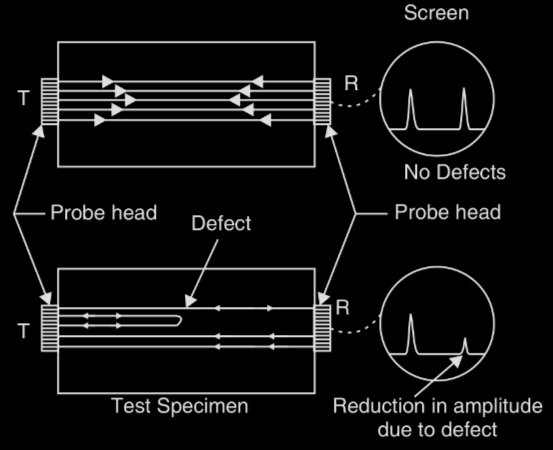
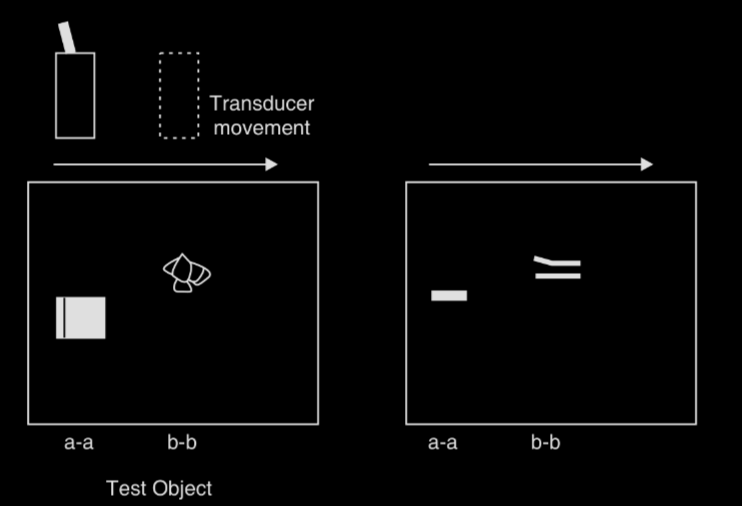
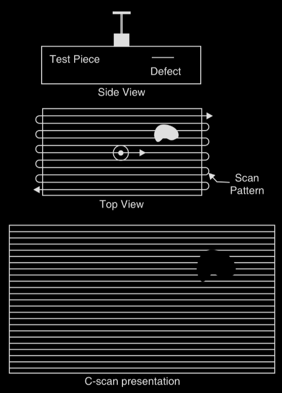

# Ultrasonics

<!--toc:start-->
- [Ultrasonics](#ultrasonics)
  - [Syllabus](#syllabus)
  - [Introduction](#introduction)
    - [Properties of Ultrasonic Waves](#properties-of-ultrasonic-waves)
      - [Reflection and Transmission](#reflection-and-transmission)
  - [Production of Ultrasonic Waves](#production-of-ultrasonic-waves)
    - [Magnetostriction generator](#magnetostriction-generator)
      - [Advantages](#advantages)
      - [Disadvantages](#disadvantages)
    - [Piezoelectric generator](#piezoelectric-generator)
      - [Advantages](#advantages)
  - [Detection](#detection)
    - [Piezoelectric Detection](#piezoelectric-detection)
    - [Acoustic Grating](#acoustic-grating)
  - [Ultrasonic Testing](#ultrasonic-testing)
    - [Non-destructive Testing](#non-destructive-testing)
      - [Normal Beam Pulse-Echo Testing](#normal-beam-pulse-echo-testing)
      - [Normal beam pulse through-transmission testing](#normal-beam-pulse-through-transmission-testing)
  - [Modes of Display](#modes-of-display)
    - [A scan display](#a-scan-display)
    - [B scan display](#b-scan-display)
    - [C scan display](#c-scan-display)
  - [Sonogram](#sonogram)
    - [Principle](#principle)
<!--toc:end-->
---

title: Ultrasonics Notes - Engineering Physics Semester 1

author: Pranaov S

lecturer: N P Rajesh

code: PH1001T

---

## Syllabus

Production - Magnetostriction and Piezoelectric methods

Detection – Piezoelectric, Acoustic grating

Non Destructive Testing

Pulse echo system

Reflection and transmission modes

Modes of data presentation - A, B and C scan displays

Sonogram

## Introduction

Study of ultrasonic sounds is called ultrasonics.

Human ears can hear sound waves ranging from 20 Hz to 20 kHz.
Sounds above 20 kHz are called ultrasonic sounds.

In fluids, ultrasounds are propagated as longitudinal waves, whereas in solids, they travel as both longitudinal and traverse waves.

### Properties of Ultrasonic Waves

1. The speed of propagation of ultrasonic waves depend upon their frequency. It increases with increase in frequency.
2. The wavelength of the waves are very small and the waves exhibit negligible diffraction effects.
3. The can travel over long distances as a highly direction beam and without much loss of energy.
4. The are highly energetic. Intensities are up to $10~kW/m^{2}$. Normally, 1 to 2 $kW/m^{2}$ intensities are used.
5. They produce cavitation effects in liquids.

#### Reflection and Transmission

When an ultrasonic wave is incident on an interface normally,
a portion of the wave is reflected back into the original medium and the rest is transmitted into the second medium.

Amplitude of reflection coefficient $r$ is the ratio of reflected to the incident account pressure amplitude.

$$r = \frac{Z_{1} - Z_{2}}{Z_{1} + Z_{2}}$$

Amplitude transmission coefficient $t$ is the ratio of transmitted to incident acoustic amplitude.

$$t = \frac{2Z_{2}}{Z_{1} + Z_{2}}$$

Reflection coefficient $R$ is the ratio of the amplitude of reflected wave $A_{R}$ to that of the incident wave $A_{I}$

$$R = (\frac{Z_{1} - Z_{2}}{Z_{1}+Z_{2}})^{2}$$

Transmission coefficient $T$ is the ratio of the amplitude of the transmitted wave $A_{T}$ to that of the incident wave $A_{I}$

$$T = \frac{4Z_{1}Z_{2}}{(Z_{1} + Z_{2})^{2}}$$

Where subscripts 1 and 2 refer to medium 1 and 2, respectively, and $Z$ is acoustic impedance.

From $T + R = 1$, percentage of energy reflected at an interface:

$$(\frac{Z_{1} - Z_{2}}{Z_{1}+Z_{2}})^{2} \times 100\%$$

The maximum transmission occurs when impedances of two media are identical,
and are reflected when there is a difference.
This difference is known as __impedance mismatch__.

## Production of Ultrasonic Waves

### Magnetostriction generator

> __Magnetostriction effect:__
> When a rod of ferromagnetic material (such as iron or nickel) is placed in a magnetic field parallel to its length,
> the rod experiences a change in length.
> This change is independent of the direction of the magnetic field and is only dependent on the magnitude of the field and the nature of the material.
> This phenomenon is known as Magnetostriction effect.
>
> Nickel exhibits a large magnetostriction effect compared to other ferromagnetic materials.

A simple method of producing longitudinal vibrations is to apply an AC magnetic field parallel to the axis of the rod of a ferromagnetic material.
An AC magnetic field is produced by wounding coil of wire around the rod and by passing AC current through it.
Let the frequency of the AC current by $f$.
The rod changes in length for once every half-cycle.
If the rod is not magnetized initially, the change in length may either be elongation or contraction.
Normally, the amplitude of vibrations are small,
but when the frequency of the alternating fields is equal to the natural frequency of the rod,
resonance occurs and the vibrations will be considerably larger.
Further, if the frequency of the alternating fields lie in ultrasonic range,
and ultrasound of frequency $2f$ will be generated in the medium present at the ends of the rod.

As the rod vibrates longitudinally, the following relation governs the frequency of oscillations

$$
f = \frac{m}{2L}\sqrt{\frac{Y}{\rho}}
$$

Where $L$ = length of the rod, $Y$ = Young's modulus, $\rho$ = density of the rod, and $m$ = $1,2,3,\dots$

If it is desired that the frequency of the vibration be same as that of the AC current, a steady *__polarizing magnetic field__* must be applied to the bar.

> A polarizing magnetic field can be produced by passing dc current through a second coil

If the magnitude of the polarizing magnetic field is __greater__ than that of the AC field,
frequency of vibration of the bat will be equal to that of the AC magnetic field.

#### Advantages

- Magnetostrictive materials are inexpensive
- Large output power can be produced

#### Disadvantages

- Frequencies higher that 300 kHz cannot be produced
- Single frequency oscillations cannot be generated

### Piezoelectric generator

> __Piezoelectric Effect:__
> When one pair of opposite opposite faces of certain asymmetric crystals such as quartz is compressed,
> opposite electric charges appear on the other pair of opposite faces of the crystals.
> If the crystals are subject to tension (elongation),
> the polarities of the charges are reversed.
> This development of charges as a result of mechanical deformation is known as __direct piezoelectric effect__.
>
> Crystals that exhibit piezoelectric effect are called piezoelectric crystals.
> Examples: Ammonium Phosphate, quartz, PZT (Lead Zirconate Titanate)

> __Inverse Piezoelectric Effect:__
> If an electric field is applied across one pair of faces of a piezoelectric crystal,
> it gets deformed along the direction of the other opposite pair of faces.
> The mechanical deformation of piezoelectric materials caused by external electric field is called __inverse piezoelectric effect__.

Quartz crystal is the most popular choice in making piezoelectric vibrators (transducers).

The axis along the longest dimension is called *optic axis* or *z-axis*.
A plate of quartz crystal cut perpendicular to one of its x-axis is called a *x-cut plate*.
It  generates longitudinal mode of ultrasound to several hundred kHz.
Similarly a crystal cut perpendicular to one of its y-axis is called a *y-cut crystal*. It generates traverse waves of frequencies from 1 MHz to 10MHz.

The frequency of the length vibration of x-cut crystal is:

$$
f = \frac{m}{2l}\sqrt{\frac{Y}{\rho}}
= \frac{m}{2l}\sqrt{\frac{v^{2}\rho}{\rho}}
= \frac{mv}{2l}
$$

Where $l$ = length of the rod, $Y$ = Young's modulus, $\rho$ = density of the rod, $v$ = velocity of sound and $m$ = $1,2,3,\dots$

#### Advantages

- High frequency waves of frequency up to 500 MHz can be generated
- Single frequency output can be obtained
- A range of frequencies can be covered using different transducers

## Detection

### Piezoelectric Detection

Ultrasonic waves are applied to one pair of faces of a quartz crystal.
As a result, varying electric charges are produced on the other pair of faces of the crystal.
These charges, being small, are amplified and detected.

### Acoustic Grating

When ultrasonic waves propagate in a liquid medium,
the alternating compressions and rarefactions change the density of the medium.
It leads to a periodic variation of refractive index of the liquid.

Passing ultrasound in a liquid creates standing wave pattern due to interference between direct and reflected waves.
Nodes are formed at maximum density and anti-nodes are formed at minimum density.

Thus, a liquid column subject to ultrasonic waves act as grating, called __acoustic grating__.

If monochromatic light is passed through the liquid column at right angles, the liquid causes diffraction of light.
The diffraction pattern can be used to determine the wavelength and velocity of waves.

$$
d\sin \theta = n \lambda\\
d = \frac{\lambda_{ac}}{2}\\
\lambda_{ac} = \frac{2n\lambda_{laser}}{\sin \theta}
$$

$$
v = \frac{\mu n \lambda_{ac}}{\sin \theta}\\
v = \frac{2 \mu n \lambda_{laser}}{\sin \theta}
$$

## Ultrasonic Testing

Ultrasonic testing is widely used non-destructive testing (NDT) method.

### Non-destructive Testing

In NDT, frequencies from 100 kHz to 25 kHz.
The ultrasonic waves are generated with piezoelectric devices.

When bursts of alternating voltage are applied to the transducer, the transducer emits ultrasonic beams.
The ultrasonic beams are then transmitted from the transmitter into the specimen under testing.
If there is even a slight discontinuity in the specimen, the ultrasonic waves are reflected back to the transducer.
The transducer then converts the reflected waves back to electrical signals, which are displayed on a screen (CRT).
The characteristics of the pulses produced by the transducer are used for interpretation of the nature and defect in the specimen.

#### Normal Beam Pulse-Echo Testing

An ultrasonic pulse propagating perpendicular to the surface of the test object is reflected at the boundaries of the object
and at the surfaces of defects.
The reflected pulses are known as echoes.

From the transmitter, the electric pulse is fed to the transducer probe.
The piezoelectric transducer is excited by the electric pulse and vibrates at its resonance frequency.
It produces a short ultrasonic pulse, which is propagated into the test object through the couplant layer.
The electric pulse also triggers the time-base generator,
so the pulse of the ultrasound starts to move through the object at the same time as the luminous spot moves across the screen.
If the ultrasonic pulse encounters a defect, part of the energy reflects back to the transducer,
which vibrates and produces a small voltage pulse, which is shown on the screen.
The ultrasonic energy in the transmitted pulse travels further to the bottom and gets reflected back to the transducer,
which is much smaller than transmitted pulse or the pulse reflected from defect.

As the Y-axis of the screen represents time, one can determine the location of the defect in the object.

$$d = \frac{vt}{2}$$

#### Normal beam pulse through-transmission testing

It is used whenever a defect does not provide the required information due to a non-suitable reflection surface,
or if  the orientation is not favourable for detection.

This method uses tow ultrasonic transducers on each side of the specimen.
An ultrasonic pulse, from the transducer is held at the front surface, propagates perpendicularly to the surface.
The transmitted pulses are detected by the second method held at the opposite end of the specimen.

The transmitter and receiver probes are coupled to the specimen using couplant oil.
The pulse generator excites the transmitting transducer, and an ultrasonic pulse is propagated across the specimen.
The pulse travels through the specimen to the other side, which is amplified and displayed on an oscilloscope.
If the ultrasonic pulse travels without encountering any defect, the signal received will be relatively large.
If there is a defect, some energy is reflected and the signal received on the other end will be reduced.

## Modes of Display

### A scan display

A scan display is the most used mode of display.
The x-axis represents time taken by the pulse to the reflecting surface and return back to the transducer.
The y-axis represents the amplitude of the echos.
The location of the defect is estimated by the position of the echo given by it on the horizontal axis.
The size of the defect can be inferred from the relative amplitude of the echo.
Information available in A-scan is one-dimensional.

### B scan display

B-scan display gives cross-sectional view of the test specimen and shows position, orientation and depth of the defects.
Y-axis represents elapsed time,
and x-axis represents position of transducer along a line on the surface of the test specimen,
relative to the starting position of the transducer.
This, the probe movement is displayed in x-direction while distance of defect is shown in y-axis.
Echo amplitude is represented by relative brightness of echo indications.
If a storage oscilloscope is used, the whole picture can be displayed,
revealing depth of defect behind surface and its size in lateral direction.

### C scan display

In C-scan, the transducer is moved over the surface of the test specimen and the echo intensity is recorded as a variation in line shading.
The image shows the plan of the specimen as viewed from the top,
and is a true-to-scale reproduction of the defect in the specimen.
This is used in cases where the depth of defects is not relevant,
but information about their distribution parallel to the test surface is required.

## Sonogram

Ultrasound is widely used in imaging internal organs and structures of the human body.
Ultrasound imaging, also called __sonography__, involves exposing parts of the body to ultrasound to produce pictures of the internal organs.
Sonogram provides valuable information regarding size, location and displacement of given structure, like tumors.
Regions of organ that differ in density displacement can be detected.
It is a noninvasive medical test.

### Principle

Sonography uses a probe containing one or more ultrasonic transducers to send pulses of ultrasound into the body.
Whenever a sound pulse encounters a boundary between two tissue structures, it is partly reflected and partly transmitted.
The sound pulse reflected back is detected as a echo.
The reflection depends on the difference in acoustic impedance of the two tissues.

$$Z = c \times p$$

The time taken for the echo to travel back is measured to calculate the depth of the tissue interface causing the echo.
Since acoustic impedance $\propto$ echo size, if the pulse hits gases or solids,
most of the acoustic energy is reflected and it becomes impossible to see deeper.

$$t = \frac{2l}{v}$$
