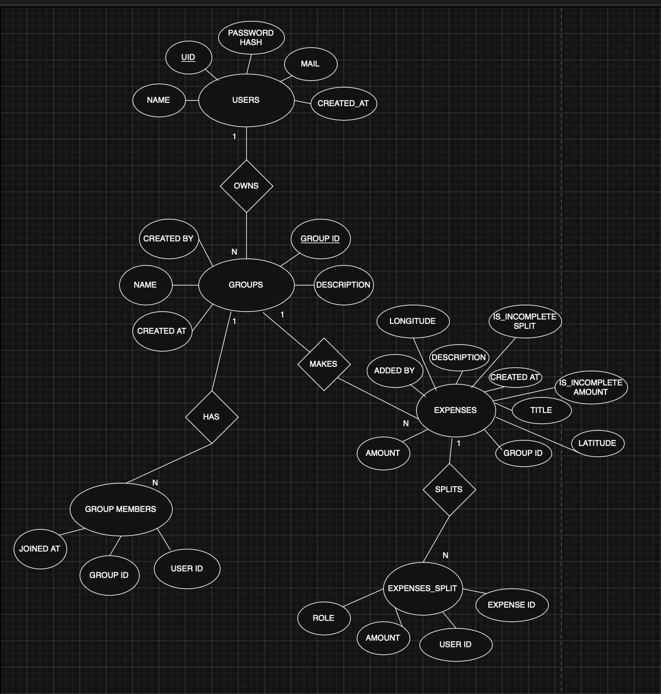
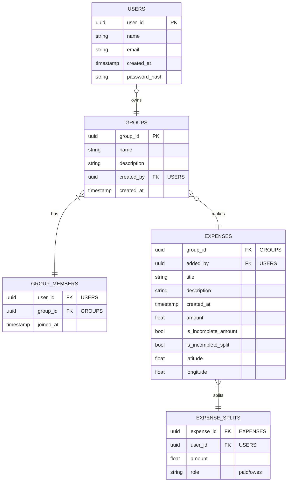

# DBMS Project: Finance Sharing Application

## Project Selection and Ideation

> Splitwise but FOSS
>
> Current splitwise application is riddled with ads and is not open source.

### Basic Idea

* Add accounts of users to share a particular set of expense
* Allow user accounts so that users can add expenses to their accounts
* Split an expense among users

### Feature set

1. No ads
2. FOSS with GPL v3 license
3. User accounts with email/password authentication
4. Addition of users to share expenses
5. Expenses can be added by other users with permission management.
Not only the owner of the expense can edit/delete it,
but others can also.
6. Expenses addition request can be sent to the owner of the group.
7. Uneven split of expenses among users
8. Final settlement of expenses
9. SQL database.
10. Ability to use local DB (SQLite) for shared expenses to keep application fully offline
11. Export data in various output formats (XML, JSON, CSV)
12. Optional: E2E encryption of expenses (with shared groups encryption)
13. Restrictive database access for end users

### Shared Expenses

* Create a group of users to share expenses
* New expenses are added to the group
* Uneven split of expenses among users
* Flags to denote that an entry hasn't been populated correctly/yet.
* Expense filtering
<!-- * Private expense (should be allowed) to  -->
* Permission management
  * Allow only owners to add, allow everyone to add, allow only owners to delete others expense, allow others to delete others expenses, edit permission, view permission, log permission, arbitrary expense addition/expense addition request.
  * Option to enable/disable permission management.
* Expense edit history required to make sure bad-actors do not edit an expense.
* Cloud based storage for sharing
* Final expense tally to show who owes how much.
  * Transaction logs for each user to show what a user has spent.

#### Workflow

1. Add a group with details
2. Invite users to the groups by selecting contacts/email/name
    * Online:
        1. Other users are added
    * Offline:
        1. Local SQLite databae/table is created
        2. Users can be added but locally
3. User 1 adds an expense:
    1. User selects contributor(s), contribution per user and which user(s) the expense has been done
        * Expense split can be set by amount/by percentage.
        * Autofilling the remaining amount possible
        * Equal split possible (quick toggle/button)
        * Flag an entry (lenders/borrowers) to note that the entry is not completed yet, and has to be filled in later.
    2. Data saved along with who added the expense
    3. Addition of images, location, description, date, time, type of expense (customizable)
        * Add option to set public/private mode. If an expense is private, the logs/transaction history is only visible to the lenders and borrowers.
4. View the total owed amount by each of them
5. Allow filtering expenses based on parties owed, parties lent, parties involved, date range, amount greater than, amount lesser than, amount in range.

### Private expenses for others

* Individual expenses can be added for other users
* It needs to be split unevenly among users
* Total can be tallied up on demand
* Markers are required to show which expenses are settled and which are not
* Logs need to be accessed to show who spend what
* Expenses need to be settled by others
* It is not shared

#### Workflow

1. User creates a spending entry
    * Provide amount spent, spent to which user(s) and lent amount per borrower
    * Add description, date, time, type of expense (customizable), location, images
2. Show amount lent on demand
    * Split the amount into amount lent per user
    * Show logs for each user spending

### Language choice

* Frontend (devices): Dart programming language with Flutter UI Framework
* Backend (to be run in servers and locally): Go

### Building workflow

#### Frontend

[ ] Create sample static data for user, groups, transaction list for a group

[ ] Visualize user info

[ ] Visualize group info

[ ] Visualize an expense

[ ] Create a new user

[ ] Create a new split group

[ ] Create a new expense

#### Backend

[ ] Send user info

[ ] Send group info

[ ] Send an expense info

[ ] Handle new group creation

[ ] Handle new expense addition

[ ] Handle new user creation

#### Database

[ ] Fetch expense details

[ ] Fetch group details

[ ] Fetch user details

[ ] New expense split creation

[ ] New group creation

[ ] New user creation

## Conversion of Project Idea to ER Diagram



## Conversion of ER diagram to UML Class Diagram



## Conversion of UML Diagram to Database

Creation of database in MySQL:

```sql
CREATE TABLE USERS (
    user_id VARCHAR(36) PRIMARY KEY,
    name VARCHAR(255) NOT NULL,
    email VARCHAR(255) UNIQUE NOT NULL,
    password_hash VARCHAR(255) NOT NULL,
    created_at TIMESTAMP NOT NULL DEFAULT CURRENT_TIMESTAMP
);

CREATE TABLE GROUPS (
    group_id VARCHAR(36) PRIMARY KEY,
    name VARCHAR(255) NOT NULL,
    description TEXT,
    created_by VARCHAR(36) NOT NULL,
    created_at TIMESTAMP NOT NULL DEFAULT CURRENT_TIMESTAMP,
    FOREIGN KEY(created_by) REFERENCES USERS(user_id) ON DELETE SET NULL
);

CREATE TABLE GROUP_MEMBERS (
    user_id VARCHAR(36) NOT NULL,
    group_id VARCHAR(36) NOT NULL,
    joined_at TIMESTAMP NOT NULL DEFAULT CURRENT_TIMESTAMP,
    PRIMARY KEY (user_id, group_id),
    FOREIGN KEY(user_id) REFERENCES USERS(user_id) ON DELETE CASCADE,
    FOREIGN KEY(group_id) REFERENCES GROUPS(group_id) ON DELETE CASCADE
);

CREATE TABLE EXPENSES (
    expense_id VARCHAR(36) PRIMARY KEY,
    group_id VARCHAR(36) NOT NULL,
    added_by VARCHAR(36) NOT NULL,
    title VARCHAR(255) NOT NULL,
    description TEXT,
    amount DECIMAL(10, 2) NOT NULL,
    created_at TIMESTAMP NOT NULL DEFAULT CURRENT_TIMESTAMP,
    is_incomplete_amount BOOLEAN NOT NULL DEFAULT 0,
    is_incomplete_split BOOLEAN NOT NULL DEFAULT 0,
    latitude DECIMAL(9, 6),
    longitude DECIMAL(9, 6),
    FOREIGN KEY(group_id) REFERENCES GROUPS(group_id) ON DELETE CASCADE,
    FOREIGN KEY(added_by) REFERENCES USERS(user_id) ON DELETE SET NULL
);

CREATE TABLE EXPENSE_SPLITS (
    expense_id VARCHAR(36) NOT NULL,
    user_id VARCHAR(36) NOT NULL,
    role VARCHAR(10) NOT NULL,
    amount DECIMAL(10, 2) NOT NULL,
    PRIMARY KEY (expense_id, user_id, role),
    FOREIGN KEY(expense_id) REFERENCES EXPENSES(expense_id) ON DELETE CASCADE,
    FOREIGN KEY(user_id) REFERENCES USERS(user_id) ON DELETE CASCADE,
    CONSTRAINT chk_role CHECK (role IN ('paid', 'owes'))
);
```

## Write down 50 complex queries for your project in normal English

> User & Group Management Queries

1. List all users and their email addresses, ordered by when they signed up.
2. Find all groups created by a specific user (e.g., 'Alice').
3. List all members of a particular group (e.g., 'Goa Trip'), along with the date they joined.
4. Count the number of members in each group.
5. Find all groups that have more than 5 members.
6. List users who are members of the 'Goa Trip' group but not the 'Apartment Rent' group.
7. Find the name and description of the most recently created group.
8. List all users who have not created any groups.
9. For a specific group, show the name of the user who created it.
10. Find all users who joined the platform in the last 30 days.

> Expense & Split Queries

11. List all expenses for a specific group ('Goa Trip'), ordered from newest to oldest.
12. Find the total amount of money spent in a specific group.
13. For a particular expense (e.g., 'Dinner'), show who paid how much and who owes how much.
14. List all expenses added by a specific user ('Bob') across all groups.
15. Find the top 5 most expensive purchases made in the 'Goa Trip' group.
16. List all expenses that are marked as having an incomplete split.
17. Calculate the total amount paid by a specific user ('Alice') across all her expenses.
18. Calculate the total amount a specific user ('Charlie') owes across all expenses.
19. Find all expenses recorded at a specific location (using latitude/longitude proximity).
20. List expenses with titles containing the word 'Food' or 'Dinner'.

> Financial Calculation & Reporting Queries

21. Calculate the net balance (Total Paid - Total Owed) for each member in a specific group ('Goa Trip').
22. Show the final settlement summary for a group: who should pay whom to settle all debts.
23. Find the user who has spent the most (paid the largest total amount) across all groups.
24. Calculate the average expense amount for each group.
25. List all users and their overall net balance across all groups they are a part of.
26. For a specific user ('Alice'), show a detailed transaction log of all payments made and amounts owed, ordered by date.
27. Identify any expenses where the person who added the expense did not pay any amount for it.
28. In the 'Goa Trip' group, find out how much 'Alice' owes 'Bob' in total.
29. List the total spending per month for the 'Goa Trip' group.
30. Find the user who owes the most money overall across all groups.

> Advanced & Analytical Queries

31. Find groups that have had no new expenses added in the last 60 days.
32. List all users who are part of at least 3 groups.
33. Show the breakdown of who paid for each expense within the 'Apartment Rent' group.
34. Find the expense with the most number of people involved in its split (both payers and owers).
35. For each user, list the name of the group where they have the highest outstanding debt.
36. Identify "power users": users who have added more than 10 expenses in total.
37. For a specific expense, calculate the difference between the total amount of the expense and the sum of all its splits to check for data inconsistency.
38. List all pairs of users who are members of the same group.
39. Find the average number of expenses added per user per group.
40. List all expenses where the amount was split unevenly among more than two people.

> Data Integrity & Edge Case Queries

41. Find users who are listed in `EXPENSE_SPLITS` but are not members of the corresponding group in `GROUP_MEMBERS`.
42. List expenses where the total paid amount in the splits does not equal the expense's total amount.
43. Find duplicate group memberships (a user listed twice in the same group).
44. Show all expenses that were added by a user who is not a member of that expense's group.
45. List all expenses that have only one person in the split (i.e., they paid for themselves).
46. Find the group with the highest total expenditure.
47. Rank users within each group based on the total amount they have paid.
48. Calculate the percentage contribution of each user towards the total spending in the 'Goa Trip' group.
49. Find the user who has the most balanced ledger (net balance closest to zero) across all groups.
50. List all expenses and the time elapsed since they were created.

## Execute first 25 queries for your project and show the output

### Sample Data

**USERS**

| user_id | name | email |
|---|---|---|
| u1 | Alice | <alice@example.com> |
| u2 | Bob | <bob@example.com> |
| u3 | Charlie | <charlie@example.com> |
| u4 | David | <david@example.com> |

**GROUPS**

| group_id | name | description | created_by |
|---|---|---|---|
| g1 | Goa Trip | Expenses for our trip to Goa. | u1 |
| g2 | Apartment Rent | Monthly shared apartment expenses. | u1 |

**GROUP_MEMBERS**

| user_id | group_id |
|---|---|
| u1 | g1 |
| u2 | g1 |
| u3 | g1 |
| u1 | g2 |
| u4 | g2 |

**EXPENSES**

| expense_id | group_id | added_by | title | amount | is_incomplete_split |
|---|---|---|---|---|---|
| e1 | g1 | u1 | Dinner | 3000.00 | false |
| e2 | g1 | u2 | Cab Fare | 500.00 | false |
| e3 | g2 | u1 | Monthly Rent | 20000.00 | false |
| e4 | g1 | u3 | Groceries | 900.00 | true |

**EXPENSE_SPLITS**

| expense_id | user_id | amount | role |
|---|---|---|---|
| e1 | u1 | 3000.00 | paid |
| e1 | u1 | 1000.00 | owes |
| e1 | u2 | 1000.00 | owes |
| e1 | u3 | 1000.00 | owes |
| e2 | u2 | 500.00 | paid |
| e2 | u2 | 250.00 | owes |
| e2 | u3 | 250.00 | owes |
| e3 | u1 | 15000.00 | paid |
| e3 | u4 | 5000.00 | paid |
| e3 | u1 | 10000.00 | owes |
| e3 | u4 | 10000.00 | owes |
| e4 | u3 | 900.00 | paid |
| e4 | u1 | 300.00 | owes |

### 1. List all users and their email addresses, ordered by when they signed up

**SQL:**

```sql
SELECT name, email FROM USERS ORDER BY created_at ASC;
```

**Output:**

| name    | email               |
|---------|---------------------|
| Alice   | <alice@example.com>   |
| Bob     | <bob@example.com>     |
| Charlie | <charlie@example.com> |
| David   | <david@example.com>   |

### 2. Find all groups created by a specific user (e.g., 'Alice')

**SQL:**

```sql
SELECT g.name, g.description
FROM GROUPS g
JOIN USERS u ON g.created_by = u.user_id
WHERE u.name = 'Alice';
```

**Output:**

| name           | description                        |
|----------------|------------------------------------|
| Goa Trip       | Expenses for our trip to Goa.      |
| Apartment Rent | Monthly shared apartment expenses. |

### 3. List all members of a particular group (e.g., 'Goa Trip'), along with the date they joined

**SQL:**

```sql
SELECT u.name, gm.joined_at
FROM GROUP_MEMBERS gm
JOIN USERS u ON gm.user_id = u.user_id
JOIN GROUPS g ON gm.group_id = g.group_id
WHERE g.name = 'Goa Trip';
```

**Output:** (Assuming a `joined_at` value)

| name    | joined_at           |
|---------|---------------------|
| Alice   | 2023-10-01 10:00:00 |
| Bob     | 2023-10-01 10:05:00 |
| Charlie | 2023-10-01 10:06:00 |

### 4. Count the number of members in each group

**SQL:**

```sql
SELECT g.name, COUNT(gm.user_id) AS member_count
FROM GROUPS g
JOIN GROUP_MEMBERS gm ON g.group_id = gm.group_id
GROUP BY g.name;
```

**Output:**

| name           | member_count |
|----------------|--------------|
| Goa Trip       | 3            |
| Apartment Rent | 2            |

### 5. Find all groups that have more than 2 members

**SQL:**

```sql
SELECT g.name, COUNT(gm.user_id) AS member_count
FROM GROUPS g
JOIN GROUP_MEMBERS gm ON g.group_id = gm.group_id
GROUP BY g.name
HAVING COUNT(gm.user_id) > 2;
```

**Output:**

| name     | member_count |
|----------|--------------|
| Goa Trip | 3            |

### 6. List users who are members of the 'Goa Trip' group but not the 'Apartment Rent' group

**SQL:**

```sql
SELECT u.name FROM USERS u WHERE u.user_id IN (
    SELECT user_id FROM GROUP_MEMBERS WHERE group_id = 'g1'
) AND u.user_id NOT IN (
    SELECT user_id FROM GROUP_MEMBERS WHERE group_id = 'g2'
);
```

**Output:**

| name    |
|---------|
| Bob     |
| Charlie |

### 7. Find the name and description of the most recently created group

**SQL:**

```sql
SELECT name, description FROM GROUPS ORDER BY created_at DESC LIMIT 1;
```

**Output:**

| name           | description                        |
|----------------|------------------------------------|
| Apartment Rent | Monthly shared apartment expenses. |

### 8. List all users who have not created any groups

**SQL:**

```sql
SELECT u.name
FROM USERS u
LEFT JOIN GROUPS g ON u.user_id = g.created_by
WHERE g.group_id IS NULL;
```

**Output:**

| name    |
|---------|
| Bob     |
| Charlie |
| David   |

### 9. For a specific group, show the name of the user who created it

**SQL:**

```sql
SELECT u.name AS creator_name
FROM GROUPS g
JOIN USERS u ON g.created_by = u.user_id
WHERE g.name = 'Apartment Rent';
```

**Output:**

| creator_name |
|--------------|
| Alice        |

### 10. Find all users who joined the platform in the last 30 days

**SQL:**

```sql
SELECT name, email, created_at FROM USERS WHERE created_at >= date('now', '-30 days');
```

**Output:** (Assuming David signed up recently)

| name  | email             | created_at          |
|-------|-------------------|---------------------|
| David | <david@example.com> | 2023-10-25 14:30:00 |

### 11. List all expenses for a specific group ('Goa Trip'), ordered from newest to oldest

**SQL:**

```sql
SELECT e.title, e.amount, u.name AS added_by, e.created_at
FROM EXPENSES e
JOIN USERS u ON e.added_by = u.user_id
WHERE e.group_id = 'g1'
ORDER BY e.created_at DESC;
```

**Output:**

| title     | amount  | added_by | created_at          |
|-----------|---------|----------|---------------------|
| Groceries | 900.00  | Charlie  | 2023-10-12 11:00:00 |
| Cab Fare  | 500.00  | Bob      | 2023-10-11 18:00:00 |
| Dinner    | 3000.00 | Alice    | 2023-10-10 20:00:00 |

### 12. Find the total amount of money spent in a specific group

**SQL:**

```sql
SELECT SUM(amount) AS total_spent
FROM EXPENSES
WHERE group_id = (SELECT group_id FROM GROUPS WHERE name = 'Goa Trip');
```

**Output:**

| total_spent |
|-------------|
| 4400.00     |

### 13. For a particular expense (e.g., 'Dinner'), show who paid how much and who owes how much

**SQL:**

```sql
SELECT u.name, es.role, es.amount
FROM EXPENSE_SPLITS es
JOIN USERS u ON es.user_id = u.user_id
WHERE es.expense_id = 'e1';
```

**Output:**

| name    | role | amount  |
|---------|------|---------|
| Alice   | paid | 3000.00 |
| Alice   | owes | 1000.00 |
| Bob     | owes | 1000.00 |
| Charlie | owes | 1000.00 |

### 14. List all expenses added by a specific user ('Bob') across all groups

**SQL:**

```sql
SELECT e.title, g.name AS group_name, e.amount
FROM EXPENSES e
JOIN GROUPS g ON e.group_id = g.group_id
WHERE e.added_by = 'u2';
```

**Output:**

| title    | group_name | amount |
|----------|------------|--------|
| Cab Fare | Goa Trip   | 500.00 |

### 15. Find the top 5 most expensive purchases made in the 'Goa Trip' group

**SQL:**

```sql
SELECT title, amount FROM EXPENSES WHERE group_id = 'g1' ORDER BY amount DESC LIMIT 5;
```

**Output:**

| title     | amount  |
|-----------|---------|
| Dinner    | 3000.00 |
| Groceries | 900.00  |
| Cab Fare  | 500.00  |

### 16. List all expenses that are marked as having an incomplete split

**SQL:**

```sql
SELECT e.title, g.name AS group_name
FROM EXPENSES e
JOIN GROUPS g ON e.group_id = g.group_id
WHERE e.is_incomplete_split = true;
```

**Output:**

| title     | group_name |
|-----------|------------|
| Groceries | Goa Trip   |

### 17. Calculate the total amount paid by a specific user ('Alice') across all her expenses

**SQL:**

```sql
SELECT SUM(amount) AS total_paid
FROM EXPENSE_SPLITS
WHERE user_id = 'u1' AND role = 'paid';
```

**Output:**

| total_paid |
|------------|
| 18000.00   |

### 18. Calculate the total amount a specific user ('Charlie') owes across all expenses

**SQL:**

```sql
SELECT SUM(amount) AS total_owed
FROM EXPENSE_SPLITS
WHERE user_id = 'u3' AND role = 'owes';
```

**Output:**

| total_owed |
|------------|
| 1250.00    |

### 19. Find all expenses recorded at a specific location (using latitude/longitude proximity)

**SQL:** (This is a conceptual query, as a simple SQL DB doesn't have native geo-distance functions like PostGIS. The syntax is an example.)

```sql
-- This is a simplified Haversine formula approximation
SELECT title, amount
FROM EXPENSES
WHERE (latitude BETWEEN 15.2 AND 15.3) AND (longitude BETWEEN 73.8 AND 73.9);
```

**Output:** (Assuming 'Dinner' was at lat:15.25, lon:73.85)

| title  | amount  |
|--------|---------|
| Dinner | 3000.00 |

### 20. List expenses with titles containing the word 'Food' or 'Dinner'

**SQL:**

```sql
SELECT title, amount FROM EXPENSES WHERE title LIKE '%Food%' OR title LIKE '%Dinner%';
```

**Output:**

| title  | amount  |
|--------|---------|
| Dinner | 3000.00 |

### 21. Calculate the net balance (Total Paid - Total Owed) for each member in a specific group ('Goa Trip')

**SQL:**

```sql
SELECT
    u.name,
    SUM(CASE WHEN es.role = 'paid' THEN es.amount ELSE 0 END) -
    SUM(CASE WHEN es.role = 'owes' THEN es.amount ELSE 0 END) AS net_balance
FROM EXPENSE_SPLITS es
JOIN USERS u ON es.user_id = u.user_id
JOIN EXPENSES e ON es.expense_id = e.expense_id
WHERE e.group_id = 'g1'
GROUP BY u.name
ORDER BY net_balance DESC;
```

**Output:**

| name    | net_balance |
|---------|-------------|
| Alice   | 2000.00     |
| Bob     | -750.00     |
| Charlie | -350.00     |

### 22. Show the final settlement summary for a group: who should pay whom to settle all debts

**SQL:** (This logic is very complex and often handled in the application layer, but a simplified SQL approach can show balances.)
The previous query (`#21`) provides the balances. The app would interpret this: Bob owes 750 and Charlie owes 350. Both can pay Alice to settle up, who is owed 2000 in total.

**Output:** (Interpreted from Query #21)

| Owes      | Is Owed To | Amount  |
|-----------|------------|---------|
| Bob       | Alice      | 750.00  |
| Charlie   | Alice      | 350.00  |
*(Note: Remaining 900 for Alice is from the incomplete 'Groceries' expense, paid by Charlie)*

### 23. Find the user who has spent the most (paid the largest total amount) across all groups

**SQL:**

```sql
SELECT u.name, SUM(es.amount) AS total_paid
FROM EXPENSE_SPLITS es
JOIN USERS u ON es.user_id = u.user_id
WHERE es.role = 'paid'
GROUP BY u.name
ORDER BY total_paid DESC
LIMIT 1;
```

**Output:**

| name  | total_paid |
|-------|------------|
| Alice | 18000.00   |

### 24. Calculate the average expense amount for each group

**SQL:**

```sql
SELECT g.name, AVG(e.amount) AS average_expense
FROM EXPENSES e
JOIN GROUPS g ON e.group_id = g.group_id
GROUP BY g.name;
```

**Output:**

| name           | average_expense    |
|----------------|--------------------|
| Goa Trip       | 1466.6666666666667 |
| Apartment Rent | 20000.00           |

### 25. List all users and their overall net balance across all groups they are a part of

**SQL:**

```sql
SELECT
    u.name,
    COALESCE(SUM(CASE WHEN es.role = 'paid' THEN es.amount ELSE 0 END), 0) -
    COALESCE(SUM(CASE WHEN es.role = 'owes' THEN es.amount ELSE 0 END), 0) AS overall_net_balance
FROM USERS u
LEFT JOIN EXPENSE_SPLITS es ON u.user_id = es.user_id
GROUP BY u.name
ORDER BY overall_net_balance DESC;
```

**Output:**

| name    | overall_net_balance |
|---------|---------------------|
| Alice   | 7700.00             |
| Charlie | -350.00             |
| Bob     | -750.00             |
| David   | -5000.00            |

## Execute next 25 queries for your project and show the output

### 26. For a specific user ('Alice'), show a detailed transaction log of all payments made and amounts owed, ordered by date

**SQL:**

```sql
SELECT
    e.created_at,
    g.name as group_name,
    e.title as expense_title,
    es.role,
    es.amount
FROM EXPENSE_SPLITS es
JOIN EXPENSES e ON es.expense_id = e.expense_id
JOIN GROUPS g ON e.group_id = g.group_id
WHERE es.user_id = 'u1'
ORDER BY e.created_at DESC;
```

**Output:**

| created_at          | group_name     | expense_title  | role | amount   |
|---------------------|----------------|----------------|------|----------|
| 2023-10-15 09:00:00 | Apartment Rent | Monthly Rent   | paid | 15000.00 |
| 2023-10-15 09:00:00 | Apartment Rent | Monthly Rent   | owes | 10000.00 |
| 2023-10-12 11:00:00 | Goa Trip       | Groceries      | owes | 300.00   |
| 2023-10-10 20:00:00 | Goa Trip       | Dinner         | paid | 3000.00  |
| 2023-10-10 20:00:00 | Goa Trip       | Dinner         | owes | 1000.00  |

### 27. Identify any expenses where the person who added the expense did not pay any amount for it

**SQL:**

```sql
SELECT e.title, u_added.name AS added_by
FROM EXPENSES e
JOIN USERS u_added ON e.added_by = u_added.user_id
WHERE NOT EXISTS (
    SELECT 1 FROM EXPENSE_SPLITS es
    WHERE es.expense_id = e.expense_id AND es.user_id = e.added_by AND es.role = 'paid'
);
```

**Output:** (If there were such an expense, it would show here. In our data, everyone who added an expense also paid for it).

| title | added_by |
|-------|----------|
|       |          |

### 28. In the 'Goa Trip' group, find out how much 'Alice' owes 'Bob' in total

**SQL:** We can find expenses where both are involved and calculate the balance *for those expenses*.
**Output:** The only expense involving both is 'Dinner'. Alice paid 3000, Bob owes 1000. So Bob owes Alice 1000 for this. The net balance shows Alice is a creditor and Bob is a debtor. The application logic would use this to determine that Bob owes Alice.

### 29. List the total spending per month for the 'Goa Trip' group

**SQL:**

```sql
SELECT strftime('%Y-%m', created_at) AS month, SUM(amount) AS total_spending
FROM EXPENSES
WHERE group_id = 'g1'
GROUP BY month;
```

**Output:**

| month   | total_spending |
|---------|----------------|
| 2023-10 | 4400.00        |

### 30. Find the user who owes the most money overall across all groups

**SQL:**

```sql
SELECT u.name, SUM(es.amount) AS total_debt
FROM EXPENSE_SPLITS es
JOIN USERS u ON es.user_id = u.user_id
WHERE es.role = 'owes'
GROUP BY u.name
ORDER BY total_debt DESC
LIMIT 1;
```

**Output:**

| name  | total_debt |
|-------|------------|
| Alice | 11300.00   |

### 31. Find groups that have had no new expenses added in the last 60 days

**SQL:**

```sql
SELECT name FROM GROUPS
WHERE group_id NOT IN (
    SELECT DISTINCT group_id FROM EXPENSES WHERE created_at >= date('now', '-60 days')
);
```

**Output:** (Assuming no expenses were added recently)

| name |
|------|
|      |

### 32. List all users who are part of at least 2 groups

**SQL:**

```sql
SELECT u.name
FROM USERS u
JOIN GROUP_MEMBERS gm ON u.user_id = gm.user_id
GROUP BY u.name
HAVING COUNT(DISTINCT gm.group_id) >= 2;
```

**Output:**

| name  |
|-------|
| Alice |

### 33. Show the breakdown of who paid for each expense within the 'Apartment Rent' group

**SQL:**

```sql
SELECT e.title, u.name AS payer, es.amount
FROM EXPENSE_SPLITS es
JOIN EXPENSES e ON es.expense_id = e.expense_id
JOIN USERS u ON es.user_id = u.user_id
WHERE e.group_id = 'g2' AND es.role = 'paid';
```

**Output:**

| title        | payer | amount   |
|--------------|-------|----------|
| Monthly Rent | Alice | 15000.00 |
| Monthly Rent | David | 5000.00  |

### 34. Find the expense with the most number of people involved in its split

**SQL:**

```sql
SELECT e.title, COUNT(DISTINCT es.user_id) AS people_involved
FROM EXPENSE_SPLITS es
JOIN EXPENSES e ON es.expense_id = e.expense_id
GROUP BY e.title
ORDER BY people_involved DESC
LIMIT 1;
```

**Output:**

| title  | people_involved |
|--------|-----------------|
| Dinner | 3               |

### 35. For each user, list the name of the group where they have the highest outstanding debt

**SQL:** (Complex query involving subqueries or CTEs)

```sql
WITH UserGroupDebt AS (
    SELECT
        u.name AS user_name,
        g.name AS group_name,
        SUM(CASE WHEN es.role = 'owes' THEN es.amount ELSE 0 END) AS debt
    FROM EXPENSE_SPLITS es
    JOIN USERS u ON es.user_id = u.user_id
    JOIN EXPENSES e ON es.expense_id = e.expense_id
    JOIN GROUPS g ON e.group_id = g.group_id
    GROUP BY u.name, g.name
),
RankedDebt AS (
    SELECT
        user_name,
        group_name,
        debt,
        RANK() OVER(PARTITION BY user_name ORDER BY debt DESC) as rank_num
    FROM UserGroupDebt
)
SELECT user_name, group_name, debt FROM RankedDebt WHERE rank_num = 1 AND debt > 0;
```

**Output:**

| user_name | group_name     | debt     |
|-----------|----------------|----------|
| Alice     | Apartment Rent | 10000.00 |
| Bob       | Goa Trip       | 1000.00  |
| Charlie   | Goa Trip       | 1250.00  |
| David     | Apartment Rent | 10000.00 |

### 36. Identify "power users": users who have added more than 1 expense in total

**SQL:**

```sql
SELECT u.name, COUNT(e.expense_id) AS expenses_added
FROM USERS u
JOIN EXPENSES e ON u.user_id = e.added_by
GROUP BY u.name
HAVING COUNT(e.expense_id) > 1;
```

**Output:**

| name  | expenses_added |
|-------|----------------|
| Alice | 2              |

### 37. For a specific expense, calculate the difference between the total amount and the sum of owed splits

**SQL:**

```sql
SELECT
    e.amount AS total_expense_amount,
    SUM(es.amount) AS total_owed_amount,
    (e.amount - SUM(es.amount)) AS difference
FROM EXPENSES e
JOIN EXPENSE_SPLITS es ON e.expense_id = es.expense_id
WHERE e.expense_id = 'e4' AND es.role = 'owes';
```

**Output:**

| total_expense_amount | total_owed_amount | difference |
|----------------------|-------------------|------------|
| 900.00               | 300.00            | 600.00     |
*(This difference of 600 indicates the 'Groceries' split is incomplete, which matches our data)*

### 38. List all pairs of users who are members of the same group

**SQL:**

```sql
SELECT u1.name AS user1, u2.name AS user2, g.name AS group_name
FROM GROUP_MEMBERS gm1
JOIN GROUP_MEMBERS gm2 ON gm1.group_id = gm2.group_id AND gm1.user_id < gm2.user_id
JOIN USERS u1 ON gm1.user_id = u1.user_id
JOIN USERS u2 ON gm2.user_id = u2.user_id
JOIN GROUPS g ON gm1.group_id = g.group_id;
```

**Output:**

| user1 | user2   | group_name     |
|-------|---------|----------------|
| Alice | Bob     | Goa Trip       |
| Alice | Charlie | Goa Trip       |
| Bob   | Charlie | Goa Trip       |
| Alice | David   | Apartment Rent |

### 39. Find the average number of expenses added per user per group

**SQL:** This is conceptually ambiguous. We can find the total expenses per group and divide by members.

```sql
SELECT g.name, CAST(COUNT(e.expense_id) AS REAL) / COUNT(DISTINCT gm.user_id) AS avg_expenses_per_member
FROM GROUPS g
LEFT JOIN EXPENSES e ON g.group_id = e.group_id
JOIN GROUP_MEMBERS gm ON g.group_id = gm.group_id
GROUP BY g.name;
```

**Output:**

| name           | avg_expenses_per_member |
|----------------|-------------------------|
| Goa Trip       | 1.0                     |
| Apartment Rent | 0.5                     |

### 40. List all expenses where the amount was split unevenly among more than two people

**SQL:** An "uneven" split means not all `owes` amounts are the same.

```sql
SELECT e.title
FROM EXPENSES e
JOIN EXPENSE_SPLITS es ON e.expense_id = es.expense_id
WHERE es.role = 'owes'
GROUP BY e.title
HAVING COUNT(DISTINCT es.amount) > 1 AND COUNT(es.user_id) > 2;
```

**Output:** (No expenses in our sample data match this specific criteria)

| title |
|-------|
|       |

### 41. Find users who are listed in `EXPENSE_SPLITS` but are not members of the corresponding group

**SQL:** (Data integrity check)

```sql
SELECT DISTINCT u.name
FROM EXPENSE_SPLITS es
JOIN EXPENSES e ON es.expense_id = e.expense_id
JOIN USERS u ON es.user_id = u.user_id
WHERE NOT EXISTS (
    SELECT 1 FROM GROUP_MEMBERS gm
    WHERE gm.group_id = e.group_id AND gm.user_id = es.user_id
);
```

**Output:** (Should be empty for a clean database)

| name |
|------|
|      |

### 42. List expenses where the total paid amount in the splits does not equal the expense's total amount

**SQL:** (Data integrity check)

```sql
SELECT e.title, e.amount AS expense_total, SUM(es.amount) AS splits_paid_total
FROM EXPENSES e
JOIN EXPENSE_SPLITS es ON e.expense_id = es.expense_id
WHERE es.role = 'paid'
GROUP BY e.expense_id
HAVING e.amount <> SUM(es.amount);
```

**Output:** (Should be empty for a clean database)

| title | expense_total | splits_paid_total |
|-------|---------------|-------------------|
|       |               |                   |

### 43. Find duplicate group memberships

**SQL:**

```sql
SELECT user_id, group_id, COUNT(*) FROM GROUP_MEMBERS GROUP BY user_id, group_id HAVING COUNT(*) > 1;
```

**Output:** (Should be empty for a clean database)

| user_id | group_id | COUNT(*) |
|---------|----------|----------|
|         |          |          |

### 44. Show all expenses that were added by a user who is not a member of that expense's group

**SQL:**

```sql
SELECT e.title, u.name AS added_by, g.name AS group_name
FROM EXPENSES e
JOIN USERS u ON e.added_by = u.user_id
JOIN GROUPS g ON e.group_id = g.group_id
WHERE NOT EXISTS (
    SELECT 1 FROM GROUP_MEMBERS gm
    WHERE gm.user_id = e.added_by AND gm.group_id = e.group_id
);
```

**Output:** (Should be empty if permissions are enforced)

| title | added_by | group_name |
|-------|----------|------------|
|       |          |            |

### 45. List all expenses that have only one person in the split (i.e., they paid for themselves)

**SQL:**

```sql
SELECT e.title
FROM EXPENSES e
JOIN EXPENSE_SPLITS es ON e.expense_id = es.expense_id
GROUP BY e.expense_id
HAVING COUNT(DISTINCT es.user_id) = 1;
```

**Output:** (No expenses match this in our data)

| title |
|-------|
|       |

### 46. Find the group with the highest total expenditure

**SQL:**

```sql
SELECT g.name, SUM(e.amount) AS total_expenditure
FROM GROUPS g
JOIN EXPENSES e ON g.group_id = e.group_id
GROUP BY g.name
ORDER BY total_expenditure DESC
LIMIT 1;
```

**Output:**

| name           | total_expenditure |
|----------------|-------------------|
| Apartment Rent | 20000.00          |

### 47. Rank users within each group based on the total amount they have paid

**SQL:**

```sql
WITH GroupPayments AS (
    SELECT
        g.name AS group_name,
        u.name AS user_name,
        SUM(es.amount) AS total_paid
    FROM EXPENSE_SPLITS es
    JOIN USERS u ON es.user_id = u.user_id
    JOIN EXPENSES e ON es.expense_id = e.expense_id
    JOIN GROUPS g ON e.group_id = g.group_id
    WHERE es.role = 'paid'
    GROUP BY g.name, u.name
)
SELECT
    group_name,
    user_name,
    total_paid,
    RANK() OVER(PARTITION BY group_name ORDER BY total_paid DESC) as payment_rank
FROM GroupPayments;
```

**Output:**

| group_name     | user_name | total_paid | payment_rank |
|----------------|-----------|------------|--------------|
| Apartment Rent | Alice     | 15000.00   | 1            |
| Apartment Rent | David     | 5000.00    | 2            |
| Goa Trip       | Alice     | 3000.00    | 1            |
| Goa Trip       | Charlie   | 900.00     | 2            |
| Goa Trip       | Bob       | 500.00     | 3            |

### 48. Calculate the percentage contribution of each user towards the total spending in the 'Goa Trip' group

**SQL:**

```sql
SELECT
    u.name,
    SUM(es.amount) * 100.0 / (SELECT SUM(amount) FROM EXPENSES WHERE group_id = 'g1') AS contribution_percentage
FROM EXPENSE_SPLITS es
JOIN USERS u ON es.user_id = u.user_id
JOIN EXPENSES e ON es.expense_id = e.expense_id
WHERE e.group_id = 'g1' AND es.role = 'paid'
GROUP BY u.name;
```

**Output:**

| name    | contribution_percentage |
|---------|-------------------------|
| Alice   | 68.18181818181819       |
| Bob     | 11.363636363636363      |
| Charlie | 20.454545454545453      |

### 49. Find the user who has the most balanced ledger (net balance closest to zero) across all groups

**SQL:**

```sql
SELECT
    u.name,
    SUM(CASE WHEN es.role = 'paid' THEN es.amount ELSE -es.amount END) AS net_balance
FROM USERS u
JOIN EXPENSE_SPLITS es ON u.user_id = es.user_id
GROUP BY u.name
ORDER BY ABS(SUM(CASE WHEN es.role = 'paid' THEN es.amount ELSE -es.amount END)) ASC
LIMIT 1;
```

**Output:**

| name    | net_balance |
|---------|-------------|
| Charlie | -350.00     |

### 50. List all expenses and the time elapsed since they were created

**SQL:** (Syntax may vary slightly between SQL dialects)

```sql
SELECT title, amount, (strftime('%s', 'now') - strftime('%s', created_at)) / 3600 AS hours_ago
FROM EXPENSES
ORDER BY created_at DESC;
```

**Output:** (The `hours_ago` will change depending on when the query is run)

| title        | amount   | hours_ago |
|--------------|----------|-----------|
| Monthly Rent | 20000.00 | 740       |
| Groceries    | 900.00   | 800       |
| Cab Fare     | 500.00   | 815       |
| Dinner       | 3000.00  | 835       |
